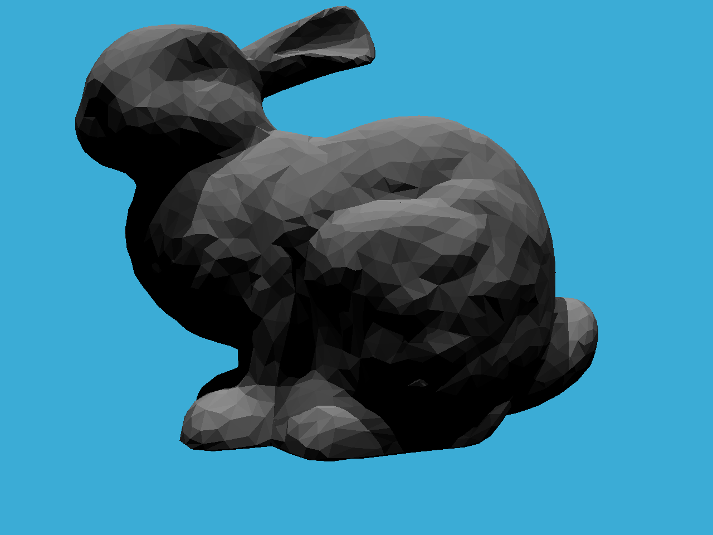
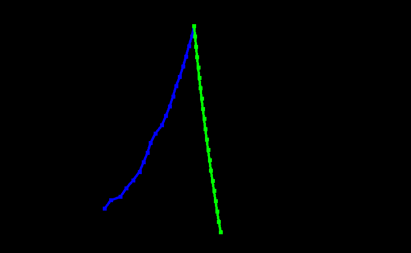

## 作业

- [x] assignment0

  环境配置，熟悉Eigen库

- [x] assignment1

  MVP 变换

  

- [x] assignment2

  Triangles，Z-buffer，MSAA

  MSAA应该在所有三角形光栅化完成后再做平均

  在`img/assignment2-naive.png`可以找到没有MSAA的结果

  

- [x] assignment3

  插值，Blinn-phong模型，纹理映射，Bilinear纹理插值

  C++ lambda的auto推导`Vector3f`的结果似乎有一些问题，在`rasterizer.cpp`的336行有相关记录

  在`img/assignment3`可以找到没有插值的纹理映射结果

  

- [x] assignment4

  贝塞尔曲线，distance function

  

- [x] assignment5

  ray generation，MT算法

  

- [x] assignment6

  - [ ] SAH (Surface Area Heuristic) ([参考资料](http://15462.courses.cs.cmu.edu/fall2015/lecture/acceleration/slide_024))

  Whitted-Style Ray Tracing, BVH

  

- [x] assignment7

  Path Tracing

  判断相交时一定要考虑精度问题!!! ~~否则ray经常会直接判定相交在origin附近~~

  在`pool.hpp`实现了一个~~假的~~线程池，每行分配一个线程处理

  在`Intersection.hpp`有一个`IceCream`类可以帮助调试

  定义在`global.hpp`的`get_random_float()`需要加`static`，[参考链接](https://zhuanlan.zhihu.com/p/20119162)

  - [ ] 重要性采样
  - [ ] Microfacet

  

- [x] assignment8

  质点弹簧系统，欧拉法，显式Verlet，阻尼

  