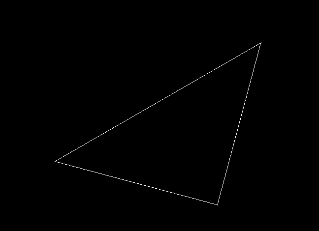
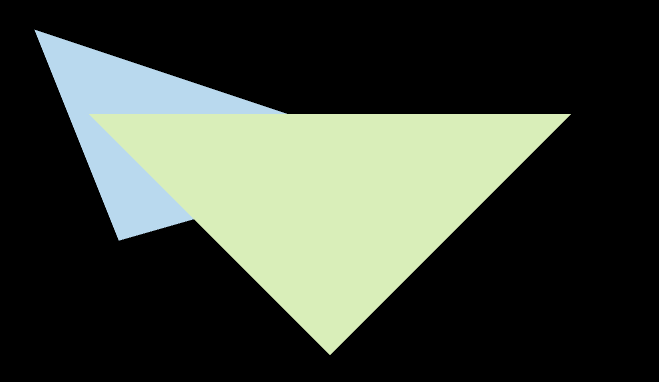
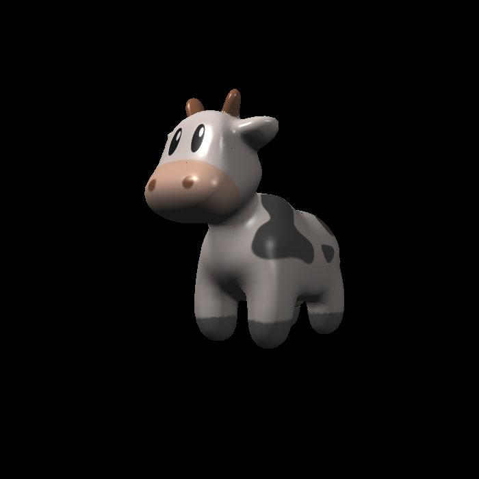
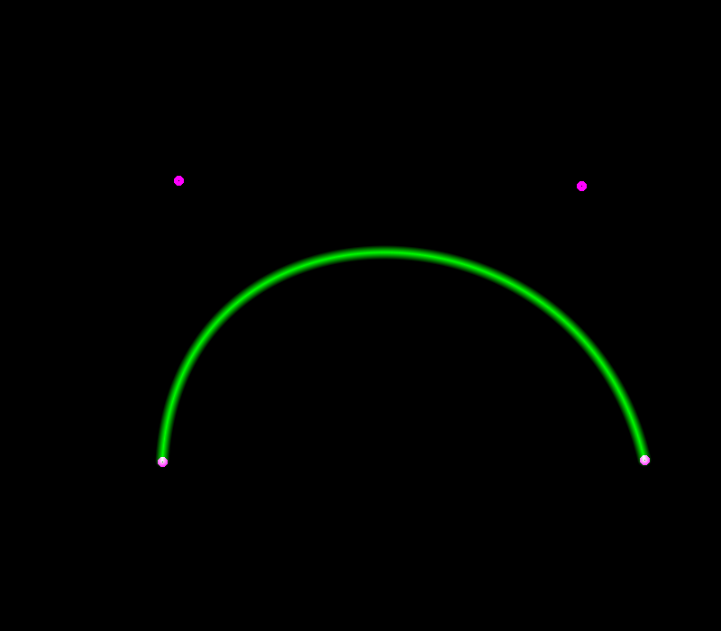
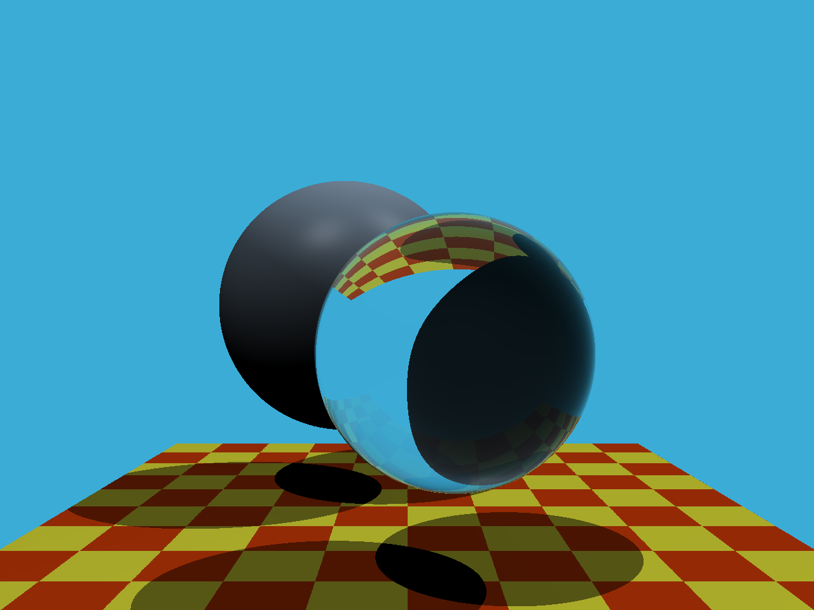

## 作业

- [x] assignment0

  环境配置，熟悉Eigen库

- [x] assignment1

  旋转和透视投影

  

- [x] assignment2

  Triangles，Z-buffer，MSAA

  注：MSAA应该在所有三角形光栅化完成后再做平均

  在`img/assignment2-naive.png`可以找到没有MSAA的结果

  

- [x] assignment3

  插值，Blinn-phong模型，纹理映射，Bilinear纹理插值

  注：C++ lambda的auto推导结果似乎有一些问题，在`rasterizer.cpp`的336行有相关记录

  在`img/assignment3`可以找到没有插值的纹理映射结果

  

- [x] assignment4

  贝塞尔曲线，distance function

  

- [x] assignment5

  ray generation，MT算法

  

- [ ] assignment6

- [ ] assignment7

- [ ] assignment8