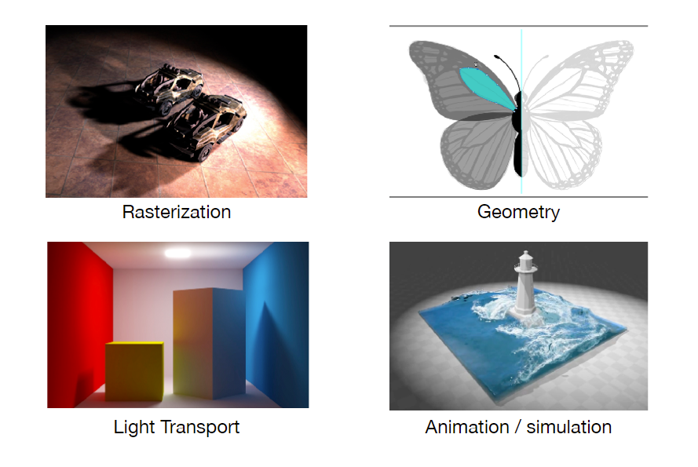
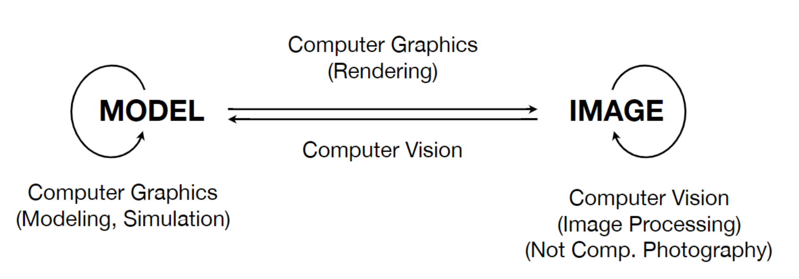

## 计算机图形学概述

### What is CG?

合成和操作视觉信息

### Why study CG?

#### Applications

- Video Games

  怎么辨别好的画面：画面是不是足够亮（全局光照）

- Movies

  特效其实是CG里较为简单的部分，平常见的少，不会感觉不真实

- Animations

- Design (CAD)

- Visualization

- Virtual Reality

  虚拟现实纯虚拟，增强现实在现实里加入新的东西

- Digital Illustration

- Simulation

  物理引擎

- GUI

- Typography (字体)

  The Quick Brown Fox Jumps Over The Lazy Dog (包含26个字母)

#### Fundamental Intellectual Challenges

- Creates and interacts with realistic virtual world

  Require understanding of physical world (有足够的输入)

- New computing methods, displays, technologies

  形成新的东西，并且显示出来

#### Technical Challenges

- Math of (perspective) projections, curves, surfaces

- Physics of lighting and shading
- Representing / operating shapes in 3D
- Animation / simulation

### Course Topics

- Rasterization (光栅化)

  Project geometry primitives (3D triangles / polygons) onto the screen

  广泛应用在实时图形学（30帧以上，否则叫offline）

- Curves and Meshes

  How to represent geometry, How to represent complicated geometry, How to handle transformation

- Ray Tracing

  广泛应用在动画和电影，tradeoff: 优异的效果，但是慢

  新技术：实时光线追踪

- Animation / Simulation

NOT about

- CG APIs
- 3D modeling, game development
- CV (猜测和理解图片)

But no clear boundaries.