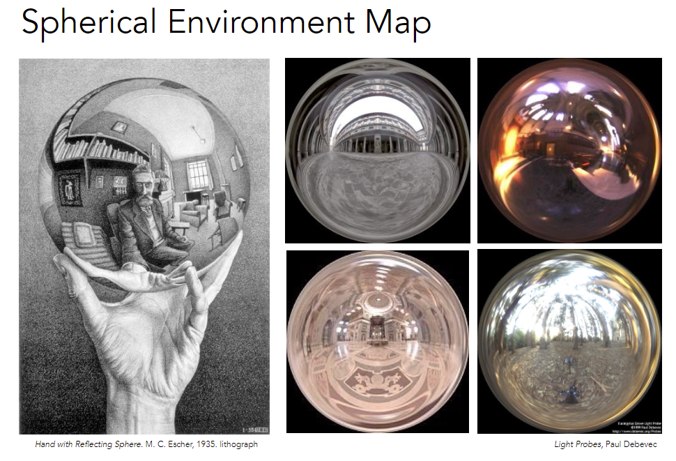
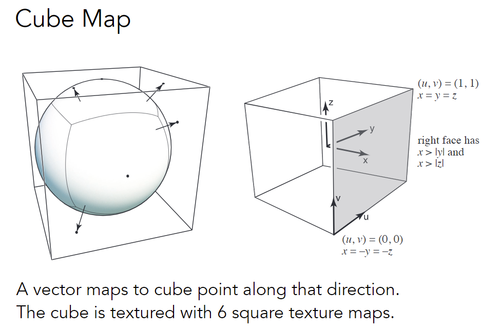
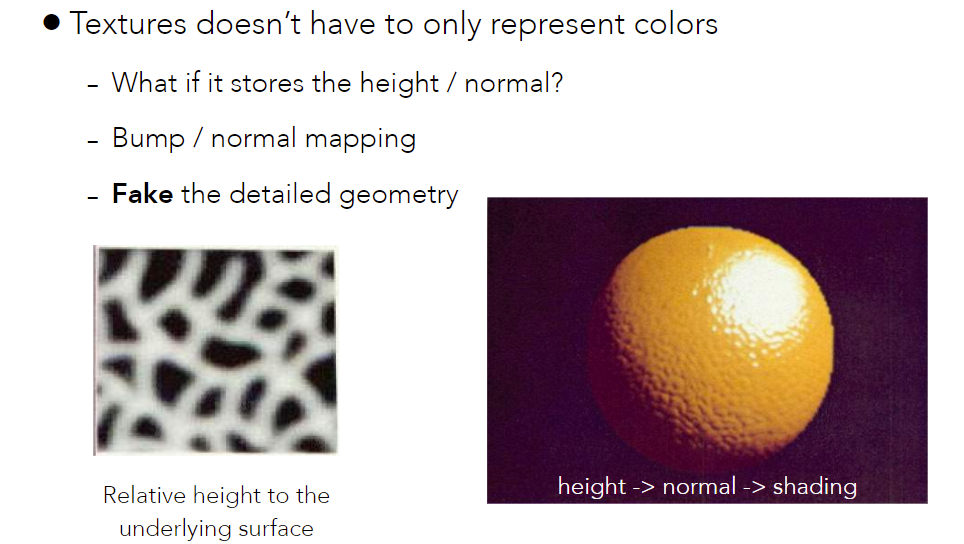
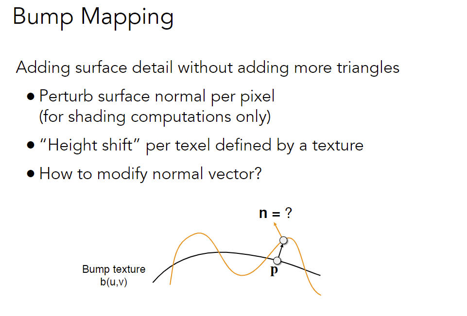
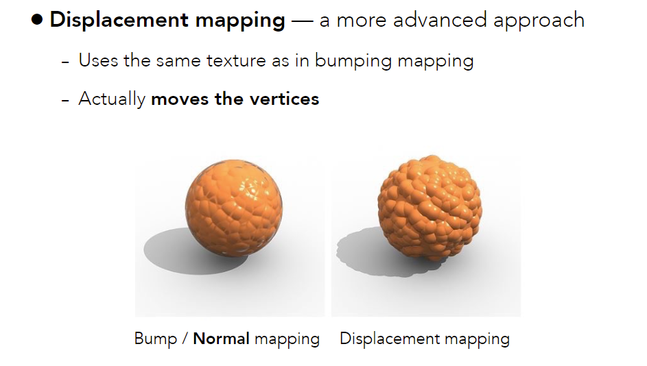
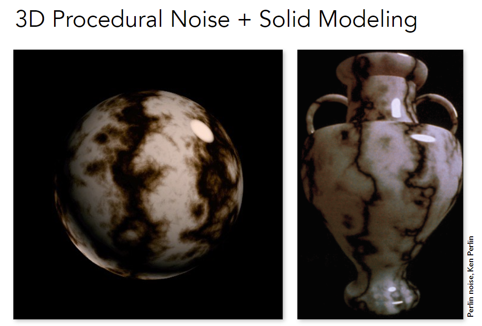
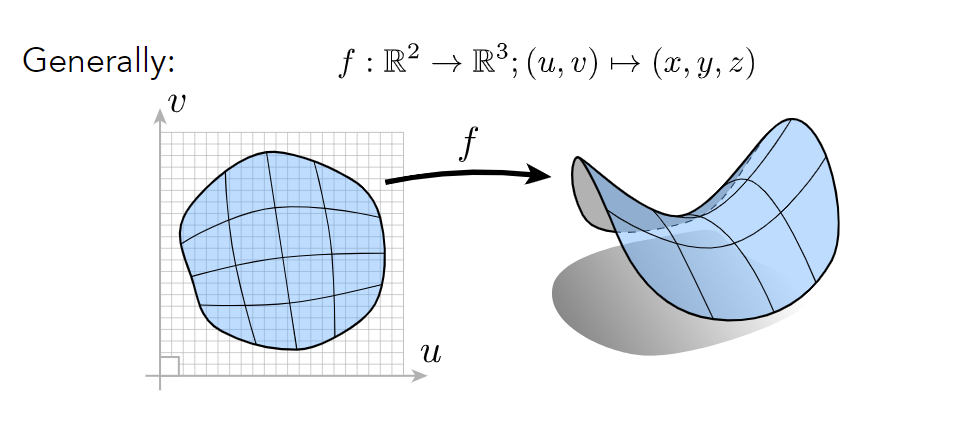
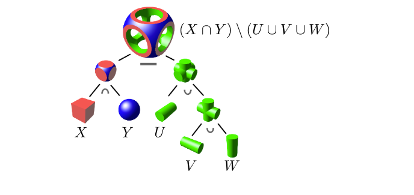
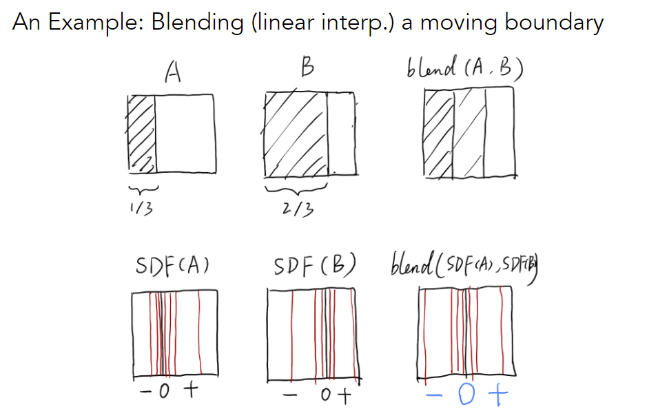
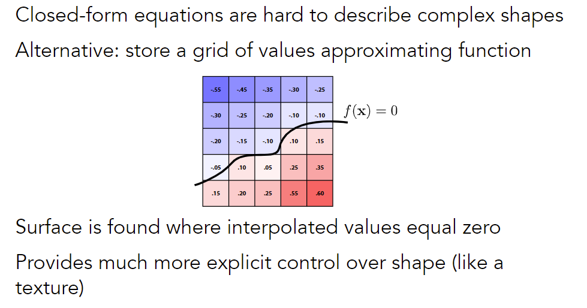

## 几何（基本表示方法）

### Shading

#### Applications of textures

In modern GPUs, texture = memory + range query (filtering) 

- General method to bring data to fragment calculations

##### Many applications 

- Environment lighting (环境贴图)

  把环境光记录下来做成纹理（假设环境光无限远，不考虑不同位置环境光不同）

  

  将环境光记录在球面上，再展开

  Problem: 上下部分会被很大地扭曲，不是均匀的表示

  

  考虑球的立方体包围盒，环境光映射到矢量方向的立方体点上

  用立方体记录，不容易扭曲，但是计算稍微复杂一些

- Store microgeometry  

  Textures can affect shading!

  

  

  - 凹凸贴图定义相对高度，从而改变normal方向

  - 定义复杂纹理但不改变几何信息

  - 给出假的法线以产生假的着色结果，以假乱真

  **How to perturb the normal ?**

  Note that this is in <u>local coordinate</u>! 

  认为局部法线是(0, 0, 1)，计算出新法线后变换回原来的坐标

  in flatland

  1. Original surface normal n(p) = (0, 1)
  2. 求出切线方向 dp = c * [h(p+1) - h(p)] (c控制贴图的影响)
  3. n(p) = (-dp, 1).normalized()

  in 3D

  1. Original surface normal n(p) = (0, 0, 1)

  2. 求出方向导数

     dp/du = c1 * [h(u+1) - h(u)]

     dp/dv = c2 * [h(v+1) - h(v)]

  3. n = (-dp/du, -dp/dv, 1).normalized() (切平面的法线)

  

  - 凹凸贴图在处理边缘和自身阴影时不真实

  - 位移贴图会实际改变几何体，要求三角形足够多

    DirectX动态曲面细分，根据需要划分更多的几何体
    
  - 其它: Parallax mapping, relief mapping

- Procedural textures + Solid modeling 

  定义三维空间函数，可以看到内部纹理

  

- Provide Precomputed Shading

  例如，把阴影计算好记录进纹理

- Volume rendering

  将3D信息记录到纹理

### Introduction to geometry

2nd part of this course!

#### Various representations of geometry

##### “Implicit” Representations of Geometry

给出点满足的方程，$f(x,y,z)=0$

- 难以看出整体结构
- Inside/Outside Tests Easy

##### “Explicit” Representations of Geometry

All points are <u>given directly</u> (e.g. 给出三角形顶点) or <u>via parameter mapping</u> (参数方程)

- 带入u,v即可得到整体结构
- Inside/Outside Test Hard

No “Best” Representation – Geometry is Hard!

Best Representation Depends on the Task!

##### More Implicit Representations

- Algebraic Surfaces

  $f(x,y,z)=0$

- Constructive Solid Geometry (CSG)

  基本几何 + 基本运算$\cap \cup \setminus $

  

- Distance Functions

  Distance functions:  giving minimum distance (could be signed distance)  from anywhere to object

  blend any distance functions

  

  求出A到B的运动的中间状态。直接blend中间效果不理想；理想结果左边是黑的，右边是白的

  Signed Distance Fields (SDF)，有非常强的表示能力

  - 分别求出A和B的SDF（可以看到+-0三部分）
  - blend SDF，得到中间是0，即边界

  SDF阅读材料: [link](https://iquilezles.org/www/articles/raymarchingdf/raymarchingdf.htm)

- Level Set Methods (水平集)

  Distance functions难以给出解析式情况，用mesh grid记录Distance functions

  

  3D level set: 找等高线

- Fractals (分形)

  Exhibit self-similarity, detail at all scales

Pros: 

- compact description (e.g., a function) 
- certain queries easy (inside object, distance to surface) 
- good for ray-to-surface intersection (more later) 
- for simple shapes, exact description (严格描述) / no sampling error 
- easy to handle changes in topology (e.g., fluid) 

Cons: 

- difficult to model complex shapes