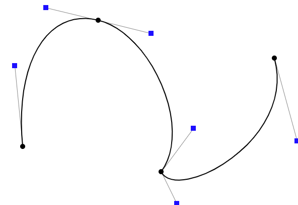
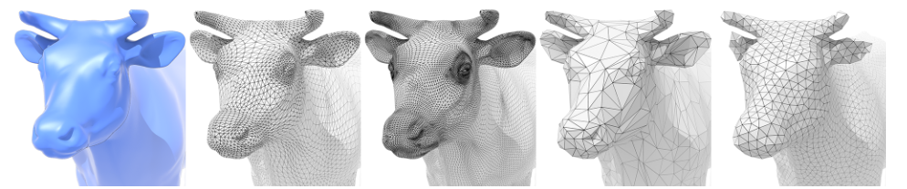

## 几何（曲线与曲面）

### Various representations of geometry

#### Explicit Representations

- Point Cloud

  把表面的点表示得足够细（e.g. 扫描后的结果）

  Easiest representation: list of points (x,y,z)

  Easily represent any kind of geometry

  Often converted into polygon mesh

- Polygon Mesh

  Store vertices & polygons (often triangles or quads)

  Easier to do processing / simulation, adaptive sampling

  

  The Wavefront Object File (.obj) Format: stores vertices, normals, texture coordinates + their connectivities

### Curves

#### Bezier curves (贝塞尔曲线)

用一系列控制点定义曲线

##### De Casteljau’s algorithm 

给出任意时间t，找到该时刻曲线上的点

Consider three points (quadratic Bezier)

参考链接：[link](https://acko.net/files/fullfrontal/fullfrontal/wdcode/online.html)

##### Algebraic Formula

Example: quadratic Bezier curve from three points
$$
\begin{aligned}
&\mathbf{b}_{0}^{1}(t)=(1-t) \mathbf{b}_{0}+t \mathbf{b}_{1} \\
&\mathbf{b}_{1}^{1}(t)=(1-t) \mathbf{b}_{1}+t \mathbf{b}_{2} \\ \\
&\mathbf{b}_{0}^{2}(t)=(1-t) \mathbf{b}_{0}^{1}+t \mathbf{b}_{1}^{1}
\end{aligned}
$$

$$
\mathbf{b}_{0}^{2}(t)=(1-t)^{2} \mathbf{b}_{0}+2 t(1-t) \mathbf{b}_{1}+t^{2} \mathbf{b}_{2}
$$

用二项式定理化简计算

$$
\sum_{i=0}^{n} B_{i}^{n}(t)=1
$$
可以理解为：定义和时间有关的多项式，对控制点进行插值

##### Properties of Bezier Curves

Interpolates endpoints
- For cubic Bezier: $\mathbf{b}(0)=\mathbf{b}_{0}\quad \mathbf{b}(1)=\mathbf{b}_{3}$

Tangent to end segments (仅对于cubic case)

- Cubic case: $\mathbf{b}^{\prime}(0)=3\left(\mathbf{b}_{1}-\mathbf{b}_{0}\right)  \quad \mathbf{b}^{\prime}(1)=3\left(\mathbf{b}_{3}-\mathbf{b}_{2}\right)$

Affine transformation property

- Transform curve by transforming control points

  画出曲线再仿射变换 = 仿射变换控制点再画出曲线

  投影变换不行

Convex hull (凸包) property

- Curve is <u>within</u> convex hull of control points

  简单应用：控制点排列在直线上

##### Piecewise (逐段) Bezier Curves

Higher-Order Bezier Curves?

Instead, chain many low-order Bezier curve

<u>Piecewise cubic Bezier</u> the most common technique (一般每4个控制点分段)

Demo: [link](https://math.hws.edu/eck/cs424/notes2013/canvas/bezier.html)

Q：怎么保证连接曲线是光滑的？

A：连接处控制杆共线等长反向

**Continuity**

C1连续：导数连续

#### B-splines

**Spline** (样条)

- a continuous curve constructed so as to pass through a given set of points and have a certain number of continuous derivatives. 
- In short, a curve under control

**B-splines** (basis splines) 

e.g. Bernstein polynomials为基函数 (basis)

- Require more information than Bezier curves 
- Satisfy all important properties that Bezier curves have (i.e. superset)
- 满足局部性：一个控制点改变不会影响整条曲线，只影响某个局部范围

Further study

- B-splines and NURBS
- operations on curves  (e.g. increasing/decreasing orders, etc.)
- reference: [Prof. Shi-Min Hu’s course](https://www.bilibili.com/video/av66548502?from=search&seid=65256805876131485)

### Surfaces

#### Bezier surfaces 

在水平和竖直方向分别计算Bezier curves

**Bicubic Bezier Surface**

4 x 4 control points 

1. 根据每行的4个控制点生成4条Bezier curves

2. 把第一步生成的4个点当作新的控制点

##### Evaluating Bezier Surfaces

Evaluating Surface Position For Parameters (u,v)

Input: 4x4 control points (bi-cubic case)

Output is 2D surface parameterized by (u,v) in [0,1]^2^

(u,v)-separable application of de Casteljau algorithm

1. Use de Casteljau to evaluate point u on each of the 4 Bezier curves in u. This gives 4 control points for the “moving” Bezier curve 
2. Use 1D de Casteljau to evaluate point v on the “moving” curve

#### Mesh Operations: Geometry Processing

- Mesh subdivision (细分)

- Mesh simplification (简化)

- Mesh regularization

  regularization: 让三角形都变得和正三角形差不多

