## 几何（网格处理）、阴影图

### Mesh Operations: Geometry Processing

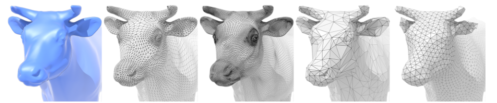

#### Mesh subdivision 

Increase resolution, upsampling

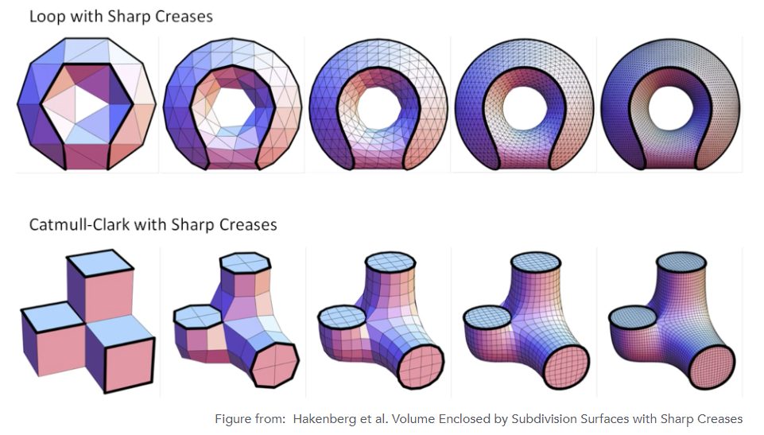

##### Loop Subdivision

Common subdivision rule for <u>triangle meshes</u>

1. create more triangles (vertices) 

2. tune their positions

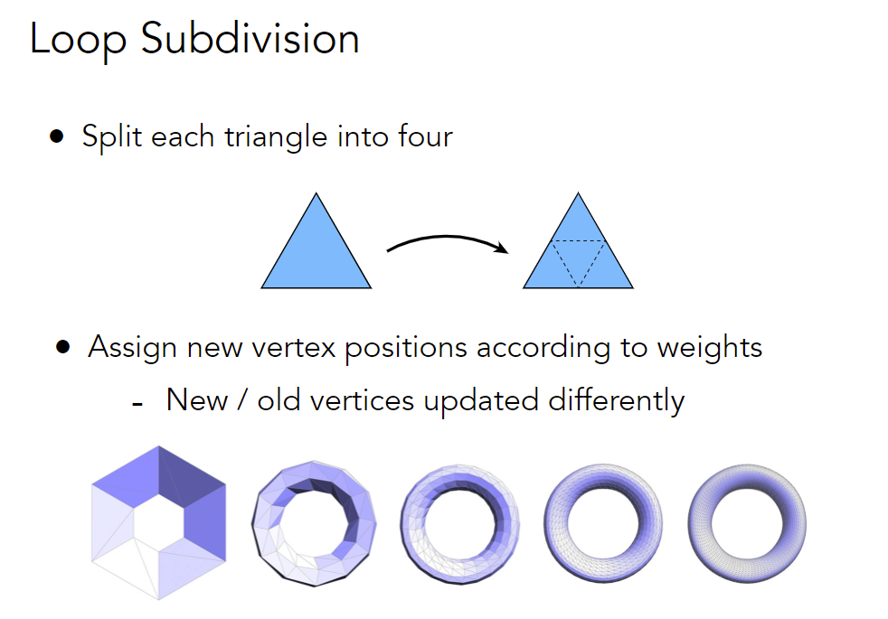

Loop Subdivision — Update

- For new vertices

  根据周围点加权平均

  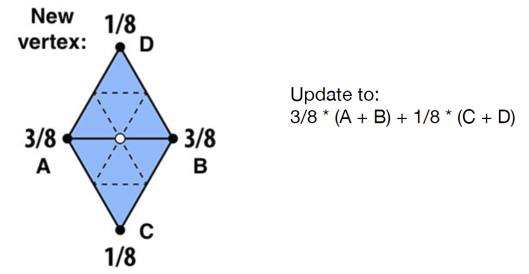

- For old vertices

  e.g. degree 6 vertices here

  根据自身和周围点加权平均

  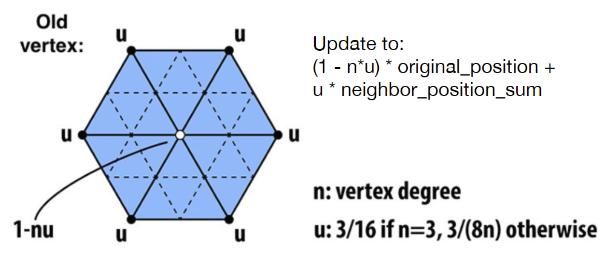

##### Catmull-Clark Subdivision

处理一般情况，不只是纯三角形

1. create more vertices

   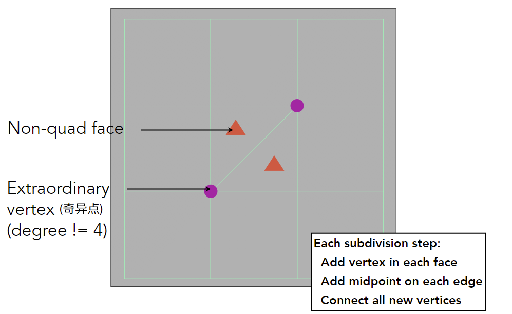

   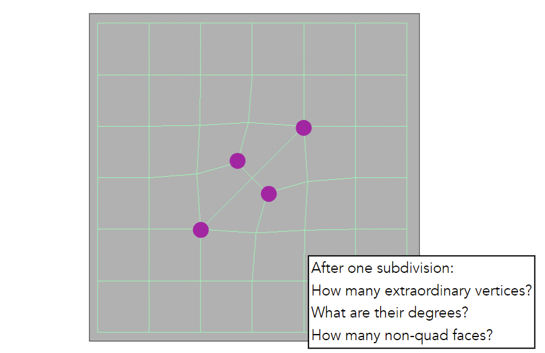

   After one subdivision:

   - How many extraordinary vertices?

     原来的奇异点 + 划分三角形得到的奇异点，之后再也不会增加

   - What are their degrees?

     新的奇异点度为3

   - How many non-quad faces?

     None. 所有non-quad faces在引入奇异点后消失

2. Catmull-Clark Vertex Update Rules

   本质上就是加权平均

   分为Face point + Edge point + Vertex point

   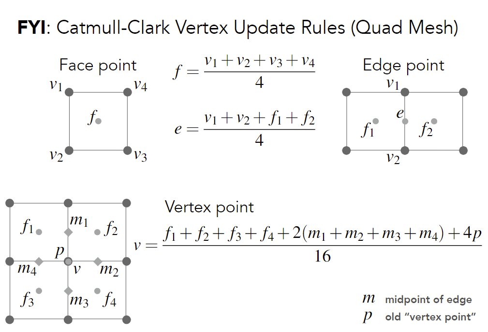

#### Mesh simplification 

Decrease resolution, downsampling; try to preserve shape/appearance

直接降低开销；不同情况的物体选用不同复杂程度的几何模型（e.g. 远处和近处）

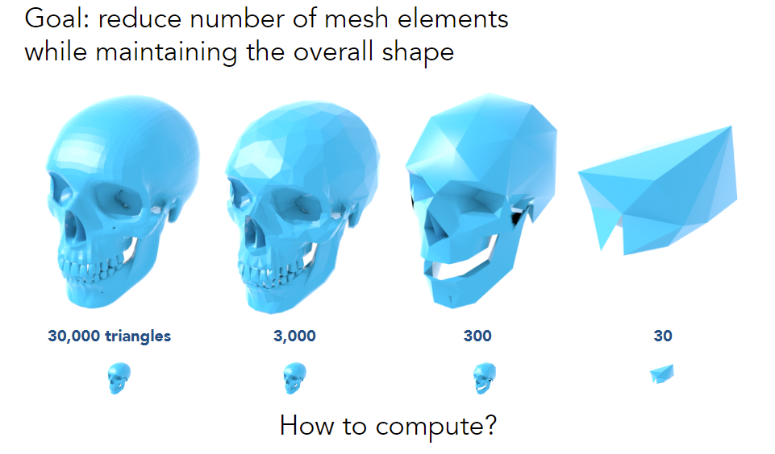

##### Edge Collapse (边坍缩)

one way to simplify a mesh

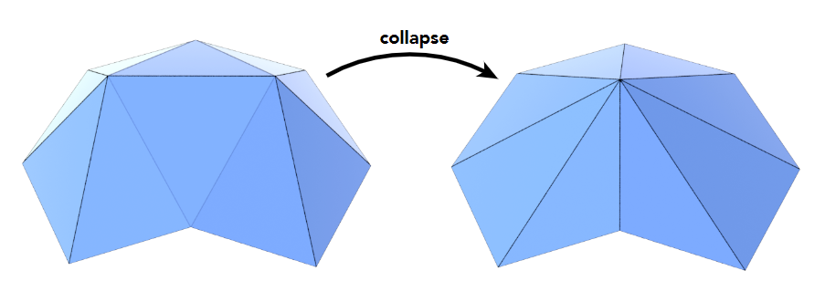

把边的两点合在一起

Q：坍缩哪些边，哪些边不重要？

Example：把中间三个点变成一个，新的点放在哪？

引入二次误差（新的点和原来面距离的平方和），使得新的图形最小化二次误差

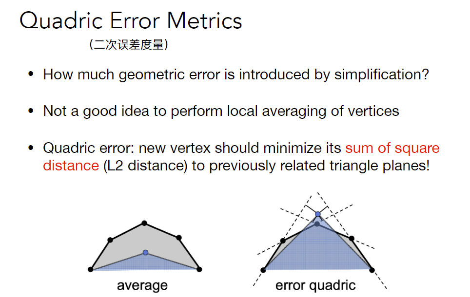

参考资料：[link](http://graphics.stanford.edu/courses/cs468-10-fall/LectureSlides/08_Simplification.pdf)

Q: How much does it cost to collapse an edge? 

Better idea: choose point that minimizes quadric error

**Simplification via Quadric Error**

Iteratively collapse edges 

Which edges?  Assign score with quadric error metric

- approximate distance to surface as sum of distances to planes containing triangles 
- iteratively collapse edge with <u>smallest score</u> and update model
- greedy algorithm... great results!

简单的部分坍缩的多，复杂的部分坍缩的少

#### Mesh regularization

Modify sample distribution to improve quality, same #triangles

### Shadow Mapping

光栅化遗留部分，Ray Tracing动机

光栅化难题：全局光照，阴影

An <u>Image-space</u> Algorithm 

- no knowledge of scene’s geometry during shadow computation 
- must deal with aliasing artifacts

**Key idea**: the points NOT in shadow must be seen both  **by the light** and **by the camera**

经典Shadow Mapping只能处理点光源（硬阴影：有明显阴影边界）

#### Pass 1: Render from Light

放置虚拟相机在光源处并做光栅化，得到光源看到点的深度图 (shadow map)

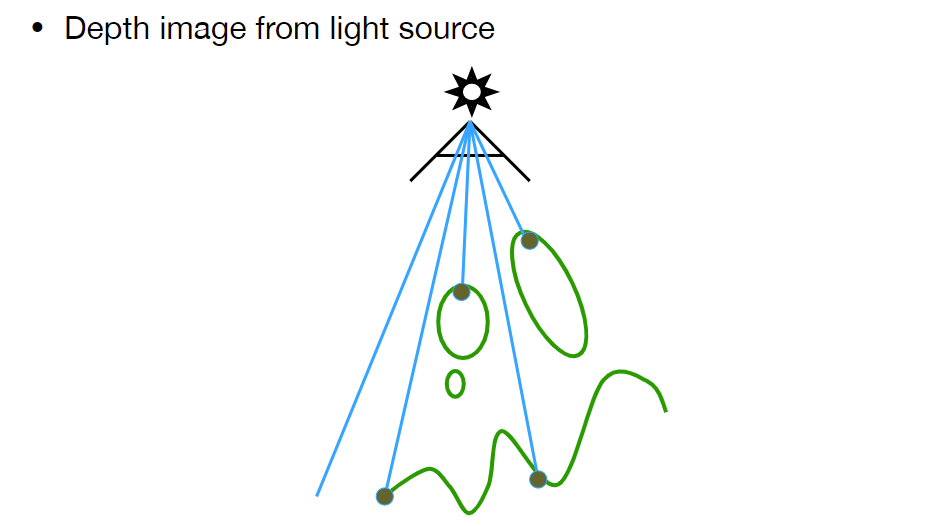

#### Pass 2A: Render from Eye

Standard image (with depth) from eye

#### Pass 2B: Project to light

Project visible points in eye view back to light source

reproject之后，在depth image上查询并和真实深度比较

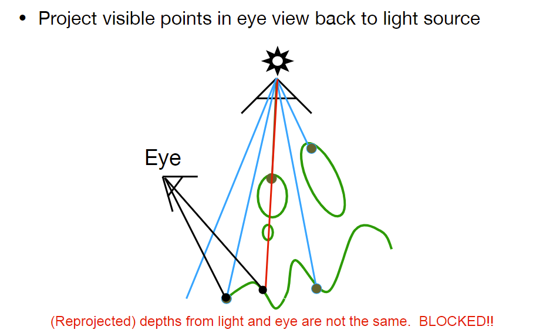

**problem**: 只能处理hard shadow；严重的精度问题；shadow map的分辨率过低会使得阴影走样

Shadow Mapping仍然是游戏的主流技术

注：游戏里的阴影质量一般指shadow map分辨率

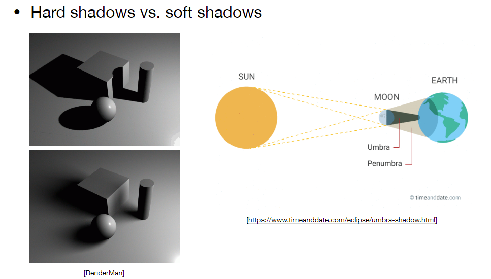

hard shadow边界比较锐利；soft shadow边界渐变

soft shadow = Penumbra (半影) => 光源有一定大小

umbra (本影): 完全看不到光源; penumbra: 可以看到部分光源

