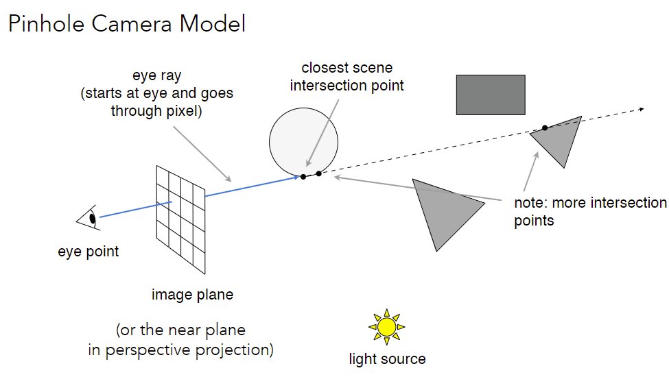
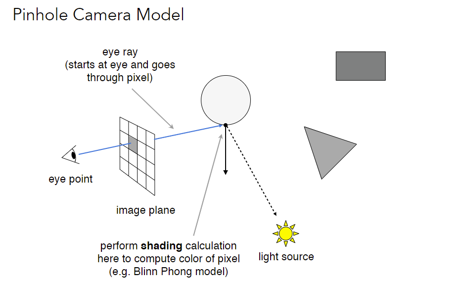
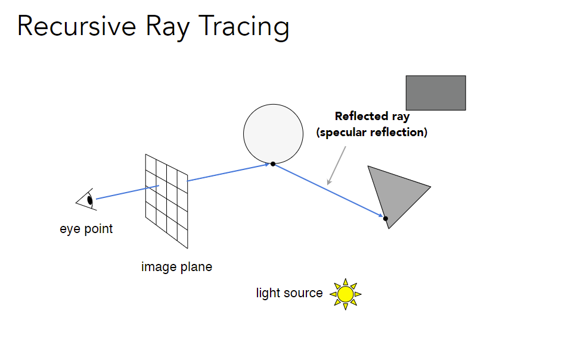
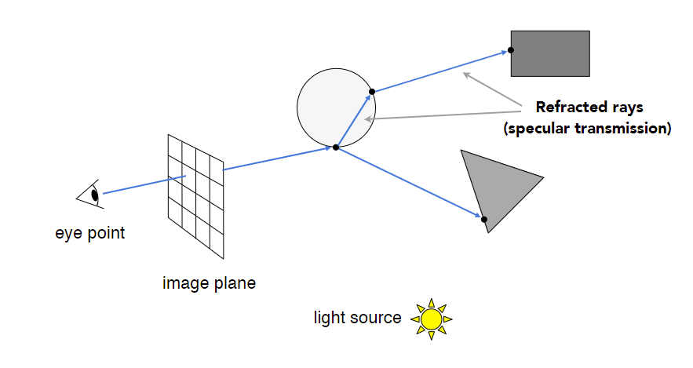
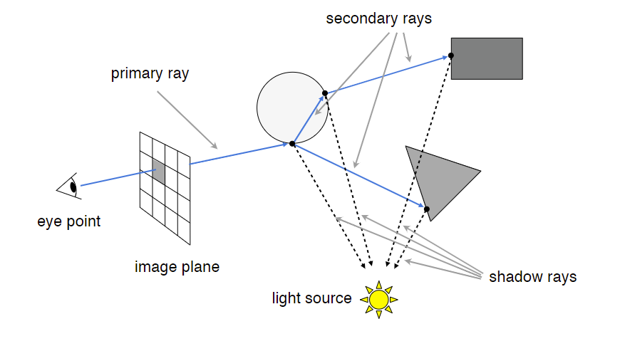
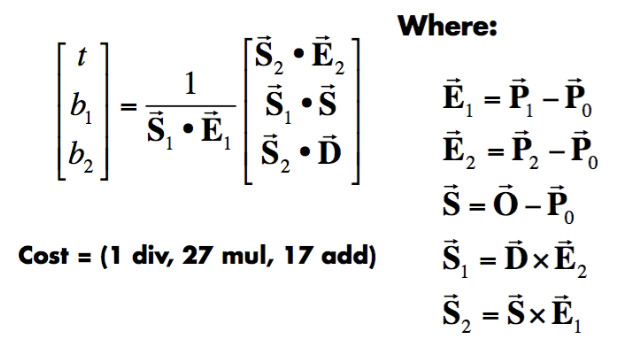
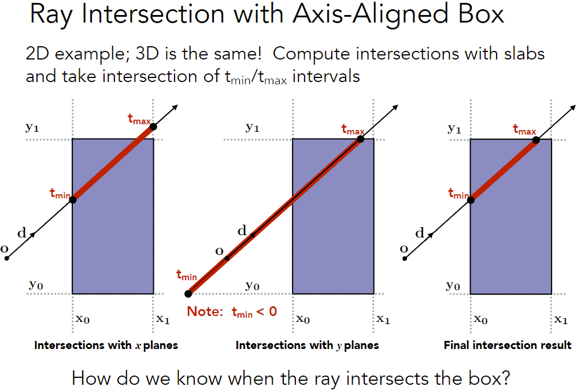

## 光线追踪（基本原理）

### Why Ray Tracing?

- Rasterization couldn’t (too hard) handle global effects well

  (Soft) shadows; Glossy reflection; Indirect illumination

  And especially when the light bounces <u>more than once</u>

- Rasterization is fast, but quality is relatively low

- Ray tracing is accurate, but is <u>very slow</u>

  Rasterization: **real-time**, ray tracing: **offline**

  ~10K CPU core hours to render one frame in production

### Basic Ray-Tracing Algorithm

#### Overview

##### Light Rays

1. Light travels in straight lines (though this is wrong)  
2. Light rays do not “collide” with each other if they cross (though this is still wrong) 
3. Light rays travel from the light sources to the eye (but the physics is invariant under path reversal - **reciprocity**).

##### Ray Casting

从相机开始

1. Generate an image by <u>casting one ray per pixel</u> (找closest = z-buffer)
2. Check for shadows by <u>sending a ray to the light</u> 

假设：

- 眼睛和光源都是点
- 物体会有完美的折射和反射

效果 $\approx$ 光栅化

##### Recursive (Whitted-Style) Ray Tracing

假设：

- 眼睛和光源都是点
- 物体会有完美的折射和反射

每一个交点都和光源连线并着色，都对pixel着色产生影响

primary ray + secondary ray + shadow ray

#### Details

##### Ray-Surface Intersection (交点)

The intersection p must satisfy both equations

Ray is defined by its origin and a direction vector
$$
\bold r(t)=\bold o + t\bold d \quad 0\leq t<\infin
$$
**Ray Intersection With Sphere**
$$
\text{Sphere: }\quad (\bold p-\bold c)^2=R^2 
$$

$$
(\mathbf{o}+t \mathbf{d}-\mathbf{c})^{2}-R^{2}=0
$$

**Ray Intersection With Implicit Surface**

General implicit surface: $f(\bold p)=0$

Solve for <u>real</u>, <u>positive</u> roots: $f(\bold o+t\bold d)=0$

**Ray Intersection With Triangle Mesh (explicit)**

Why?  

- Rendering: visibility, shadows,  lighting ... 

- Geometry: inside/outside test 

  点投射的光线和物体有奇数个交点，则点在物体内（物体需要是封闭的）

Simple idea: just intersect ray with <u>each</u> triangle 

Simple, but slow (acceleration?) 

Note: can have 0, 1 intersections with each triangle

Steps

1. Ray-<u>plane</u> intersection 
2. Test if hit point is inside  triangle

**Ray Intersection With Plane**

Plane is defined by normal vector and a point on plane
$$
\mathbf{p}:\left(\mathbf{p}-\mathbf{p}^{\prime}\right) \cdot \mathbf{N}=0 \\
ax+by+cz+d=0
$$

$$
\begin{aligned}
&\left(\mathbf{p}-\mathbf{p}^{\prime}\right) \cdot \mathbf{N}=\left(\mathbf{o}+t \mathbf{d}-\mathbf{p}^{\prime}\right) \cdot \mathbf{N}=0 \\
&t=\frac{\left(\mathbf{p}^{\prime}-\mathbf{o}\right) \cdot \mathbf{N}}{\mathbf{d} \cdot \mathbf{N}} \quad \text { Check: } 0 \leq t<\infty
\end{aligned}
$$

**Möller Trumbore (MT) 算法**

giving barycentric coordinate directly

使用重心坐标表示平面
$$
\overrightarrow{\mathbf{O}}+t \overrightarrow{\mathbf{D}}=\left(1-b_{1}-b_{2}\right) \overrightarrow{\mathbf{P}}_{0}+b_{1} \overrightarrow{\mathbf{P}}_{1}+b_{2} \overrightarrow{\mathbf{P}}_{2}
$$
解线性方程组（使用Cramer法则）

判断$t\geq0$，重心坐标非负

##### Accelerating Ray-Surface Intersection

Performance Challenges

Simple ray-scene intersection 

- Exhaustively test ray-intersection with <u>every triangle</u>
- Find the closest hit (i.e. minimum t) 

Naive algorithm = #pixels ⨉ # traingles (⨉ #bounces)

For generality, we use the term <u>objects</u> instead of triangles later (but doesn’t necessarily mean entire objects)

**Bounding Volumes**

bound complex object with a simple volume

- Object is fully contained in the volume 
- If it doesn’t hit the volume, it doesn’t hit the object 
- So test BVol first, then test object if it hits

**AABB** (Axis-Aligned Bounding Box)

Understanding: box是三组对面空间的交集

We often use an  Axis-Aligned Bounding Box (AABB) 

Q: Why Axis-Aligned ? 

简化线和面交点的计算，e.g. $t=(\mathbf{p}_{x}^{\prime}-\mathbf{o}_{x})/\mathbf{d}_{x}$，带入坐标即可

Recall: a box (3D) = three pairs of infinitely large slabs

Key ideas

- The ray enters the box <u>only when</u> it enters all pairs of slabs 
- The ray exits the box <u>as long as</u> it exits any pair of slabs 

For each pair, calculate the tmin and tmax (negative is fine)

For the 3D box, $t_{enter} = \max\{t_{min}\}, t_{exit} = \min\{t_{max}\}$

If t~enter~ < t~exit~, we know the ray stays a while in the box(so they must intersect!)

- What if t~exit~ < 0?

  The box is “behind” the ray — no intersection! 

- What if t~exit~ >= 0 and t~enter~ < 0?

  The ray’s origin is inside the box — have intersection! 

In **summary**: ray and AABB intersect iff t~enter~ < t~exit~ && t~exit~ >= 0

