## 光线追踪（加速结构）

**Announcements** from Prof. Yan.

DLSS 2.0: [link](https://zhuanlan.zhihu.com/p/116211994)

RTXGI: [link](https://developer.nvidia.com/zh-cn/rtxgi)

- Offline rendering techniques will soon become real-time 

- Current real-time rendering techniques will still be useful

WHY, WHAT, then HOW (HOW is less important and more likely to forget)

### Using AABBs to accelerate ray tracing 

#### Uniform grids

1. Build Acceleration Grid

   对场景的预处理（在RT之前）

   

2. Ray-Scene Intersection

   假设ray和grid求交比较快，和物体求交比较慢（实际上也是）

   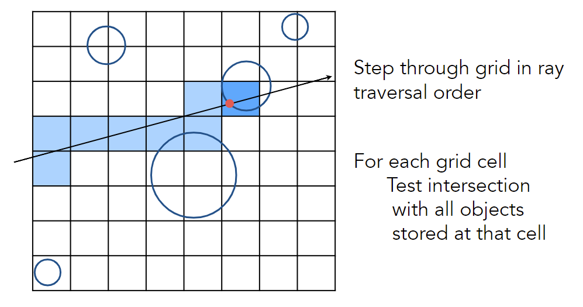

   Q: 如何判断光传播经过哪些grid？

   下一个grid在右边或上面（~线的光栅化）

Grid Resolution?

- One cell

  No speedup

- Too many cells

  Inefficiency due to extraneous grid traversal

Heuristic: #cells = C * #objs, C ≈ 27 in 3D

Grids work well on large collections of objects that are <u>distributed evenly</u> in size and space, 处理稀疏场景效果不好

#### Spatial partitions 

对空间做划分

对场景的预处理（在RT之前）

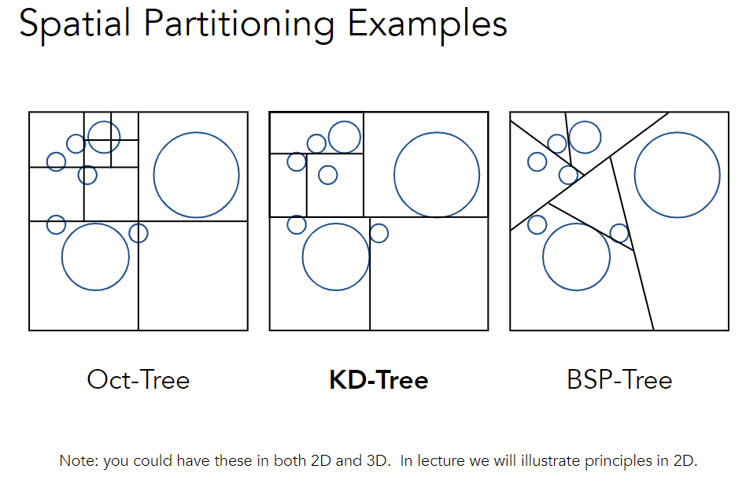

Oct-Tree: 对于所有坐标轴切一刀，2^n^划分

KD-Tree: 使用某一个坐标轴划分，一般交替或者随机选取

BSP-Tee: 每次对空间切一刀（非Axis-Aligned）

##### KD-Tree

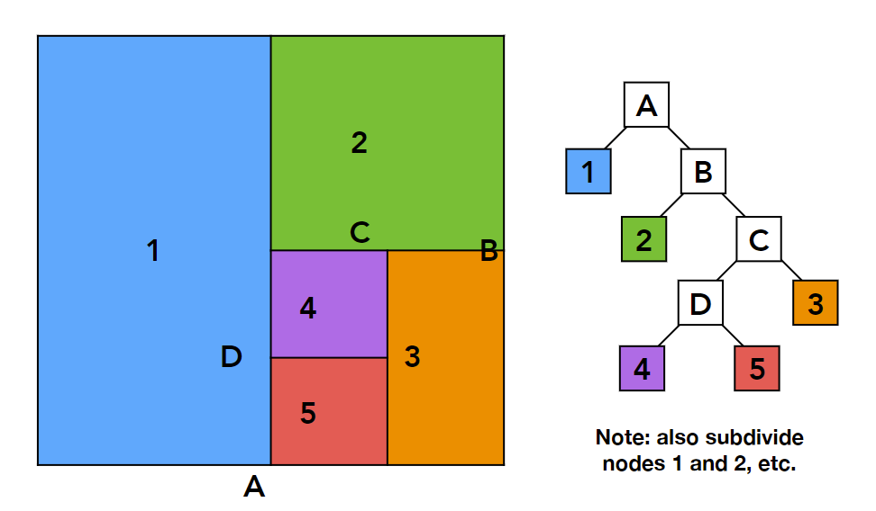

- 叶子节点存储物体

- 中间节点

  split axis, split position, children

  NO objects are stored in internal nodes

**Traversing a KD-Tree**

- Internal node: split

  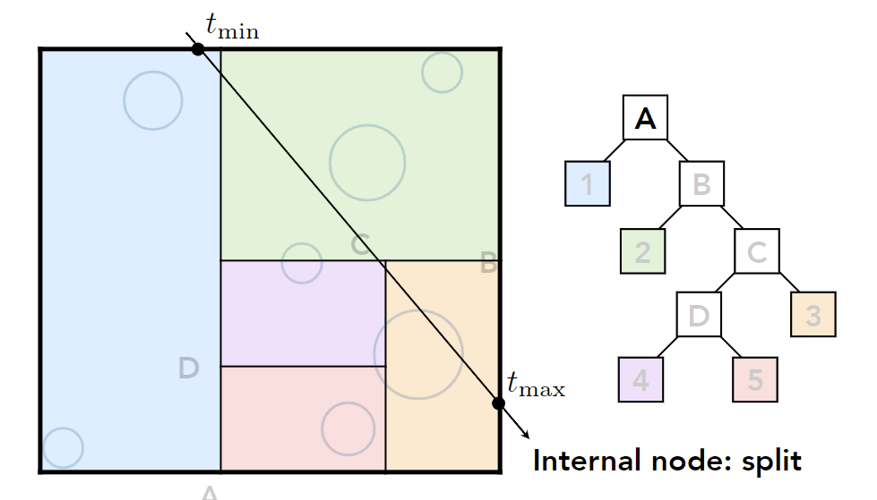

- Leaf node: intersect all objects

  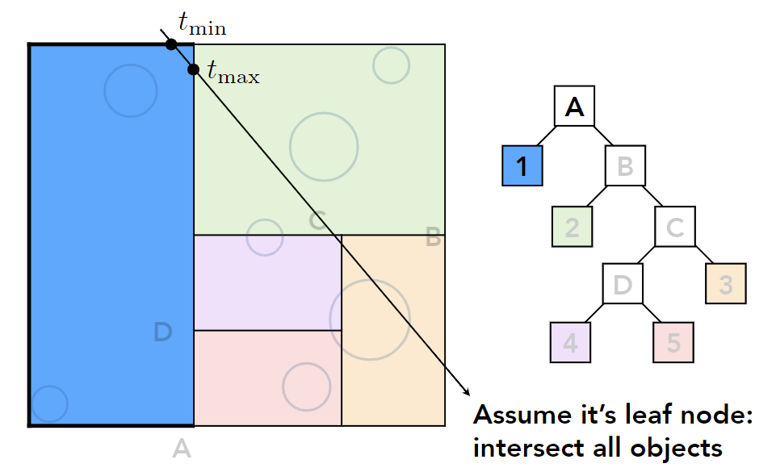

- repeat

  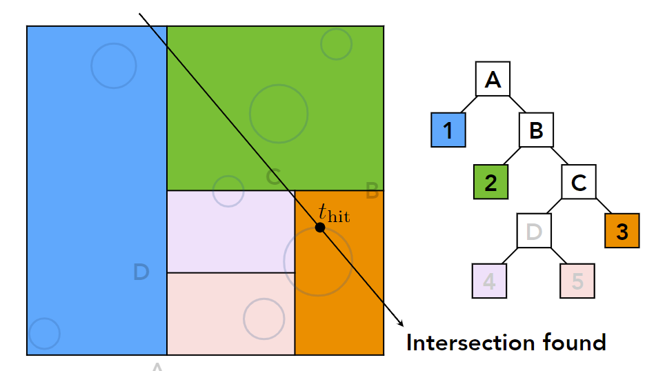

过程

1. 和node没有交点，结束
2. 和node有交点，递归判断children (objects)

**problem**: 

- 怎么判定物体和BB是否相交，哪些物体在BB内？
- 物体可能和不同的BB相交，需要记录在多个叶子节点

#### Object Partitions & Bounding Volume Hierarchy (BVH)

对物体做划分

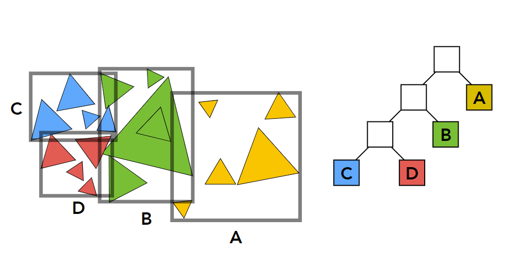

- 一个物体只会出现在一个BB里
- BB之间可以相交

过程：

1. Find bounding box 
2. Recursively split set of objects in two subsets 
3. **Recompute** the bounding box of the subsets 
4. Stop when necessary 
5. Store objects in each leaf node

How to subdivide a node? 

- Choose a dimension to split 

  希望分布能够更加均匀

- Heuristic #1: Always choose the longest axis in node 

- Heuristic #2: Split node at location of <u>median</u> object (不需要排序)

Termination criteria? 

- Heuristic: stop when node contains few elements (e.g. 5)

注：不支持场景修改

Data Structure for BVHs

- Internal nodes store 

  Bounding box

  Children: pointers to child nodes

- Leaf nodes store 

  Bounding box 

  List of objects 

Nodes represent subset of primitives in scene (All objects in subtree)

**Spatial vs Object Partitions**

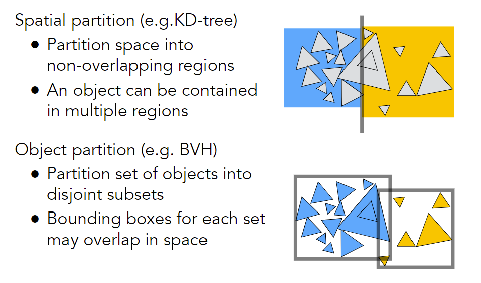

### Basic radiometry (辐射度量学)

new topics from now on!

精确定义光，光如何和物体作用，光线如何传播等

#### Motivation

- Light intensity I is 10, for example. But 10 what?

- Do you think Whitted style ray tracing gives you CORRECT results?

  没有考虑折射能量损失，考虑反射时能量不守恒

- Blinn-Phong model is NOT accurate

**Radiometry**

- Measurement system and units for illumination

- Accurately measure the <u>spatial</u> properties of light 

  - New terms: Radiant flux, intensity, irradiance, radiance 

  基于几何光学，不考虑波动性

- Perform lighting calculations in <u>a physically correct manner</u>

#### Radiant Energy and Flux (Power)

Definition: Radiant energy is the <u>energy</u> of electromagnetic radiation. It is measured in units of joules, and denoted by the symbol:
$$
Q\left[\mathrm{~J}=\mathrm{J}_{\text {oule }}\right]
$$
Definition: Radiant flux (power) is the energy emitted, reflected, transmitted or received, <u>per unit time</u>. (光源有多亮)
$$
\Phi \equiv \frac{\mathrm{d} Q}{\mathrm{~d} t}[\mathrm{~W}=\mathrm{Watt}][\mathrm{lm}=\text { lumen }]^{\star}
$$
Flux – #photons (光子) flowing through a sensor in unit time

##### Radiant Intensity

Definition: The radiant (luminous) intensity is the <u>power</u> <u>per unit solid angle</u> (立体角) emitted by a point light source.

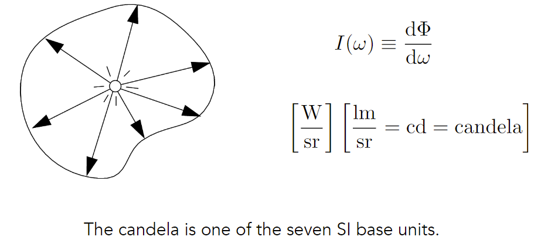

球形均匀光源：$I=\Phi / 4\pi$

**Solid Angles**

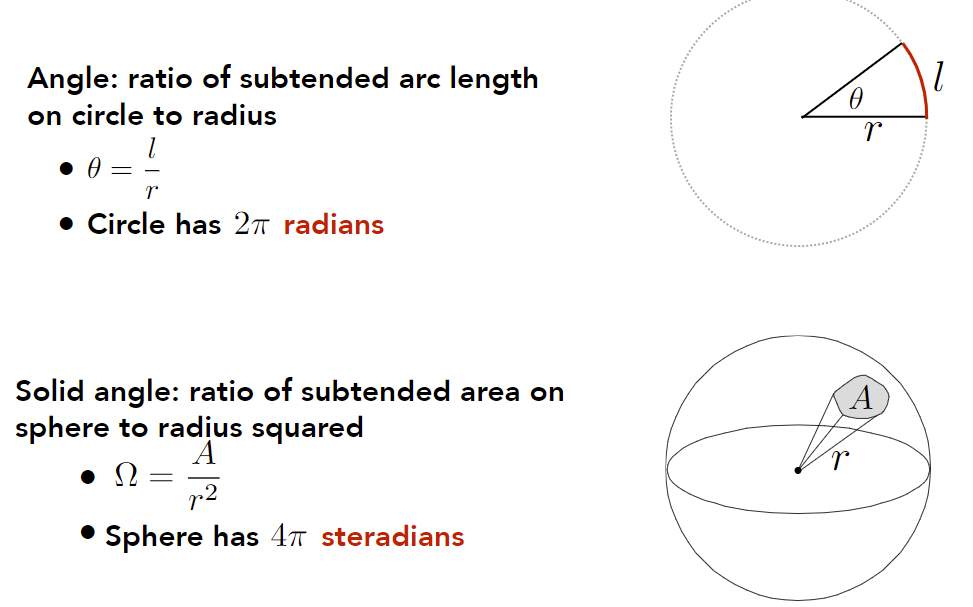

微分形式

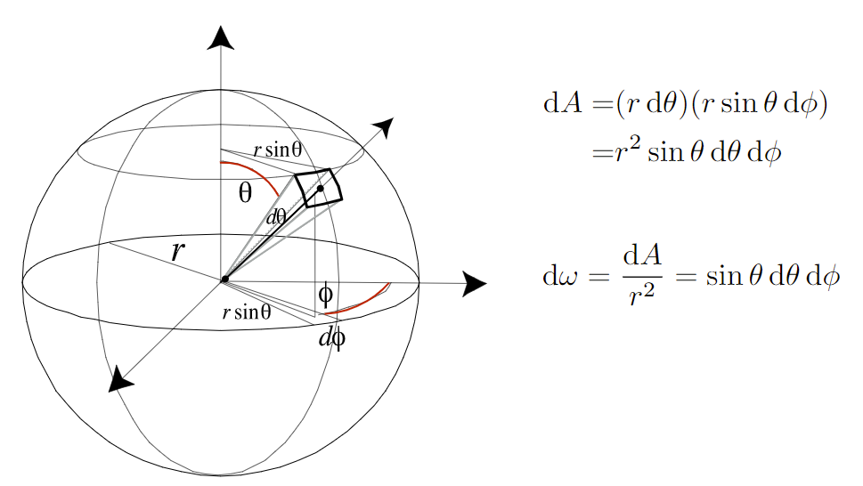

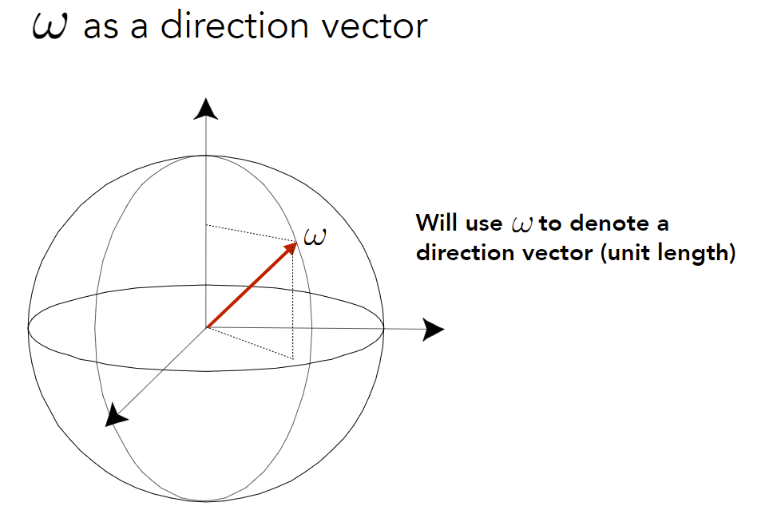

注：$\mathrm{d}\omega$立体角和这里的$\omega$没有关系

