## 光线追踪（辐射度量学、渲染方程与全局光照）

### Radiometry

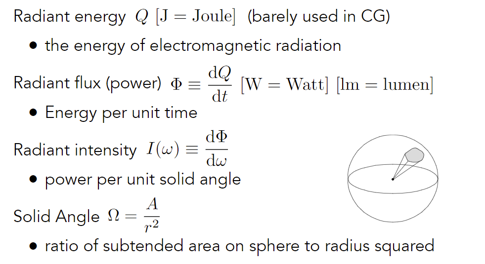

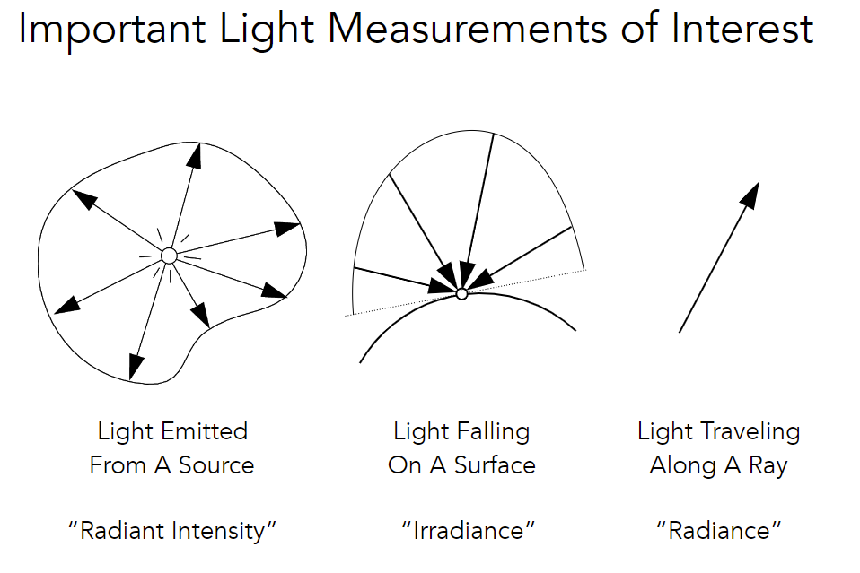

#### Irradiance

Definition: The irradiance is the power <u>per unit area</u> incident on a surface point.

区分：Intensity是per unit solid angle

注：area需要垂直（投影）于光线

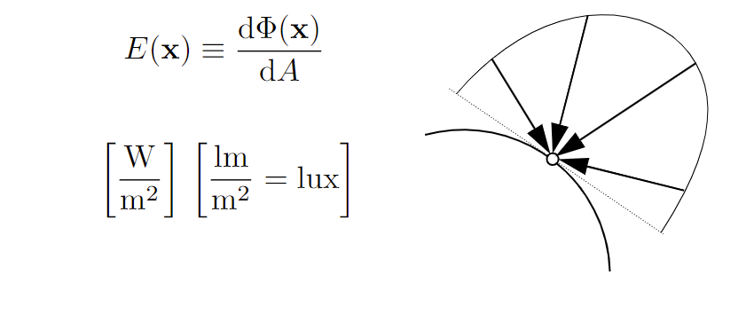

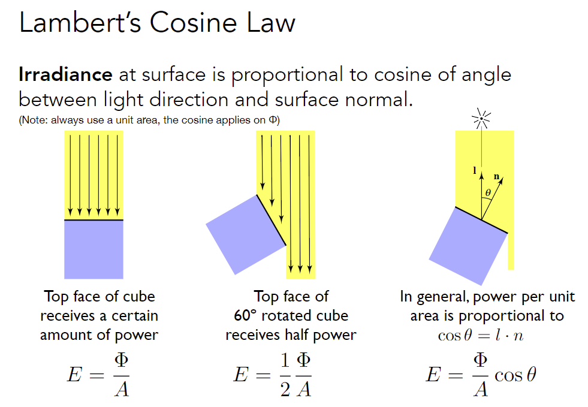

Lambert’s Cosine Law正是反映Irradiance

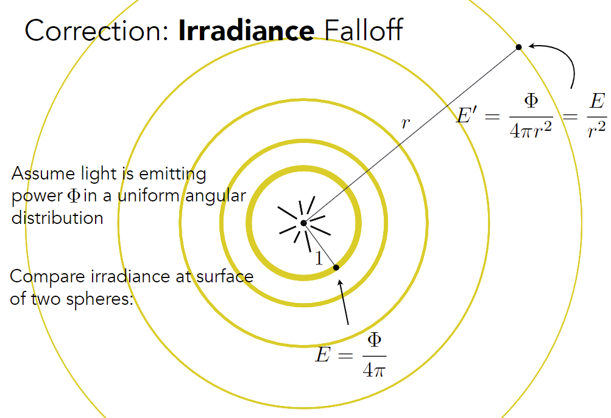

**注**：Intensity没有衰减，只有Irradiance在衰减

#### Radiance

**注**：描述光线属性，和$\mathrm{d}\omega,\mathrm{d}A,\theta$无关

**注**：可以理解为每根光线携带的能量

Radiance is the fundamental field quantity that describes the distribution of light in an environment 

- Radiance is the quantity associated with a ray 
- Rendering is all about computing radiance Light Traveling Along A Ray

Definition: The radiance (luminance) is the power emitted, reflected, transmitted or received by a surface, <u>per unit solid angle</u>, <u>per projected unit area</u>. (两次微分)

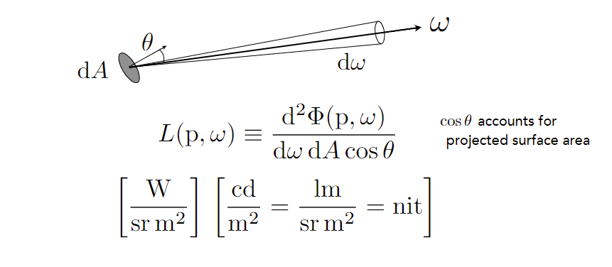

Recall 

- Irradiance: power per projected unit area 
- Intensity: power per solid angle 

So 

- Radiance: Irradiance per solid angle 

  Irradiance = $\mathrm{d}A$面积的能量 辐射向$\mathrm{d}\omega$方向的Intensity (Irradiance的Intensity)

  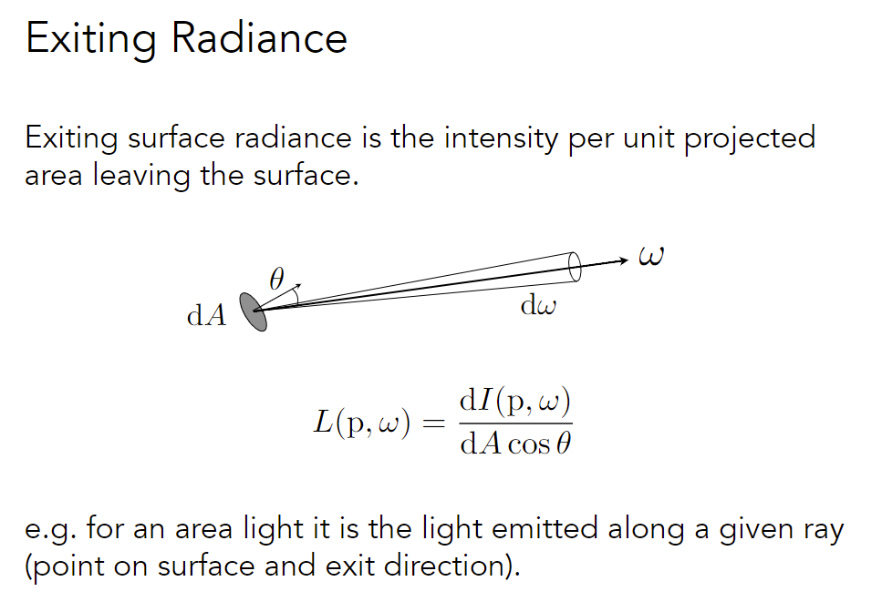

- Radiance: Intensity per projected unit area

  Intensity = $\mathrm{d}\omega$方向的能量 打到$\mathrm{d}A$面积的Irradiance (Intensity的Irradiance)

  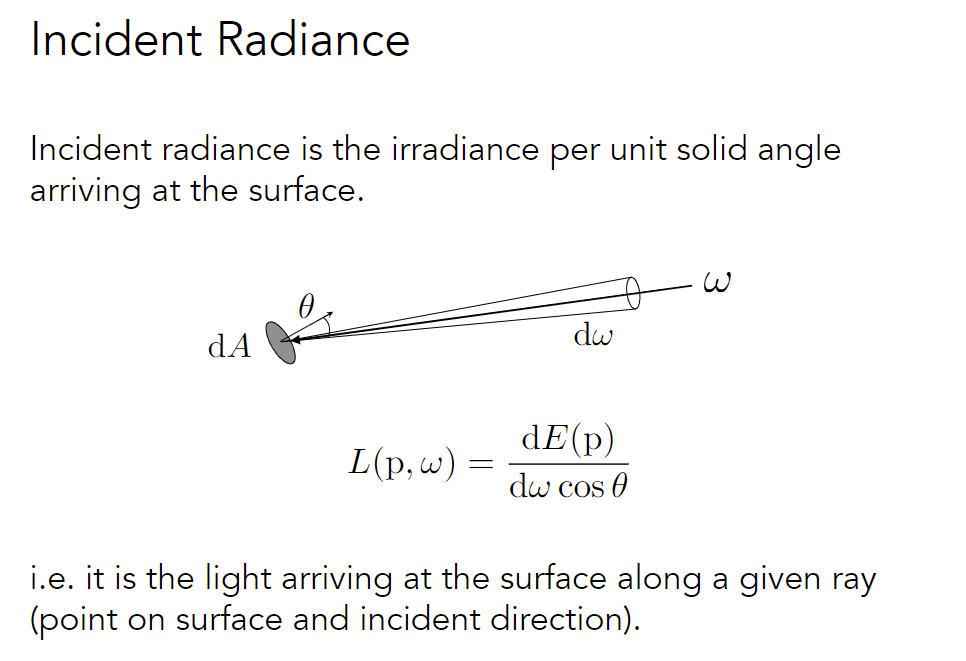

#### Irradiance vs. Radiance

Irradiance有方向性，Radiance可以是<u>双向的</u>

$\mathrm{d}E(p,\omega)$为$p$点来自$\omega$方向的Irradiance，$E(p)$为$p$点的总irradiance

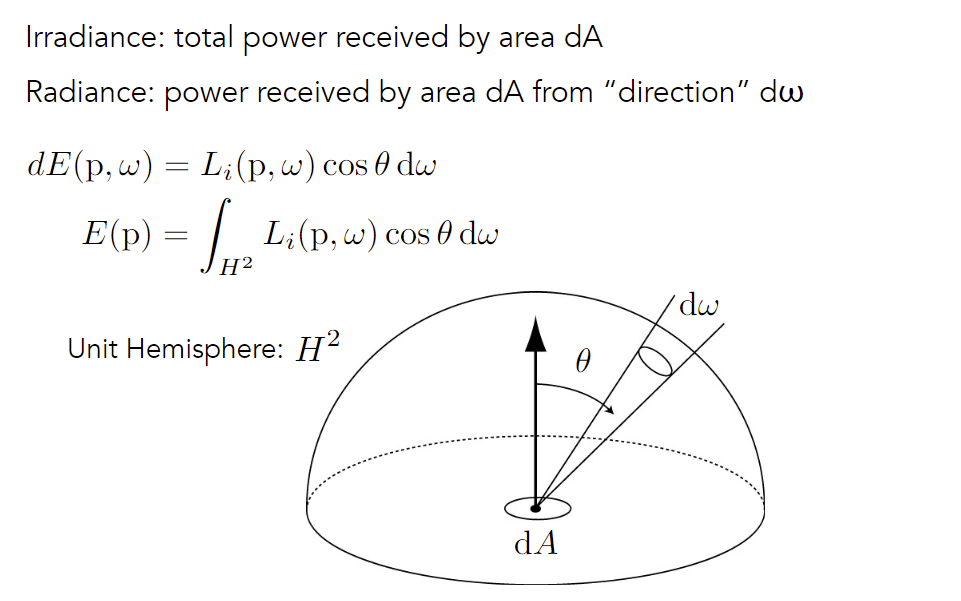

### Light transport

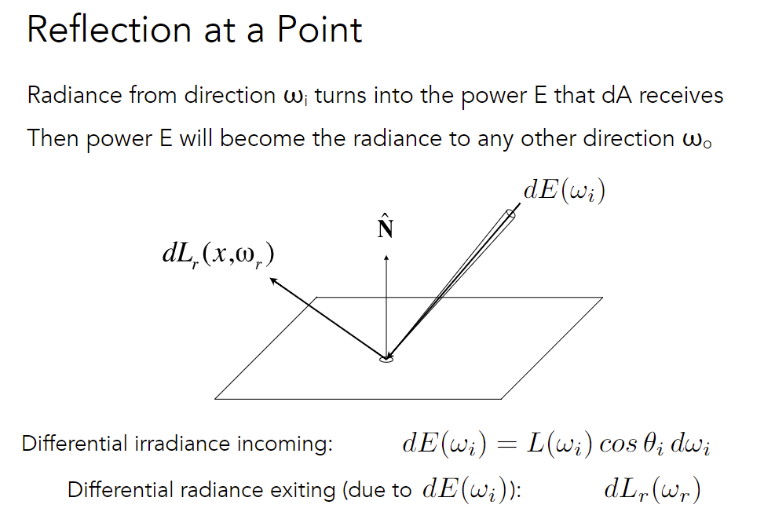

反射 = 入射光被物体吸收后再发射 (能量守恒)

入射radiance在dA转化成power，power再辐射到其它方向

考虑dA的irradiance

- incoming irradiance
  $$
  d E\left(\omega_{i}\right)=L\left(\omega_{i}\right) \cos \theta_{i} d \omega_{i}
  $$

- radiance exiting

  irradiance被转化成radiance辐射出去
  $$
  \mathrm{d} L_{r}\left(\omega_{r}\right)
  $$
  **注**：
  $$
  \mathrm{d} L_{r}\left(\omega_{r}\right)\neq L\left(\omega_{o}\right) \cos \theta_{o} d \omega_{o} \\
  \int \mathrm{d} L_{r}\left(\omega_{r}\right)= L_{r}\left(\omega_{r}\right) \\
  \int L\left(\omega_{o}\right) \cos \theta_{o} d \omega_{o}= \int L\left(\omega_{i}\right) \cos \theta_{i} d \omega_{i}
  $$
    

problem：不知道irradiance变成radiance出射的能量分布

#### Bidirectional Reflectance Distribution Function (BRDF)

定义往各个方向分配多少能量，描述光线和物体如何作用，定义不同材质

BRDF represents how much light is reflected into each outgoing direction $\omega_r$ from each incoming direction

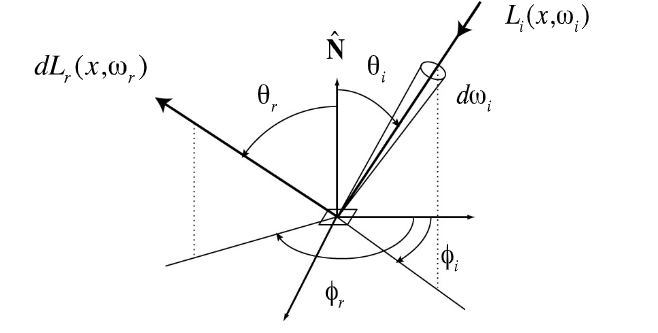
$$
f_{r}\left(\omega_{i} \rightarrow \omega_{r}\right)\equiv  \frac{\mathrm{d} L_{r}\left(\omega_{r}\right)}{\mathrm{d} E_{i}\left(\omega_{i}\right)}=\frac{\mathrm{d} L_{r}\left(\omega_{r}\right)}{L_{i}\left(\omega_{i}\right) \cos \theta_{i} \mathrm{~d} \omega_{i}}
$$

#### The Reflection Equation

固定出射方向，考虑所有方向的入射光

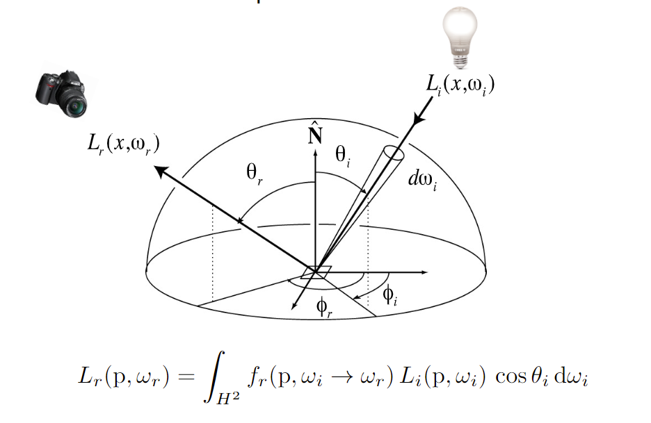

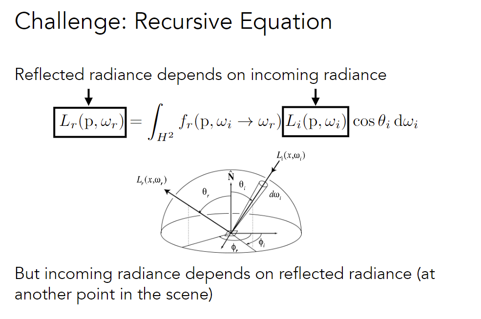

入射光可以是来自其它物体的反射光

Q：光线在某些物体循环弹射，递归死循环？

Q：不考虑循环（但是好像一定有循环），整个过程应该是始于光源的DAG？

#### The Rendering (渲染) Equation 

adding an Emission term (物体发光)

出射光 = 自己发光 + 所有根据BRDF的反射光
$$
L_{o}\left(p, \omega_{o}\right)=L_{e}\left(p, \omega_{o}\right)+\int_{\Omega^{+}} L_{i}\left(p, \omega_{i}\right) f_{r}\left(p, \omega_{i}, \omega_{o}\right)\left(n \cdot \omega_{i}\right) \mathrm{d} \omega_{i}
$$
**注**：假定所有方向向量都朝外；积分域为$\Omega^+$不考虑下面来的光

### Global illumination

#### Understanding the rendering equation

考虑所有光源

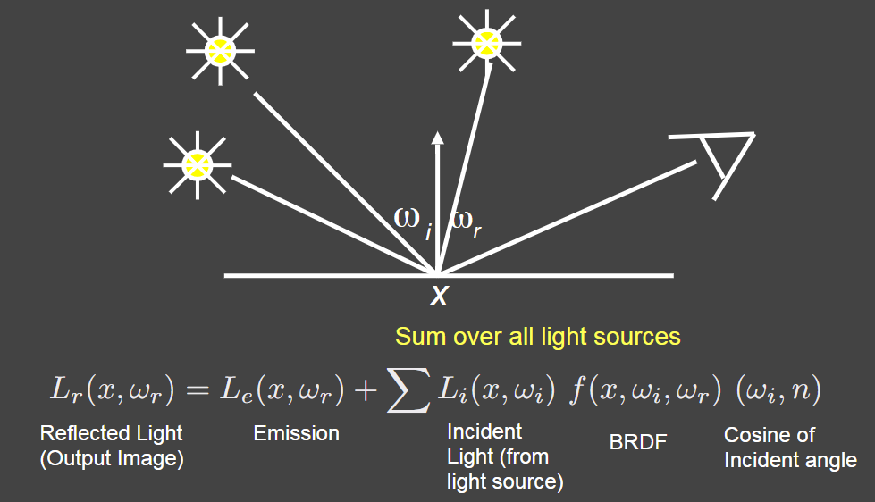

考虑面光源

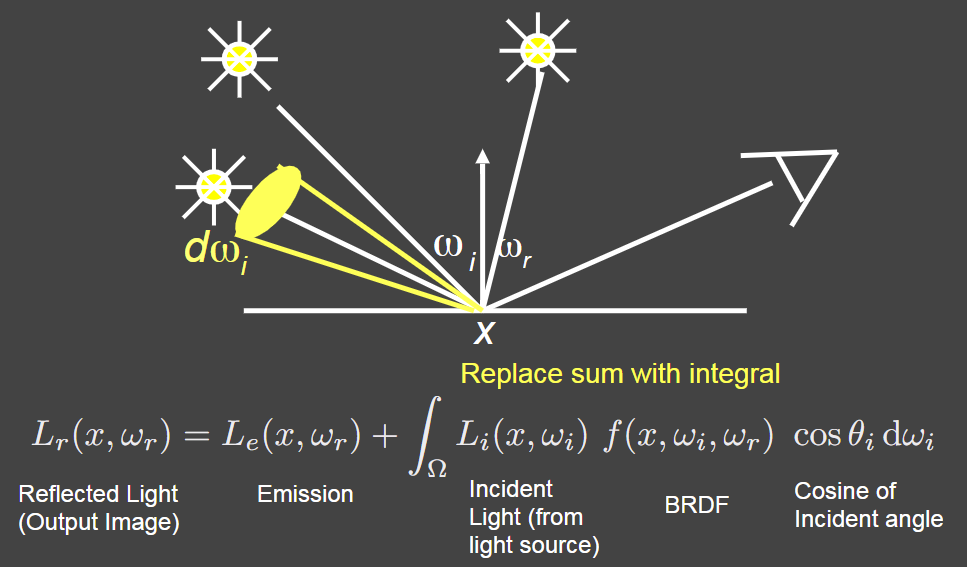

考虑其它物体的反射光（当作光源）

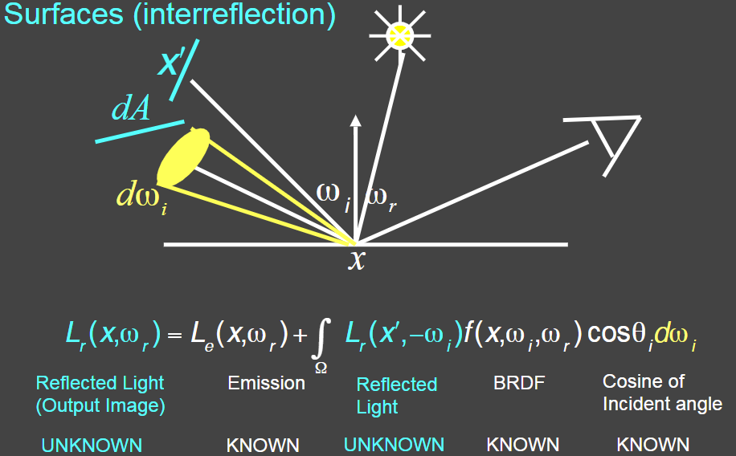

化简方程表达方式

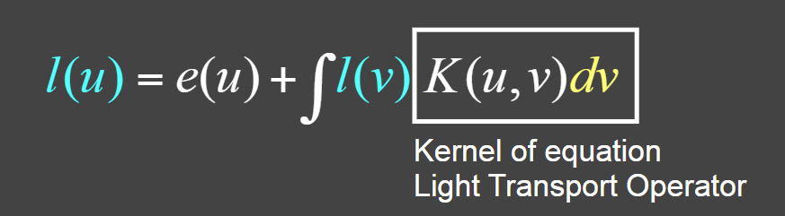

Is a Fredholm Integral Equation of second kind [extensively studied numerically] with canonical form

引入算子，~~省略大量过程~~

Can be discretized to a simple matrix equation[or system of simultaneous linear equations]
$$
L=E+KL
$$
L, E are vectors, K is the light transport matrix (反射算子)

L is set of all paths of light in scene
$$
\begin{aligned}
L&=(I-K)^{-1}E \\
&=(I+K+K^2+\cdots)E \\
L=&E+KE+K^2E+ K^3E+\cdots
\end{aligned}
$$
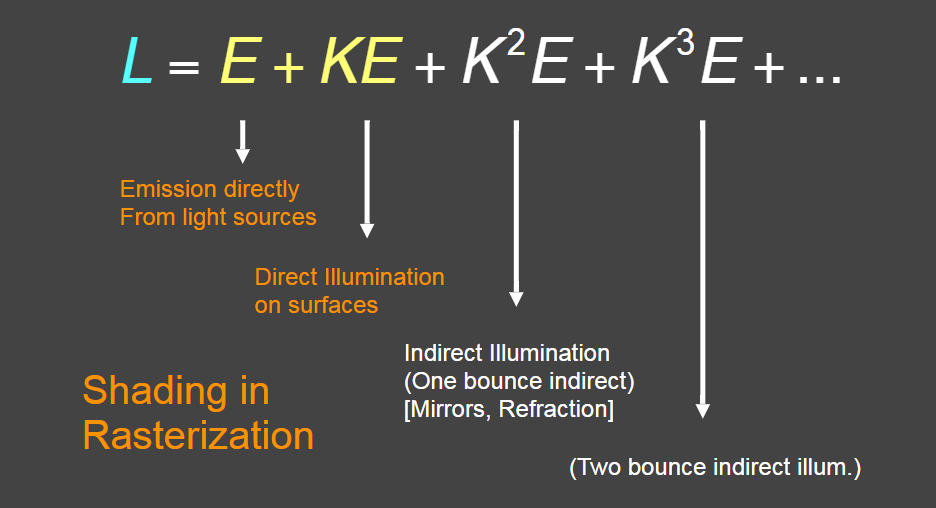

Global illumination (全局光照) = 弹射次数超过1次的光线 = $KE+K^2E+ K^3E+\cdots$

注：多次弹射后，全局光照一定会收敛

### Probability review

#### Function of a Random Variable

$$
X\sim p(x)\\
Y=f(X)
$$

$$
E[Y]=E[f(X)]=\int f(x)p(x)dx
$$

