## 光线追踪（蒙特卡洛积分与路径追踪） 

**The Rendering Equation**
$$
L_{o}\left(p, \omega_{o}\right)=L_{e}\left(p, \omega_{o}\right)+\int_{\Omega^{+}} L_{i}\left(p, \omega_{i}\right) f_{r}\left(p, \omega_{i}, \omega_{o}\right)\left(n \cdot \omega_{i}\right) \mathrm{d} \omega_{i}
$$


### Monte Carlo Integration

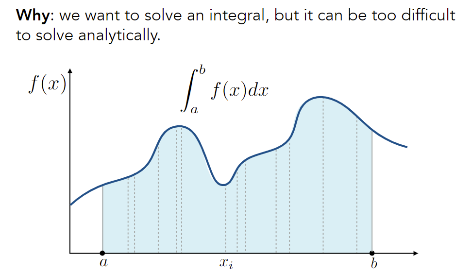

**What & How**: estimate the integral of a function by averaging random samples of the function’s value.

**Monte Carlo estimator**
$$
X_i\sim p(x) \\
F_N=\frac{1}{N}\sum\frac{f(X_i)}{p(X_i)} \longrightarrow \int f(x) \mathrm{d}x
$$
证明：
$$
E[\frac{f(X)}{p(X)}]=\int \frac{f(x)}{p(x)}\cdot p(x) \mathrm{d}x=\int f(x) \mathrm{d}x \\
\frac{1}{N}\sum\frac{f(X_i)}{p(X_i)}\longrightarrow E[\frac{f(X)}{p(X)}]
$$


### Path Tracing

Whitted-style ray tracing

- Always perform <u>specular</u> reflections / refractions 
- Stop bouncing at <u>diffuse</u> surfaces

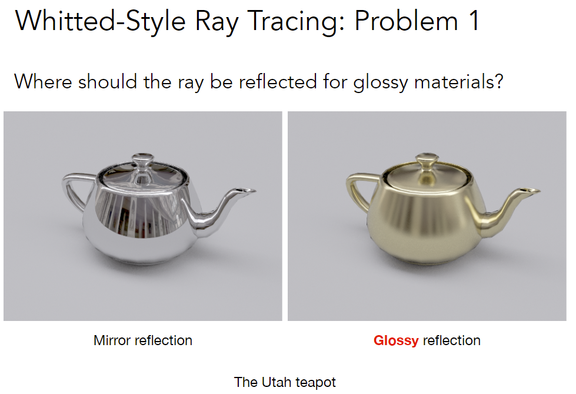

Glossy介于Mirror和Diffuse之间

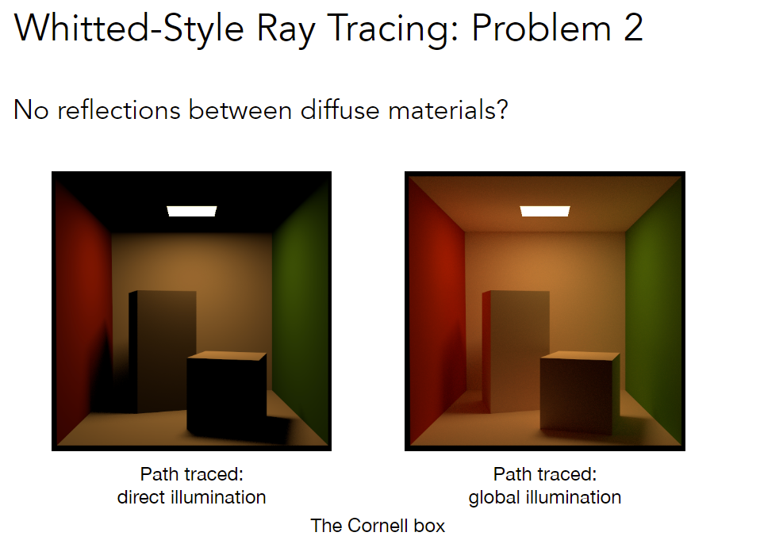

color bleeding: 光照到带颜色的物体并反射后，把该物体的颜色带到其它物体上（例如，长方体左侧变红）

Whitted-Style Ray Tracing is Wrong. But the rendering equation is correct

- Solving an integral over the hemisphere
- Recursive execution


#### A Simple Monte Carlo Solution

简单场景：计算p点的直接光照

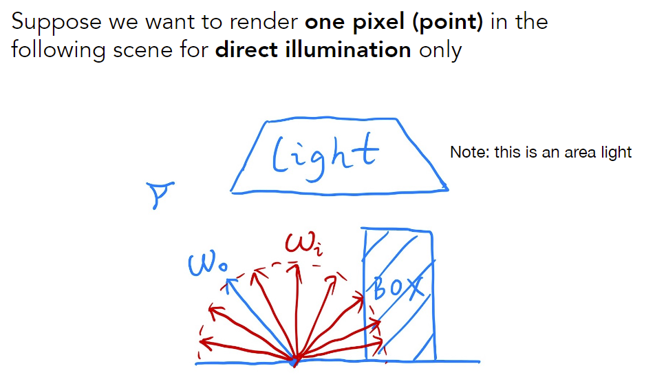

note: we assume all directions are <u>pointing outwards</u>

直接光照 = 只考虑来自光源的光线，其它方向$L=0$

just an integration over directions
$$
L_{o}\left(p, \omega_{o}\right)=\int_{\Omega^{+}} L_{i}\left(p, \omega_{i}\right) f_{r}\left(p, \omega_{i}, \omega_{o}\right)\left(n \cdot \omega_{i}\right) \mathrm{d} \omega_{i}
$$

$$
f(x)= L_{i}\left(p, \omega_{i}\right) f_{r}\left(p, \omega_{i}, \omega_{o}\right)\left(n \cdot \omega_{i}\right) \\
\text{pdf}(\omega_i)=1/2\pi
$$

assume uniformly sampling the hemisphere
$$
L_{o}\left(p, \omega_{o}\right) \approx \frac{1}{N} \sum_{i=1}^{N} \frac{L_{i}\left(p, \omega_{i}\right) f_{r}\left(p, \omega_{i}, \omega_{o}\right)\left(n \cdot \omega_{i}\right)}{\text{pdf}\left(\omega_{i}\right)}
$$
note: abuse notation a little bit for i


#### Introducing Global Illumination

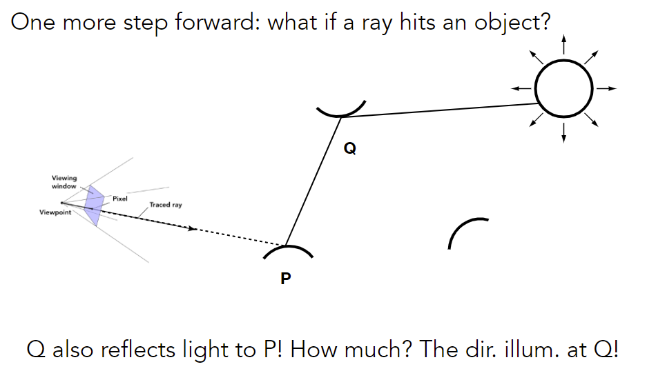

```c++
// correct but useless
shade(p, wo)
	Randomly choose N directions wi~pdf
	Lo = 0.0
	For each wi
		Trace a ray r(p, wi)
		If ray r hit the light
    		Lo += (1 / N) * L_i * f_r * cosine / pdf(wi)
   		Else If ray r hit an object at q
    		// add this, note that use -wi
    		Lo += (1 / N) * shade(q, -wi) * f_r * cosine / pdf(wi)
    Return Lo
```

##### Problem 1: Explosion of #rays as #bounces go up

**Path Tracing**

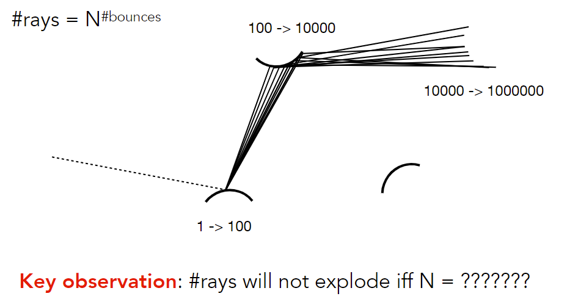

```c++
shade(p, wo)
    // only 1 ray is traced at each shading point
	Randomly choose ONE direction wi~pdf(w)
    Trace a ray r(p, wi)
    If ray r hit the light
    	Return L_i * f_r * cosine / pdf(wi)
    Else If ray r hit an object at q
    	Return shade(q, -wi) * f_r * cosine / pdf(wi)
```

This is <u>path tracing</u>! (FYI, Distributed Ray Tracing if N != 1)

But this will be noisy! 

No problem, just trace more <u>paths</u> (not more rays) through each pixel and average their radiance!

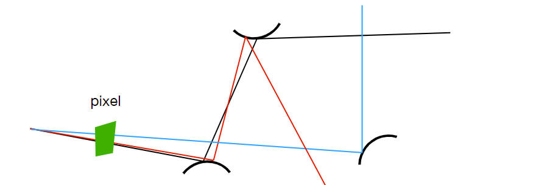

形成连接视点和光源的path

**Ray (Path) Generation**

每个pixel发出一系列光线

```c++
ray_generation(camPos, pixel)
    Uniformly choose N sample positions within the pixel
    pixel_radiance = 0.0
    For each sample in the pixel
    	Shoot a ray r(camPos, cam_to_sample)
    	// path tracing
    	If ray r hit the scene at p
    		pixel_radiance += 1 / N * shade(p, sample_to_cam)
    Return pixel_radiance
```


##### Problem 2: The recursive algorithm will never stop!

Dilemma: the light does not stop bouncing indeed!

Cutting #bounces == cutting energy!

**Russian Roulette (RR)** (俄罗斯轮盘赌)

Russian Roulette is all about probability 

- With probability 0 < P < 1, you are fine 
- With probability 1 - P, otherwise

以一定概率停止递归

Previously, we always shoot a ray at a shading point  and get the shading result **Lo**

Suppose we manually set a probability P (0 < P < 1) 

- With probability P, shoot a ray and  return the **shading result divided by P**: **Lo / P**
- With probability 1-P, don’t shoot a ray and you’ll get **0**

In this way, you can still **expect** to get Lo: E = P * (Lo / P) + (1 - P) * 0 = Lo

tradeoff: 引入噪声

```c++
shade(p, wo)
    // add RR
    Manually specify a probability P_RR
    Randomly select ksi in a uniform dist. in [0, 1]
    If (ksi > P_RR) return 0.0;

	Randomly choose ONE direction wi~pdf(w)
    Trace a ray r(p, wi)
    If ray r hit the light
        Return L_i * f_r * cosine / pdf(wi) / P_RR
    Else If ray r hit an object at q
        Return shade(q, -wi) * f_r * cosine / pdf(wi) / P_RR
```

Now we already have a <u>correct</u> version of path tracing! 

But it’s <u>not really efficient</u>. (noisy)


##### Sampling the Light (importance sampling)

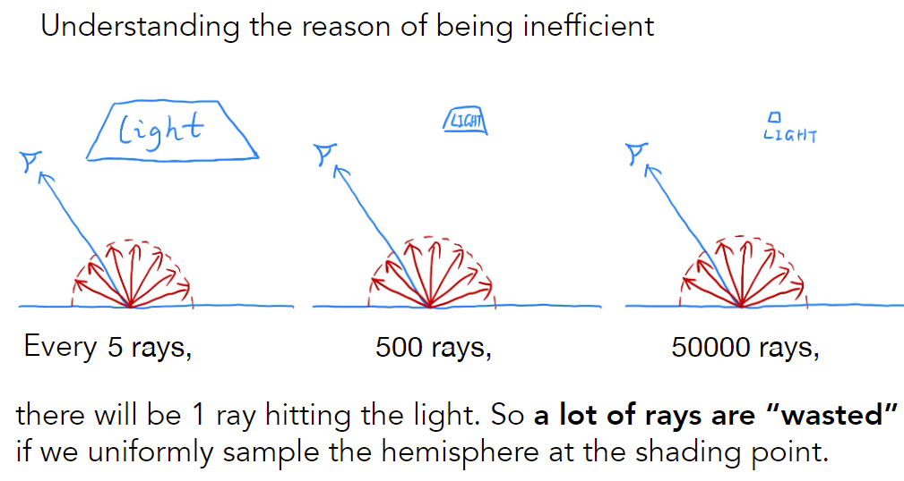

Monte Carlo methods allows any sampling methods, so  we can <u>sample the light</u> (therefore no rays are “wasted”)

以下是公式推导，场景如下图所示

Assume uniformly sampling on the light: $\text{pdf}=1/A$ (**dA**)

But the rendering equation integrates on the solid angle: $L_o=\int L_i f_r \cos d\omega$ (**dw**)

两者积分域不同，不符合MC积分要求，需要变换积分变量

Since we sample on the light, can we <u>integrate on the light</u>?

Need the <u>relationship</u> between dω and dA

Recall the alternative def. of solid angle: Projected area on the unit sphere
$$
d \omega=\frac{d A \cos \theta^{\prime}}{\left\|x^{\prime}-x\right\|^{2}}
$$
注：注意这里是$\theta ^\prime$

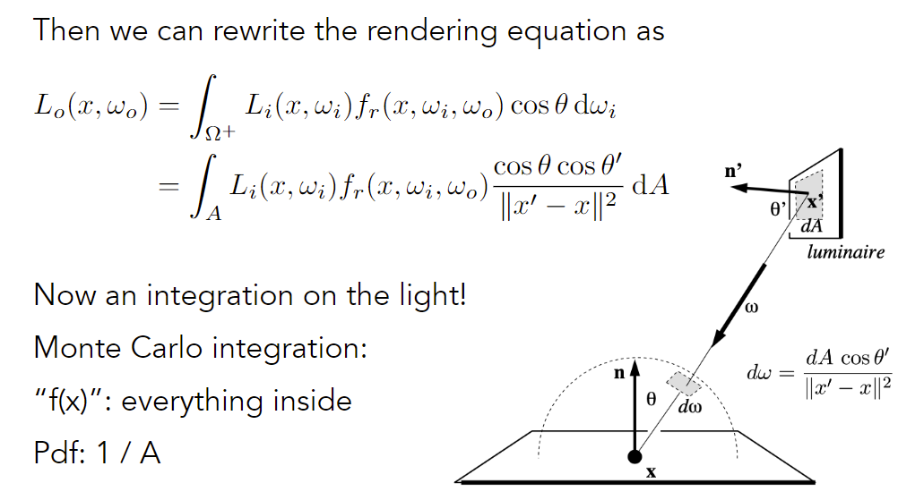

Previously, we assume the light is “accidentally” shot by uniform hemisphere sampling

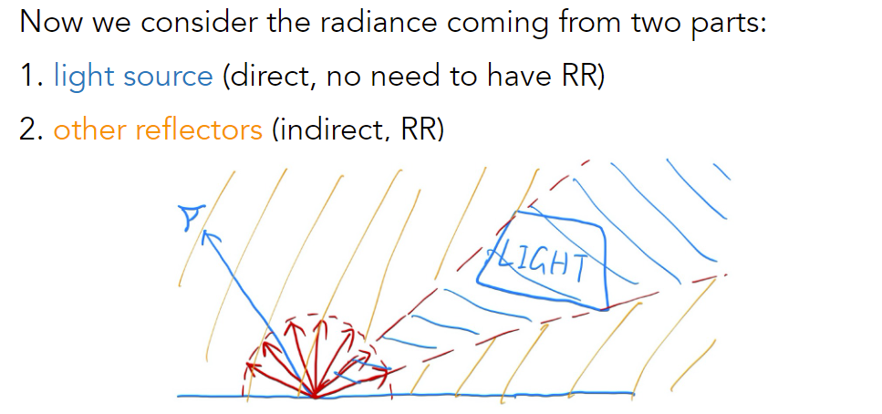

```python
shade(p, wo)
    # Contribution from the light source.
    "Uniformly" sample the light at x’ (pdf_light = 1 / A)
    L_dir = L_i * f_r * cos θ * cos θ’ / |x’ - p|^2 / pdf_light 
    
    # Contribution from other reflectors.
    L_indir = 0.0
    Test Russian Roulette with probability P_RR
    "Uniformly" sample the hemisphere toward wi (pdf_hemi = 1 / 2pi)
    Trace a ray r(p, wi)
    # NOTE: only consider non-emitting object
    #  otherwise may sample light source again
    If ray r hit a "non-emitting" object at q
    	L_indir = shade(q, -wi) * f_r * cos θ / pdf_hemi / P_RR
        
    Return L_dir + L_indir
# L_dir和L_indir分别计算直接和间接光照，两部分互不干扰
# 全局光照 = 直接光照 + 间接光照
# Q: L_dir和L_indir的收敛速度应该不一致?
```

One final thing: how do we know if the sample on the light is not blocked or not?

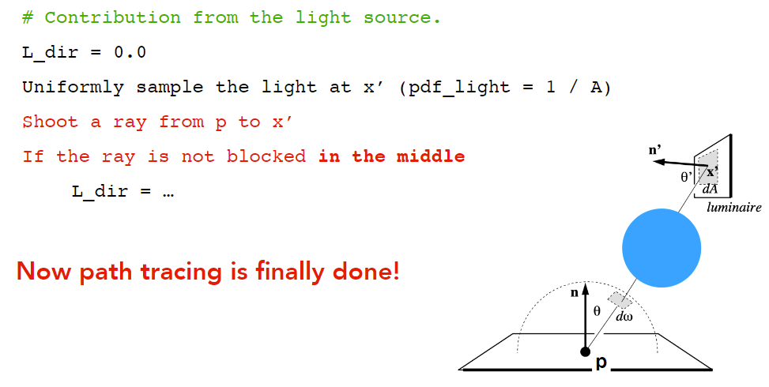

注：很难处理点光源（近似成小面积光源）


### Some Side Notes

Path tracing (PT) is indeed difficult 

- Consider it the most challenging in undergrad CS 
- Why: physics, probability, calculus, coding 
- Learning PT will help you understand deeper in these

PHOTO-REALISTIC (照片级真实感)

#### Ray tracing: Previous vs. Modern Concepts

Previous 

- Ray tracing == Whitted-style ray tracing

Modern 

- The <u>general solution of light transport</u>, including
- (Unidirectional & bidirectional) path tracing 
- Photon mapping 
- Metropolis light transport 
- VCM / UPBP... 

如何生成一张图：光栅化/光线追踪

#### Further Topic

Things we haven’t covered / won’t cover

- Uniformly sampling the hemisphere 

  How? And in general, how to sample any function?  (sampling) 

  MCMC makes it!

- Monte Carlo integration allows arbitrary pdfs 

  What's the best choice? (importance sampling) 

- Do random numbers matter?  

  Yes! (low discrepancy sequences)

- I can sample the hemisphere and the light 

  Can I combine them? Yes! (multiple importance sampling) 

- The radiance of a pixel is the average of radiance on all  paths passing through it 

  Why? (pixel reconstruction filter) 

- Is the radiance of a pixel the color of a pixel? 

  No. (gamma correction, curves, color space) 

- Asking again, is path tracing still “Introductory”? 

  > This time, yes. Fear the science, my friends.		Prof. Yan.

