## 材质与外观

外观是光线和材质共同作用的结果

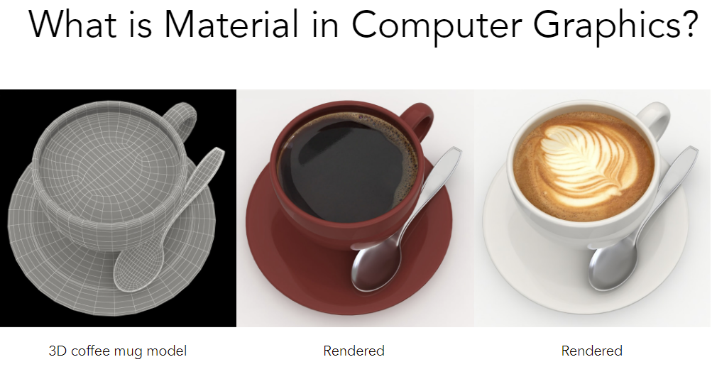

### Material == BRDF

#### Diffuse / Lambertian Material

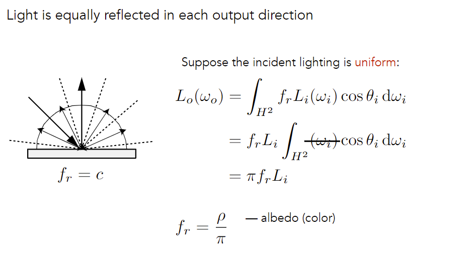

- diffuse material的BRDF是常数，均匀出射

- 假设入射光的radiance一样 (uniform)

  利用能量守恒：如果点不发光也不吸收，入射irradiance = 出射irradiance，那么 (最大值)
  $$
  f_r=\frac{1}{\pi}
  $$

- albedo为反射率

#### Glossy material

抛光金属，比镜子粗糙一点

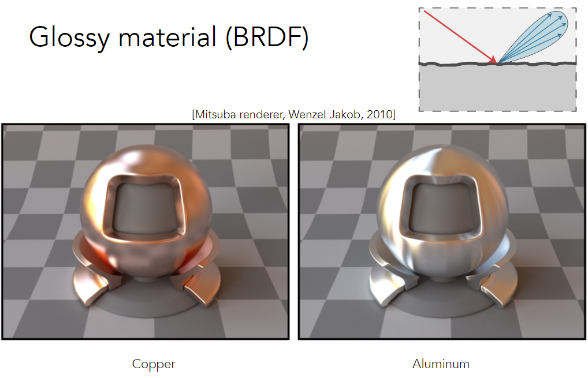

#### Ideal reflective / refractive material

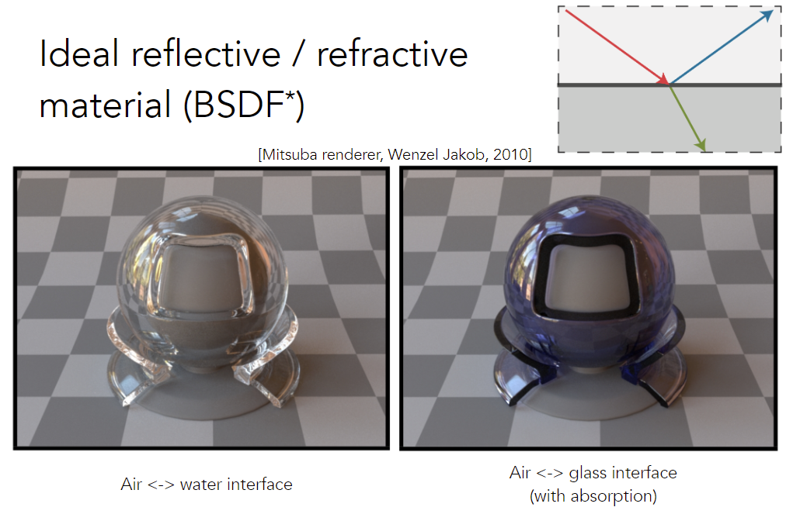

glass with absorption: 折射光部分被吸收，显示出内部颜色

**反射**

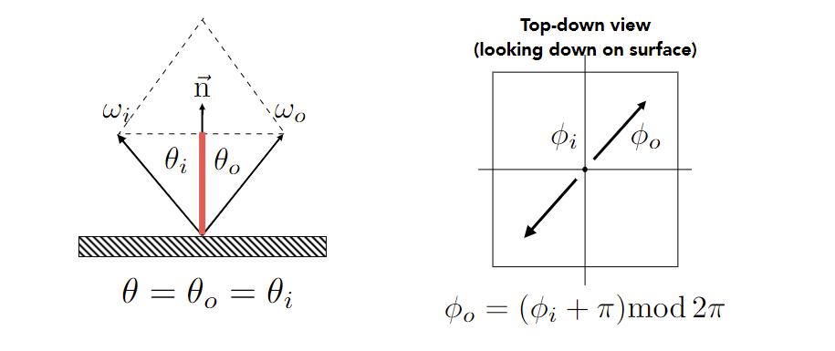
$$
\begin{aligned}
&\omega_{o}+\omega_{i}=2 \cos \theta \vec{n}=2\left(\omega_{i} \cdot \vec{n}\right) \vec{n} \\
&\omega_{o}=-\omega_{i}+2\left(\omega_{i} \cdot \vec{n}\right) \vec{n}
\end{aligned}
$$
Top-down view: 从法线上方向下看，入射光和反射光方位角相反

**注**：理想反射的BRDF很复杂（出射方向过于集中）

**折射**

仍采用几何光学描述折射

Caustics: 折射后聚集到同一点

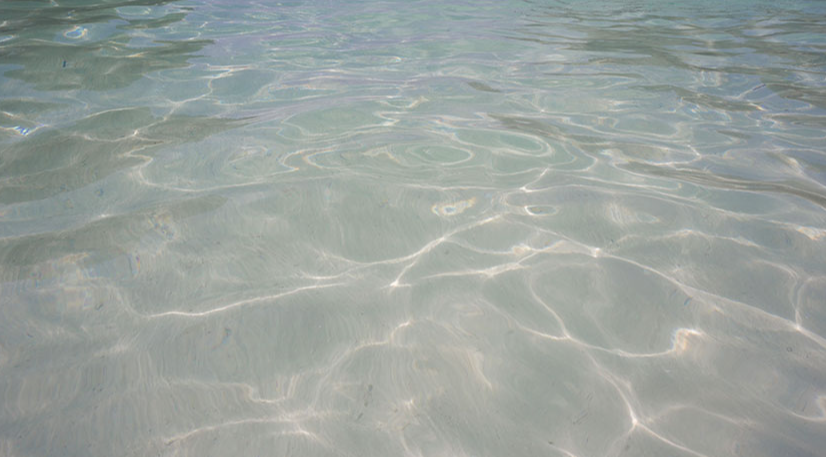

**Snell’s Law**

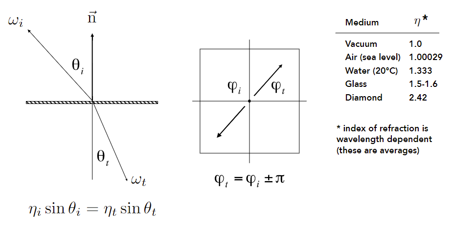

全反射：$\eta_i>\eta_t$时可能发生（光密射到光疏）

Snell’s Window / Circle

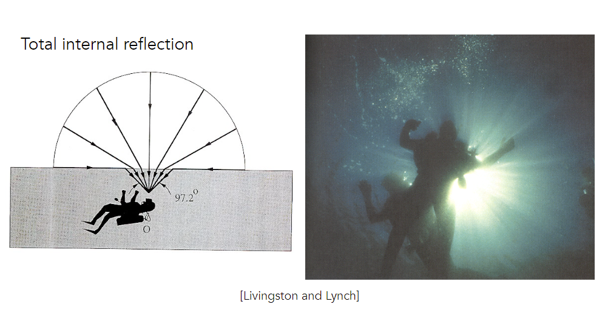

**注**：BT(transmit)DF + BRDF = BS(scatter)DF

**Fresnel Reflection / Term**（菲涅耳项）

描述反射和折射能量分配情况

例如，垂直看车窗可以看到窗外，斜着看车窗大概率看到车内反射

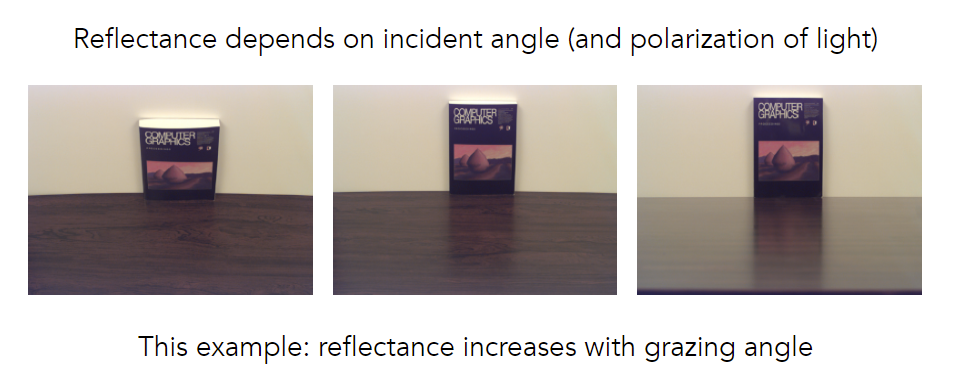

导体和绝缘体菲涅耳项不同

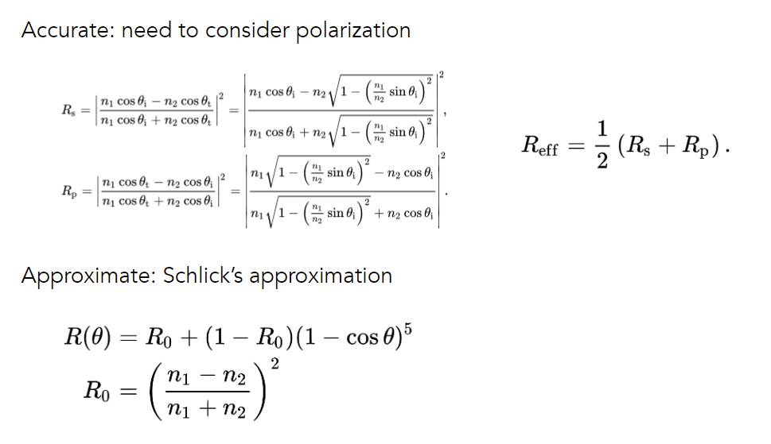

注：$R(0)=R_0,R(\pi/2)=1$

#### Microfacet (微表面) Material

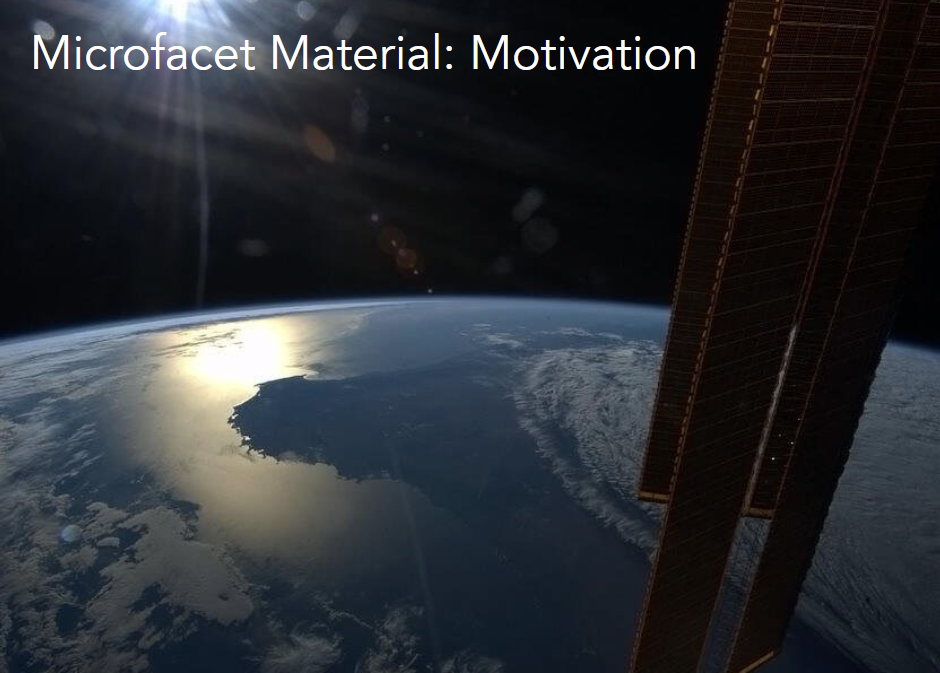

Q：地球表面是粗糙的，如何产生图中的高光？

离得足够远时，不关心表面具体情况，只能看到总体效应


**Microfacet Theory**

远处看到材质，近处看到几何

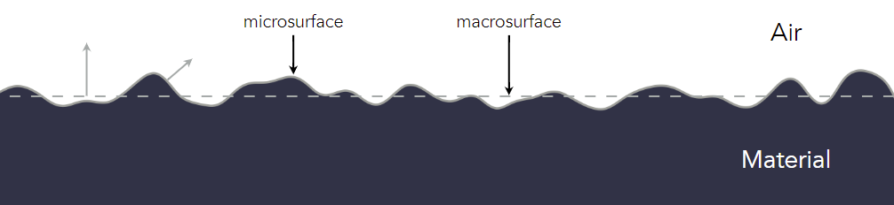

Rough surface  

- Macroscale (远处): flat & rough 
- Microscale (近处): bumpy & <u>specular</u>

Individual elements of surface act like <u>mirrors</u>

- Known as Microfacets 
- Each microfacet has its own normal

Key: the **distribution** of microfacets’ normals

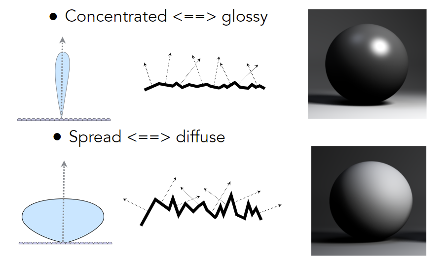

**Microfacet BRDF**

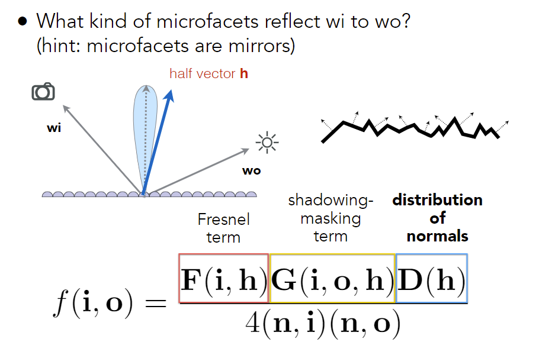

- $D(\vec h)$：只有微表面$\vec n=\vec h$时，才能把入射光反射到出射光

- $G$：微表面互相遮挡

  光线平行表面时容易发生遮挡

#### Isotropic / Anisotropic Materials (BRDFs)

Key: <u>directionality</u> of underlying surface

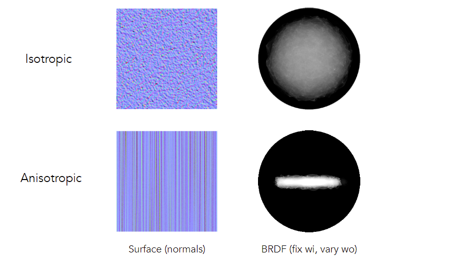

**Anisotropic (各向异性) BRDFs**

Reflection depends on azimuthal angle $\phi$ (方位角)
$$
f_{r}\left(\theta_{i}, \phi_{i} ; \theta_{r}, \phi_{r}\right) \neq f_{r}\left(\theta_{i}, \theta_{r}, \phi_{r}-\phi_{i}\right)
$$
Results from oriented microstructure of surface, e.g., brushed metal, Nylon, Velvet


### Properties of BRDFs

- Non-negativity
  $$
  f_{r}\left(\omega_{i} \rightarrow \omega_{r}\right) \geq 0
  $$

- Linearity (可加性)
  $$
  L_{r}\left(\mathrm{p}, \omega_{r}\right)=\int_{H^{2}} f_{r}\left(\mathrm{p}, \omega_{i} \rightarrow \omega_{r}\right) L_{i}\left(\mathrm{p}, \omega_{i}\right) \cos \theta_{i} \mathrm{~d} \omega_{i}
  $$

- Reciprocity principle (可逆性)
  $$
  f_{r}\left(\omega_{r} \rightarrow \omega_{i}\right)=f_{r}\left(\omega_{i} \rightarrow \omega_{r}\right)
  $$

- Energy conservation (能量守恒)
  $$
  \forall \omega_{r} \int_{H^{2}} f_{r}\left(\omega_{i} \rightarrow \omega_{r}\right) \cos \theta_{i} \mathrm{~d} \omega_{i} \leq 1
  $$

- Isotropic vs. anisotropic
  - If isotropic,
    $$
    f_{r}\left(\theta_{i}, \phi_{i} ; \theta_{r}, \phi_{r}\right)=f_{r}\left(\theta_{i}, \theta_{r}, \phi_{r}-\phi_{i}\right)
    $$
    Then, from reciprocity,
    $$
    f_{r}\left(\theta_{i}, \theta_{r}, \phi_{r}-\phi_{i}\right)=f_{r}\left(\theta_{r}, \theta_{i}, \phi_{i}-\phi_{r}\right)=f_{r}\left(\theta_{i}, \theta_{r},\left|\phi_{r}-\phi_{i}\right|\right)
    $$


### Measuring BRDFs

Avoid need to develop / derive models 

- Automatically includes all of the scattering effects present 

Can accurately render with real-world materials 

- Useful for product design, special effects, ...

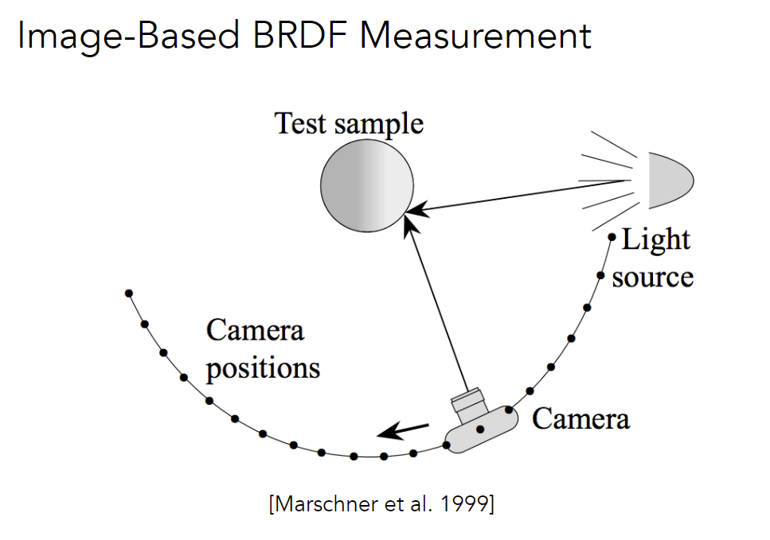

Measuring BRDFs: gonioreflectometer

General approach:

```python
foreach outgoing direction wo    
	move light to illuminate surface with a thin beam from wo    
    for each incoming direction wi        
    	move sensor to be at direction wi from surface        
        measure incident radiance
```

Improving efficiency: 

- Isotropic surfaces reduce dimensionality from 4D to 3D 
- Reciprocity reduces # of measurements by half 
- Clever optical systems... (e.g. 插值)

Challenges in Measuring BRDFs

- Accurate measurements at grazing angles 

  Important due to Fresnel effects 

- Measuring with dense enough sampling to capture high frequency specularities 
- Retro-reflection 
- Spatially-varying reflectance, ...

Representing Measured BRDFs (如何存储)

Desirable qualities 

- Compact representation 
- Accurate representation of measured data 
- Efficient evaluation for arbitrary pairs of directions 
- Good distributions available for importance sampling

BRDF库：MERL BRDF Database

