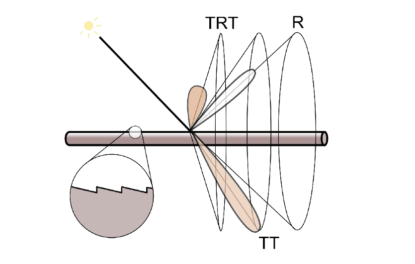

## 高级光线传播与复杂外观建模

**注**：课件里包含大量示意图和不同方法结果的可视化比较

### Advanced Light Transport

- Unbiased light transport methods 
  - Bidirectional path tracing (BDPT) 
  - Metropolis light transport (MLT) 
- Biased light transport methods 
  - Photon mapping 
  - Vertex connection and merging (VCM) 
- Instant radiosity (VPL / many light methods)

#### Biased vs. Unbiased Monte Carlo Estimators

- unbiased

  The expected value of an unbiased estimator will always be the correct value

- biased

  One special case, the expected value converges to the correct value as infinite #samples are used — <u>consistent</u>

#### Bidirectional Path Tracing (BDPT)

- Suitable if the <u>light transport is complex</u> on the light’s side (类比双向搜索)
- Difficult to implement & quite slow

#### Metropolis Light Transport (MLT)

A Markov Chain Monte Carlo (MCMC) application 

- Jumping from the current sample to the next  with some PDF

Very good at <u>locally</u> (局部) exploring difficult light paths 

**Key idea**: Locally perturb an existing path to get a new path

- Pros

  - Works great with <u>difficult</u> light paths 

    找到一条path作为初始sample，不断找到更多

    Caustics：specular + diffuse + specular 形成困难路径

  - Also unbiased

- Cons

  - Difficult to estimate the convergence rate 
  - Does not guarantee equal convergence rate per pixel (since explore locally)
  - So, usually produces “dirty” results 
  - Therefore, usually not used to render animations

#### Photon Mapping

- A biased approach & A two-stage method 
- Very good at handling Specular-Diffuse-Specular (SDS) paths and generating <u>caustics</u>

Approach (variations apply)

1. photon tracing 

   Emitting photons from the light source, bouncing them around, then recording (stop) photons on <u>diffuse</u> surfaces

2. photon collection (final gathering) 

   Shoot sub-paths from the camera, bouncing them around, until they hit <u>diffuse</u> surfaces

Calculation — <u>local density estimation</u> 

- Idea: areas with more photons should be brighter 
- For each shading point, find the <u>nearest</u> N photons. Take the surface area they over

An easier understanding bias in rendering 

- Biased == blurry 
- Consistent == not blurry with infinite #samples

Why not do a “const range” search for density estimation?

- 结果有偏，且不一致；光子越多越亮

#### Vertex Connection and Merging

A combination of BDPT and Photon Mapping 

**Key idea** 

- Let’s not waste the sub-paths in BDPT if their end points cannot be connected but can be merged 
- Use photon mapping to handle the merging of nearby “photons”

#### Instant Radiosity (IR)

Sometimes also called <u>many-light</u> approaches 

**Key idea**

- Lit surfaces can be treated as light sources 

Approach 

- Shoot light sub-paths and assume the end point of each sub-path is a <u>Virtual Point Light</u> (VPL) 
- Render the scene as usual using these VPLs

Pros

- fast and usually gives good results on diffuse scenes 

Cons 

- Spikes will emerge when VPLs are close to shading points

  distance作为分母，出现精度问题

- Cannot handle glossy materials

### Advanced Appearance Modeling

- Non-surface models 
  - Participating media 
  - Hair / fur / fiber (BCSDF) 
  - Granular material 
- Surface models 
  - Translucent material (BSSRDF) 
  - Cloth 
  - Detailed material (non-statistical BRDF) 
- Procedural appearance

#### Participating Media

e.g., Fog, Cloud

注：很多介质都可以不同程度地透光

**Phase Function**

Rendering

- Randomly choose a direction to bounce 
- Randomly choose a distance to go straight 
- At each ‘shading point’, connect to the light

#### Hair Appearance

光线和曲线作用

无色高光 + 有色高光 （分别为左右两边所示）

**Kajiya-Kay Model**

- 圆锥specular + diffuse 

**Marschner Model**

- 直接反射 (R) + 穿入头发 (T)

  TT: 穿透两次出去

  TRT: 穿透后在内壁反射后返回

#### Fur Appearance

Hair/Fur contains

- Cortex: Absorbs light
- Medulla: Scatters light
- Cuticle: Covered with scales

但动物的Medulla比较大

#### Granular Material

e.g., sand, rice

#### Translucent Material

e.g. 玉石

光线可以从不同的地方离开

**Scattering Functions**

BSSRDF: generalization of BRDF; exitant radiance at one point due to incident differential irradiance <u>at another point</u>:
$$
S\left(x_{i}, \omega_{i}, x_{o}, \omega_{o}\right)
$$
Generalization of rendering equation: integrating <u>over all points</u> on the surface and all directions (!)
$$
L\left(x_{o}, \omega_{o}\right)=\int_{A} \int_{H^{2}} S\left(x_{i}, \omega_{i}, x_{o}, \omega_{o}\right) L_{i}\left(x_{i}, \omega_{i}\right) \cos \theta_{i} \mathrm{~d} \omega_{i} \mathrm{~d} A
$$

**Dipole Approximation**

Approximate light diffusion by <u>introducing two point sources</u>

**Application**: 皮肤 [link](https://cgelves.com/10-most-realistic-human-3d-models-that-will-wow-you/?v=1c2903397d88)

#### Cloth

A collection of twisted fibers!

**Render as Surface**

表面模型非常复杂，考虑overall情况

**Render as Participating Media**

认为是空间分布的体积，划分成有不同参数的微小体积

Properties of individual fibers & their distribution -> scattering parameters

**Render as Actual Fibers**

Render every fiber explicitly! (类似hair)

#### Detailed material (non-statistical BRDF)

render结果过于完美，没有划痕

Real world is more complicated

**Statistical NDF vs. Actual NDF**

Statistical NDF 过于完美

使用法线贴图来定义Actual NDF

But For Rendering? Too difficult!

problem: 认为微表面是镜面

考虑被像素覆盖微表面范围的$\mathcal{P}-\text{NDF}$，替代原来的光滑分布

problem: 尺度太小，需要引入波动光学

BRDF会受到干涉影响，不连续

#### Procedural Appearance (程序生成)

Can we define details without textures? 

Yes! <u>Define a noise function</u> on the fly. (e.g. Perlin Noise)

- 3D noise ->  internal structure
- Thresholding (noise -> binary noise)
- Complex noise functions can be very powerful.

