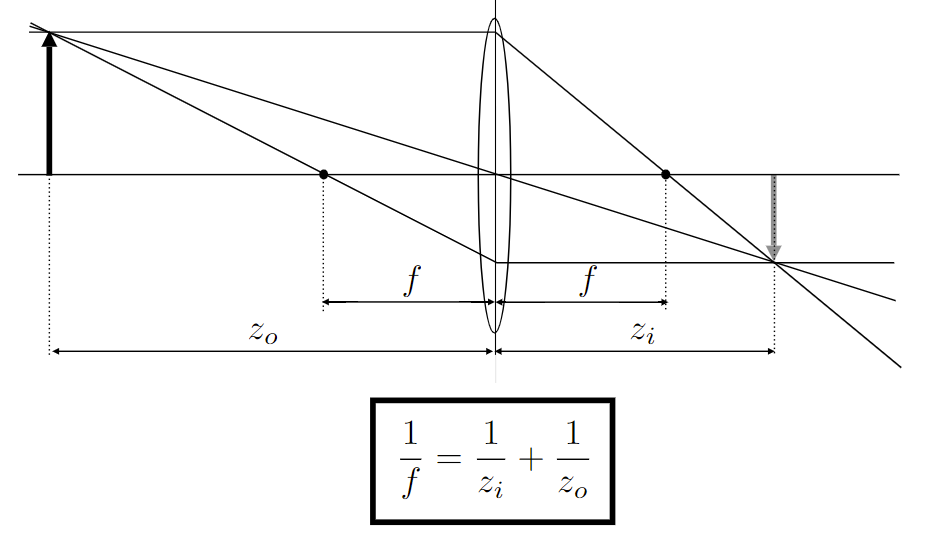
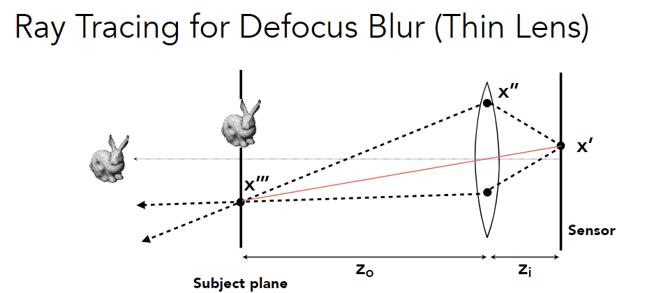

## 相机与透镜

### 相机

Imaging = Synthesis + Capture

What’s Happening Inside the Camera?

1. Pinholes (小孔) & Lenses (透镜) Form Image on Sensor

2. Shutter (快门) Exposes Sensor For Precise Duration (控制进光时间)

3. Sensor Accumulates Irradiance During Exposure

Why Not Sensors Without Lenses?

#### Pinhole Image Formation

小孔成像

注：Pinhole的结果没有深度，不会有景深

#### Field of View (FOV) (视场)

观测范围

**Focal Length (焦距)**

For historical reasons, it is common to refer to angular field of view by focal length of a lens used on a 35mm-format film (36 x 24mm) 

Maintain FOV on Smaller Sensor: decrease focal length of lens

#### Exposure (曝光度)

H = T x E  (总能量)

Exposure = time x irradiance 

- Exposure time (T) 

  Controlled by shutter  

- Irradiance (E) 

  Power of light falling on a unit area of sensor 

  Controlled by lens aperture (光圈) and focal length

**Exposure Controls in Photography**

Aperture size (类似瞳孔)

- Change the f-stop by opening / closing the aperture (if camera has iris control) 

Shutter speed 

- Change the duration the sensor pixels integrate light 

ISO gain (感光度)

- Change the <u>amplification</u> (analog and/or digital) between sensor values and digital image values

##### ISO (Gain)

也会放大噪声

Film: trade sensitivity for grain  

Digital: trade sensitivity for noise 

- Multiply signal before analog-to-digital conversion 
- Linear effect (ISO 200 needs half the light as ISO 100) 

##### F-Number (F-Stop): Exposure Levels

Written as FN or F/N. N is the f-number. 

Informal understanding: the inverse-diameter of a round aperture

##### Shutter Speed

控制进光时间

Side Effect of Shutter Speed

- <u>Motion blur</u> 

  Note: motion blur is not always bad! (think about anti-aliasing, 时间采样)

- Rolling shutter

  相对于超高速物体，快门打开过程有一定时间

  different parts of photo taken at different times

  

Constant Exposure: F-Stop vs Shutter Speed 

Photographers must trade off <u>depth of field</u> (景深, 大光圈引起) and <u>motion blur</u> for moving subjects

**Fast and Slow Photography**

Normal exposure =  extremely fast shutter speed x (large aperture and/or high ISO)

- High-Speed Photography
- Long-Exposure Photography (延时摄影)

### 透镜

- Real Lens Designs Are Highly Complex

- Real Lens Elements Are Not Ideal – Aberrations

  

  Real plano-convex lens (spherical surface shape). 

  Lens does not converge rays to a point anywhere

  

#### Thin Lens Approximation

Ideal Thin Lens (不考虑厚度)

1. All parallel rays entering a lens pass through its focal point. (Parallel Ray)
2. All rays through a focal point will be in parallel after passing the lens. (Focal Ray)
3. Focal length can be arbitrarily changed (in reality, yes! 棱镜组).

#### The Thin Lens Equation

平行光过焦点，穿过中心的光 (Chief Ray) 不改变方向

证明：

##### Defocus Blur 

造成景深

Computing Circle of Confusion (**CoC**) Size

- 假设focal plane经过透镜被聚焦到sensor plane

- 若物体在focal plane之外，聚焦的image会在sensor plane之前，

  光线继续传播到sensor plane变成圆 (CoC), 造成confusion

- A越大，CoC越大，景深越严重

Revisiting F-Number (a.k.a. F-Stop)

Formal definition: The f-number of a lens is defined as <u>the focal length divided by the diameter of the aperture</u>
$$
N=f/D
$$

$$
C=A \frac{\left|z_{s}-z_{i}\right|}{z_{i}}=\frac{f}{N} \frac{\left|z_{s}-z_{i}\right|}{z_{i}}
$$

##### Ray Tracing Ideal Thin Lenses

之前提到的RT假设相机是小孔，无法形成景深

(One possible) Setup: 

- Choose sensor size (成像平面), lens focal length and aperture size 

- Choose depth of subject of interest z~o~ (拍摄平面)

  Calculate corresponding depth of sensor z~i~ from thin lens equation

Rendering: 

- For each pixel <u>x’</u> on the sensor (actually, film (胶片)) 

- Sample random points <u>x’’</u> on lens plane 

- You know the ray passing through the lens will hit <u>x’’’</u>  

  because x’’’ is in focus, consider virtual ray (x’, center of the lens)) (考虑红色直线与其下方的黑色虚线)

- Estimate radiance on ray <u>x’’ -> x’’‘</u>

##### Depth of Field

景深：画面中景象清晰的深度范围

focal plane的物体不模糊，光圈影响模糊的范围

- 景象清晰 = CoC在focal plane附件足够小 (pixel有大小)

  求解这些CoC对应的区域

