## 光场、颜色与感知

### Light Field / Lumigraph (光场)

What do we see? 看到各个方向的光线

如果有Painted backdrop可以完美记录这些信息，看Painted backdrop和真实看到的景象一样 (虚拟现实)

#### The Plenoptic Function (全光函数)

Q: What is the set of all things that we can ever see?

A: The Plenoptic Function (Adelson & Bergen)

**Grayscale snapshot**: $P(\theta,\phi)$

intensity of light

- Seen from a single view point
- At a single time
- average on wavelength

**Color snapshot**: $P(\theta,\phi,\lambda)$

- As a function of wavelength

**Movie**: $P(\theta,\phi,\lambda,t)$

- 在时间$t$，看向$\theta,\phi$方向，看到的波长(颜色)为$\lambda$的光的强度

**Holographic movie** (全息电影): $P\left(\theta, \phi, \lambda, t, V_{X}, V_{Y}, V_{Z}\right)$

- Seen from ANY viewpoint

**The Plenoptic Function**
$$
P\left(\theta, \phi, \lambda, t, V_{X}, V_{Y}, V_{Z}\right)
$$

- Can reconstruct every possible view, at every moment, from every position, at every wavelength
- Contains every photograph, every movie, everything that anyone has ever seen! it completely captures our visual reality!
- <u>This is what we see!</u>

#### Light Field / Lumigraph (光场)

**Ray** = 2D direction + 2D position

Q：如何记录物体？

Only need plenoptic surface 

记录任何位置往外部不同方向投射的光线强度 (即部分全光函数) (4D)

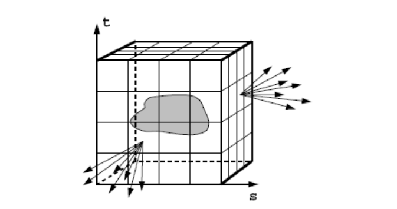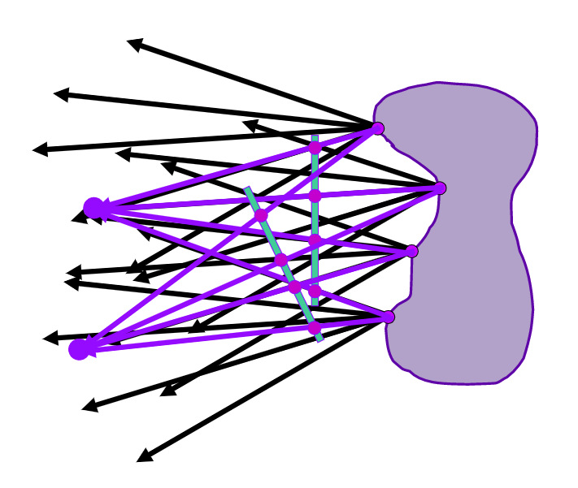

可以得到任意位置看到物体的结果

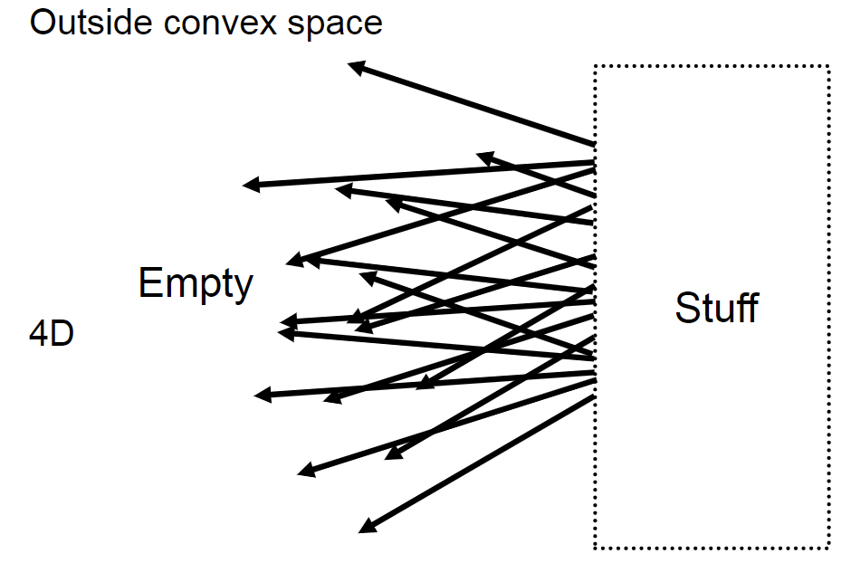

Q：如何记录光场？

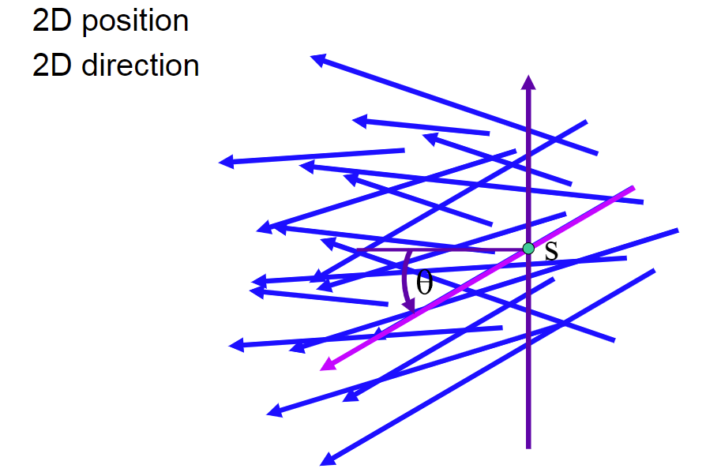

取一个平面，对于平面任意点记录经过的光线方向

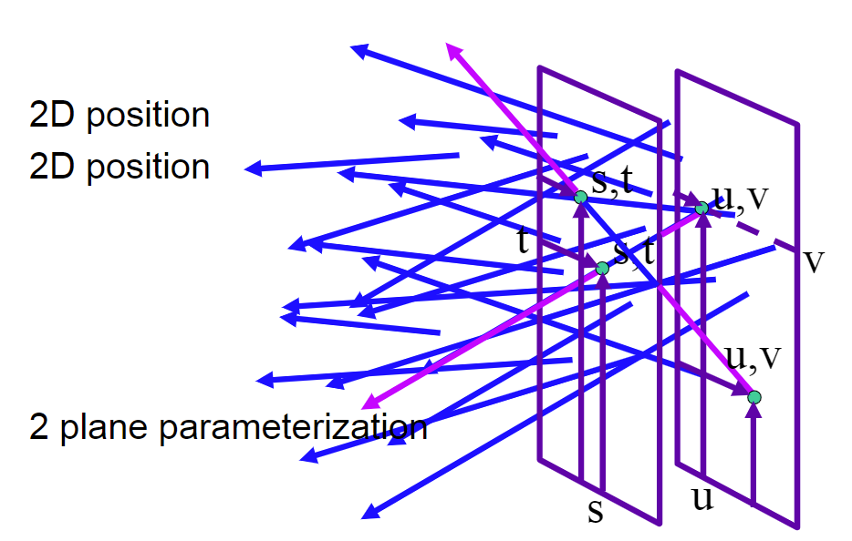

光场 = 2个平面 + $\{(u,v,s,t)\}$

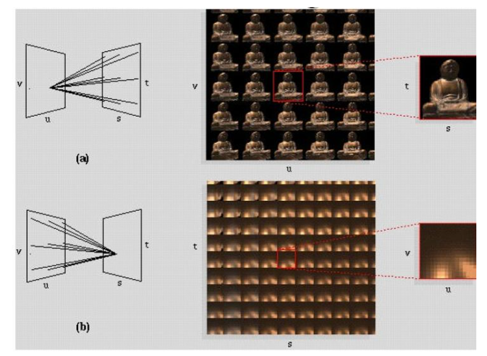

- hold u,v

  不同角度的图像

- hold s,t

  irradiance展开成radiance，打到某个点上不同方向的光

  **Light Field Camera原理**

  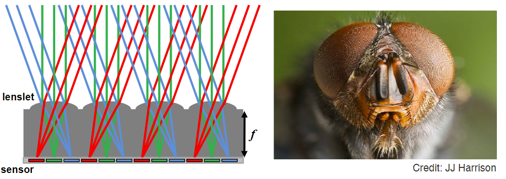

  普通相机在图中Lenslets的位置直接用sensor记录光线，得到平均结果（irradiance）

  而 Lenslets (小透镜) 可以把光线分开，在底下的sensor分别记录（radiance）

  **注**：Light Field Camera没有普通相机的Lens

  

#### Light Field Camera

**注**：Light Field Camera没有普通相机的Lens

Microlens design

Most significant function 

- <u>Computational Refocusing</u> 

  (virtually changing focal length & aperture  size, etc. <u>after taking the photo</u>)

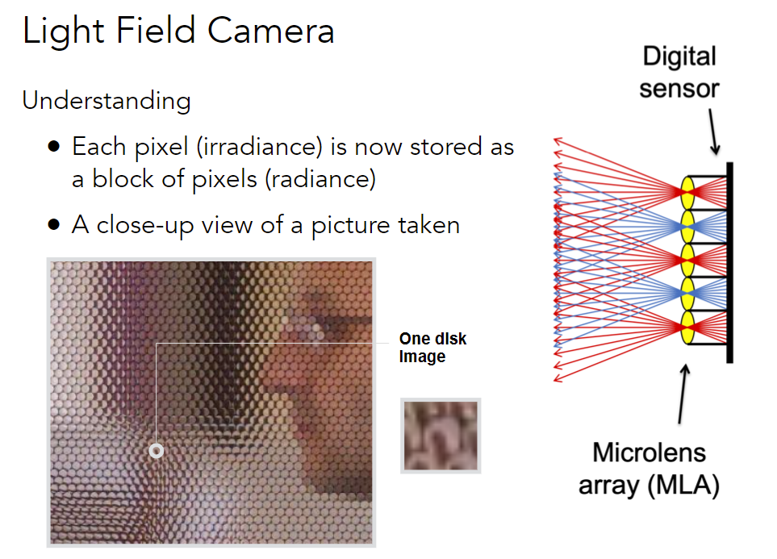

Q: How to get a “regular” photo from the light field photo?

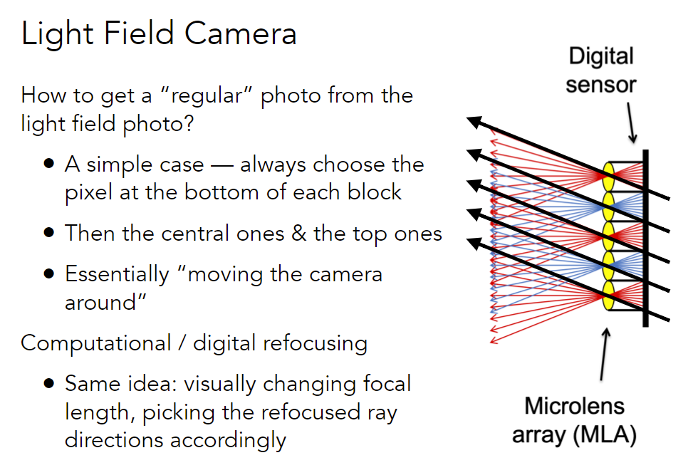

得到的结果就是相机看向黑色箭头方向（即在Lec19的Why Not Sensors Without Lenses?情况下可以直接区分radiance）

In all, all these functionalities are available because 

- The light field contains everything 

Any problems to light field cameras? 

- Insufficient spatial resolution (需要记录四维信息)

  (same film used for both spatial and directional information) 

- High cost  (intricate designation of microlenses) 

### Color 

#### Physical Basis of Color

**Spectrum**: 光包含的成分信息

**Spectral Power Distribution (SPD)** 

光线在不同波长谱功率密度的分布，具有可加性 (光线叠加)

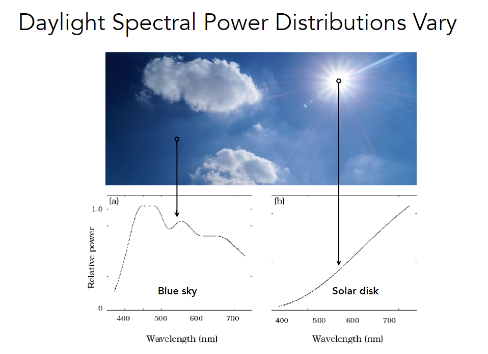

#### What is color 

- Color is a phenomenon of <u>human perception</u>; it is not a universal property of light  
- Different wavelengths of light are not “colors”

#### Biological Basis of Color

Retinal Photoreceptor Cells (感光细胞)

- Rod Cells

  Rods are primary receptors in very low light (“scotopic” conditions), e.g. dim moonlight 

  - ~120 million rods in eye 

  - 感知强度，但不感知颜色

    Perceive only <u>shades of gray</u>, no color

- Cone Cell

  Cones are primary receptors in typical light levels (“photopic”) 

  - ~6-7 million cones in eye 
  - <u>Three types of cones</u>, each with different spectral sensitivity 
  - Provide sensation of <u>color</u> (感知颜色)

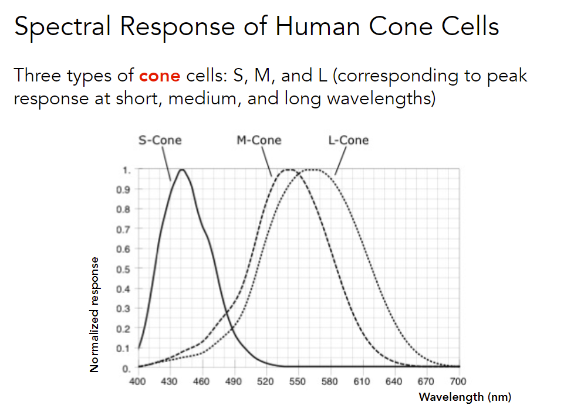

#### Tristimulus Theory of Color

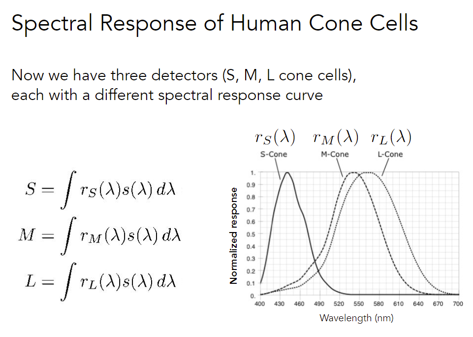

The Human Visual System

- Human eye does not measure and brain does not receive information about each wavelength of light 
- Rather, <u>the eye “sees” only three response values (S, M, L)</u>, and this is only info available to brain

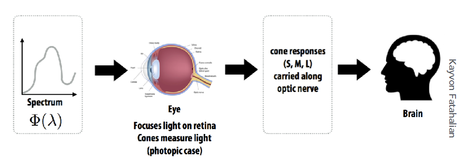

#### Metamerism (同色异谱)

Metamers are two <u>different</u> spectra (∞-dim) that project to the <u>same</u> (S,M,L) (3-dim) response.  

- These will appear to have the same color to a human 

The existence of metamers is critical to <u>color reproduction</u>  

- Don’t have to reproduce the full spectrum of a real world scene (不需要光谱一致)
- Example: A metamer can reproduce the perceived color of a real-world scene on a display with pixels of only three colors

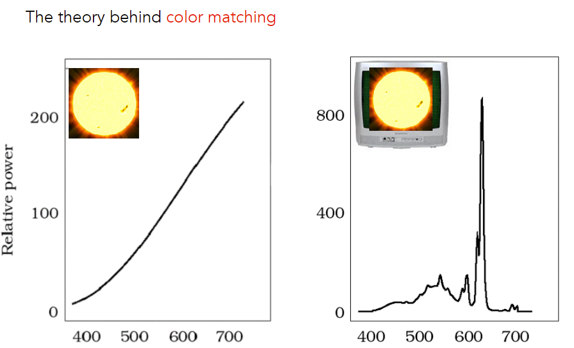

#### Color Reproduction / Matching

Additive model: 越混合越白

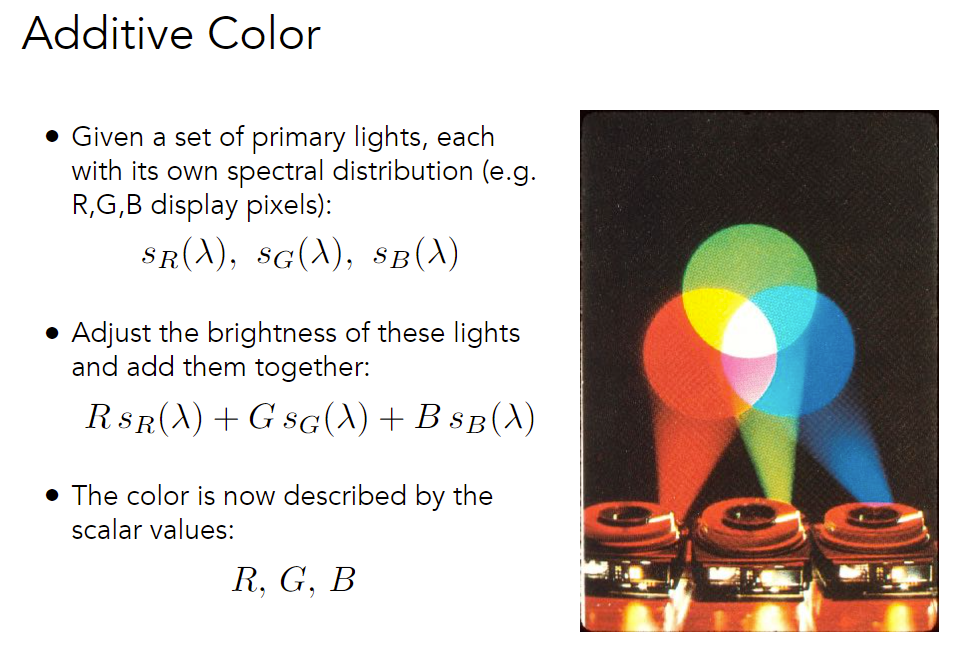

**Additive Color Matching Experiment**

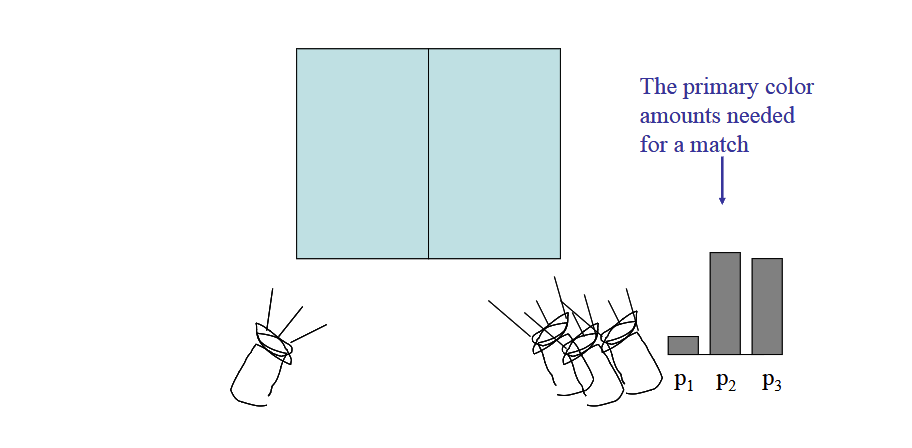

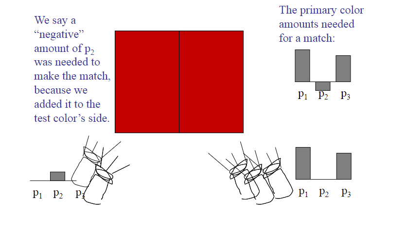

如果basis选不好系数可能是负数

**CIE RGB Color Matching Experiment**

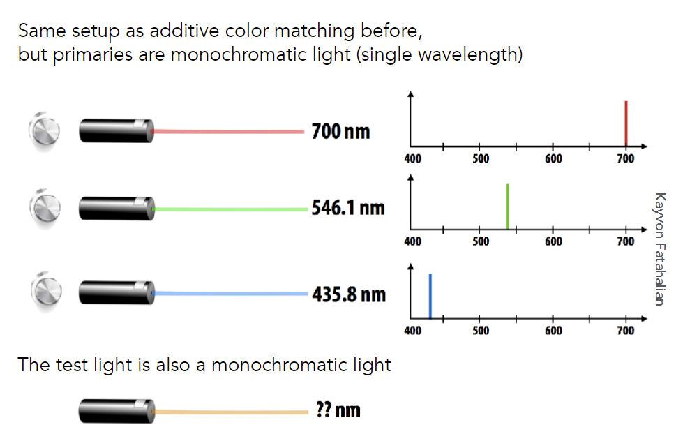

Graph plots how much of each CIE RGB primary light must be combined to <u>match a monochromatic light</u> of <u>wavelength given on x-axis</u>

For any spectrum s, the perceived color is matched by the following formulas for scaling the CIE RGB primaries

any spectrum s = combination of monochromatic light

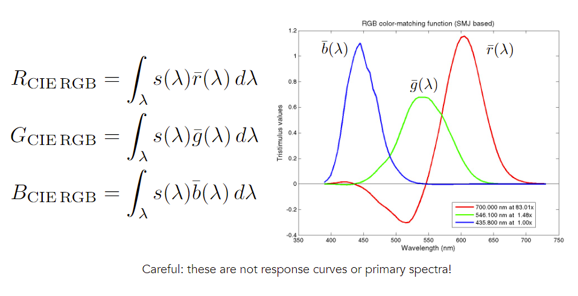

#### Color space

**Standardized RGB (sRGB)** 

- makes a particular monitor RGB standard 
- other color devices simulate that monitor by calibration 
- widely adopted today 
- gamut (色域) is limited

**A Universal Color Space: CIE XYZ**

Imaginary set of standard color primaries X, Y, Z 

- Primary colors with these matching functions do not exist (人为定义)
- Y is luminance (<u>brightness</u> regardless of color) (可以反映亮度)

Designed such that 

- Matching functions are <u>strictly positive</u> 
- Span all observable colors

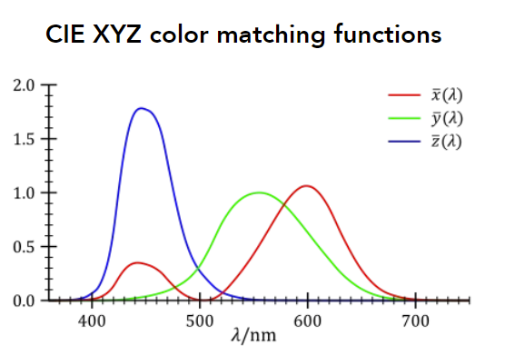

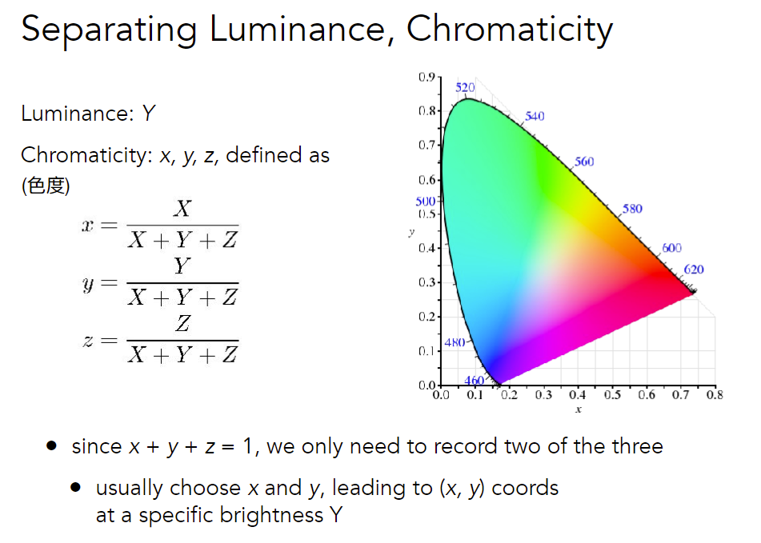

- Y影响亮度，固定Y改变X,Z
- 图像以x,y为坐标，leading to (x, y) coords at a specific brightness Y

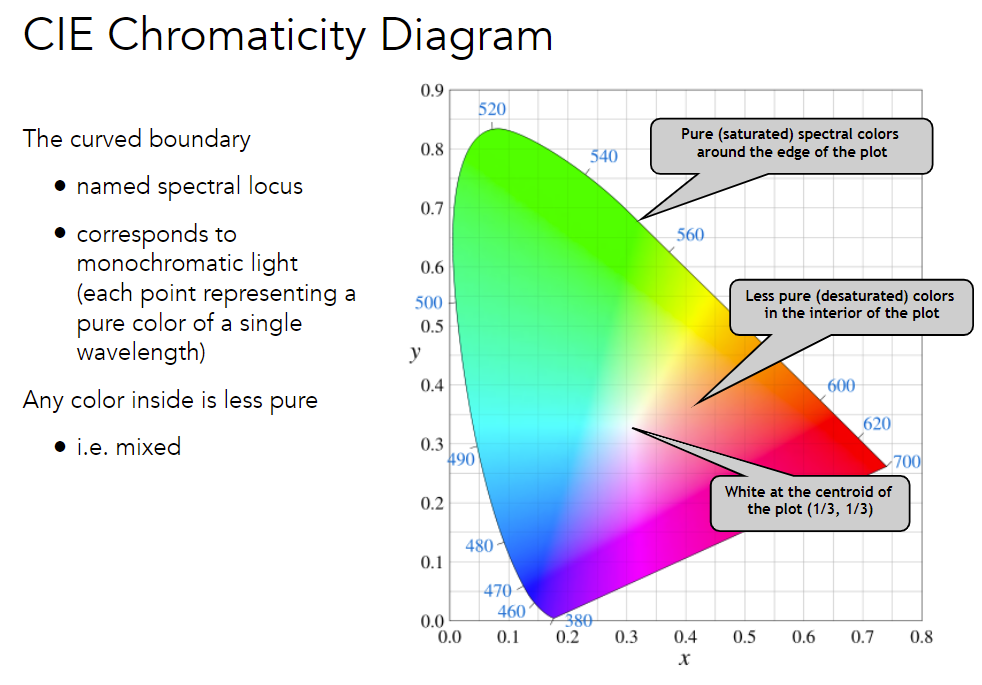

**Gamut (色域)**

Gamut is the set of chromaticities generated by a set of color primaries 

- Different color spaces represent different ranges of colors 

  So they have different gamuts, i.e.  they cover different regions on the chromaticity diagram

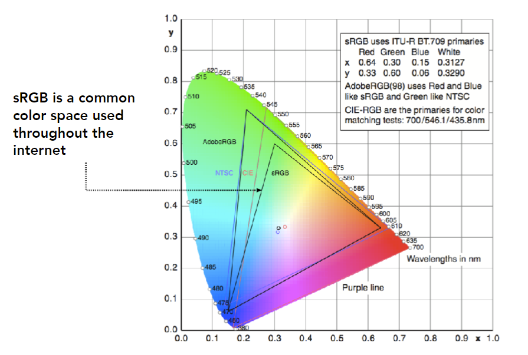

#### Perceptually Organized  Color Spaces

**HSV Color Space** (Hue-Saturation-Value)

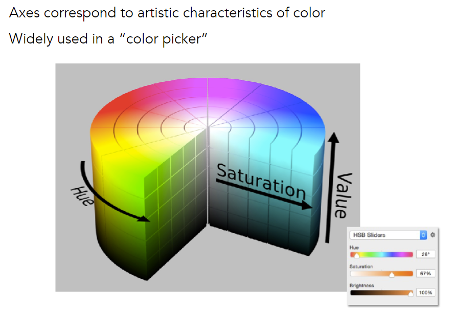

- Hue (色调)
  - the “kind” of color, regardless of attributes (不同颜色)
- Saturation (饱和度) 
  - the “colorfulness” (偏白还是偏当前颜色)
- Lightness (or value) 
  - the overall amount of light

**CIELAB Space** (AKA L\*a\*b\*)

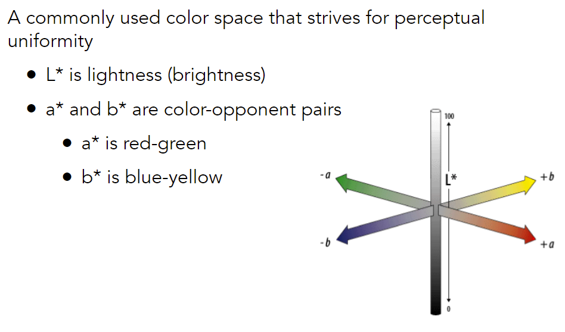

Opponent Color (互补色) Theory (类比反义词)

There’s a good <u>neurological basis</u> 

- the brain seems to encode color early on using three axes: 
  - white — black,    red — green,    yellow —blue 
- the white — black axis is lightness; the others determine hue and saturation

**CMYK: A Subtractive Color Space**

Subtractive color model: 越混合越黑

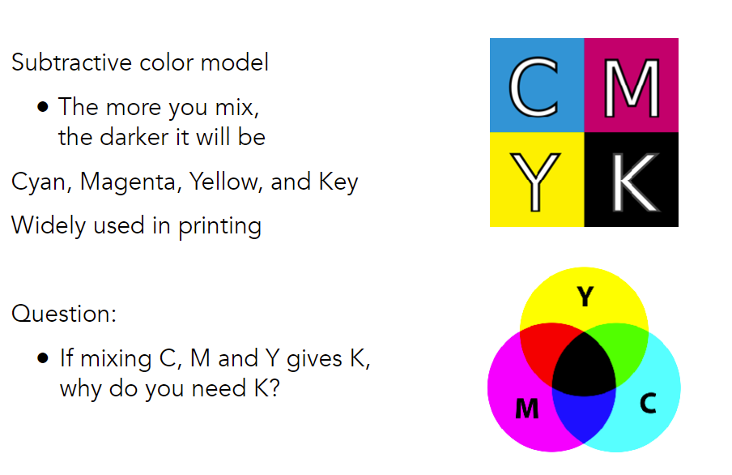

A：K比较常用，靠混合成本太高

**Other Topics**

- HDR
- 伽马校正