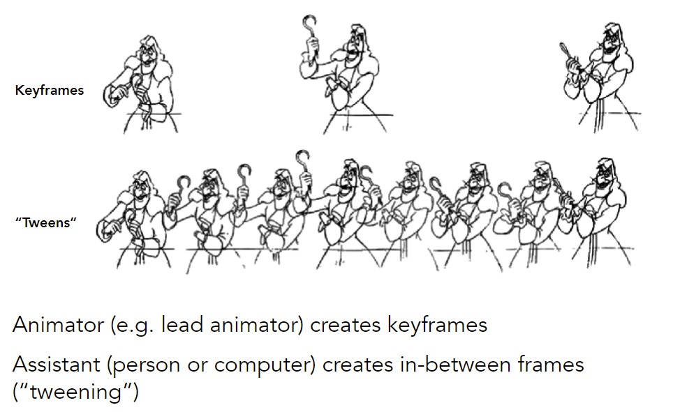

## 动画与模拟（基本概念、质点弹簧系统、运动学）

### Introduction to Computer Animation 

**Animation**

"Bring things to life"

- Communication tool
- Aesthetic issues often dominate technical issues

An extension of modeling

- Represent scene models as a function of <u>time</u>

Output: sequence of images that when viewed sequentially provide a sense of motion

- Film: 24 frames per second
- Video (in general): 30 fps
- Virtual reality: 90 fps

#### Keyframe (关键帧) animation 

e.g. flash

Keyframe Interpolation

Think of each frame as a vector of parameter values

- Linear interpolation usually not good enough
- Recall splines (e.g. 贝塞尔曲线C^1^) for smooth / controllable interpolation

#### Physical simulation 

$$
F=ma
$$

Generate motion of objects using numerical simulation

##### Mass Spring System (质点弹簧系统)

Example of Modeling a Dynamic System

**A Simple Spring**

一根弹簧连接a,b质点

Idealized spring

Strength proportional to displacement (Hooke’s Law)
$$
\begin{aligned}
\boldsymbol{f}_{a \rightarrow b}&=k_{S} \frac{\boldsymbol{b}-\boldsymbol{a}}{\|\boldsymbol{b}-\boldsymbol{a}\|}(\|\boldsymbol{b}-\boldsymbol{a}\|-l) \\
&\boldsymbol{f}_{b \rightarrow a}=-\boldsymbol{f}_{a \rightarrow b}
\end{aligned}
$$
Problem: oscillates (振动) forever

Dot Notation for Derivatives
$$
\begin{aligned}
&\dot{\boldsymbol{x}}=\boldsymbol{v} \\
&\ddot{\boldsymbol{x}}=\boldsymbol{a}
\end{aligned}
$$
**Introducing Energy Loss**

阻尼振动

Simple motion damping $\boldsymbol{f}=-k_{d} \dot{\boldsymbol{b}}$

- Behaves like viscous drag on motion
- Slows down motion in the direction of velocity

Problem: slows down all motion  

- should spring also fall to the ground more slowly? (a,b没有相对运动)

<u>Internal</u> Damping for Spring

- 不妨以a点为参考系，计算$(\dot{\boldsymbol{b}}-\dot{\boldsymbol{a}})$在$\bold b-\bold  a$的投影大小（e.g. 圆周运动）

- Damp only the internal, spring-driven motion

- Viscous drag only on change in spring length 

  Won’t slow group motion for the spring system 

- Note: This is only one specific type of damping

**Structures from Springs**

Behavior is determined by structure linkages

- 无法抵抗shear（e.g. 拉开左下角和右上角）
- 无法抵抗out-of-plane bending（e.g. 沿着竖直方向弯折）

**Aside**: FEM (Finite Element Method) Instead of Springs

##### Particle Systems (粒子系统)

Model dynamical systems as collections of large numbers of particles 

Each particle’s motion is defined by a set of physical (or non-physical) forces 

Popular technique in graphics and games 

- Easy to understand, implement 
- Scalable: fewer particles for speed, more for higher complexity 

Challenges 

- May need many particles (e.g. fluids) 
- May need acceleration structures (e.g. to find nearest particles for interactions)

**Animations**

For each frame in animation 

- [If needed] Create new particles  
- Calculate forces on each particle (hard)
- Update each particle’s position and velocity 
- [If needed] Remove dead particles 
- Render particles

**Particle System Forces**

Attraction and repulsion forces

- Gravity, electromagnetism, $\ldots$
- Springs, propulsion, ...

Damping forces

- Friction, air drag, viscosity, $\ldots$

Collisions 

- Walls, containers, fixed objects, $\ldots$
- Dynamic objects, character body parts, $\ldots$

**Example: boid model**

#### Kinematics (运动学)

##### Forward Kinematics

**Example**: simple two segment arm in 2D

Animation is described as angle parameter values as a function of time

Strengths 

- Direct control is convenient 
- Implementation is straightforward 

Weaknesses 

- Animation may be inconsistent with physics 
- Time consuming for artists

##### Inverse Kinematics

Animator provides position of end-effector, and computer must determine joint angles that satisfy constraints

Why is the problem hard? 

- Multiple solutions in configuration space
- Solutions may not always exist

Numerical solution to general N-link IK problem (优化问题)

- Choose an initial configuration 
- Define an <u>error metric</u> (e.g. square of distance between goal and current position) 
- Compute gradient of error as function of configuration 
- Apply gradient descent (or Newton’s method, or other optimization procedure)

#### Rigging

Rigging is a set of higher level controls (e.g. 控制点) on a character that allow more rapid & intuitive modification of pose, deformations, expression, etc. (逆运动学的应用)

- Like strings on a puppet (提线木偶) 
- Captures all meaningful  character changes 
- Varies from character to  character

**Blend Shapes**

插值控制点，而不是插值整个model

Simplest scheme: take linear combination of vertex positions 

Spline used to control choice of weights over time

**Motion Capture**

给人加控制点，并记录控制点动作

- Record real-world performances (e.g. person executing an activity) 
- Extract pose as a function of time from the data collected

Strengths 

- Can capture large amounts of real data quickly 
- Realism can be high 

Weaknesses 

- Complex and costly set-ups 
- Captured animation may not meet artistic needs, requiring alterations

Optical Motion Capture

- Markers on subject  
- Positions by triangulation from multiple cameras  
- 8+ cameras, 240 Hz, occlusions are difficult

Uncanny valley (恐怖谷效应)

#### The Production Pipeline

