## 动画与模拟（求解常微分方程，刚体与流体）

### Single particle simulation 

To start, assume motion of particle determined by a velocity vector field that is a function of position and time:
$$
\bold v(x,t)
$$
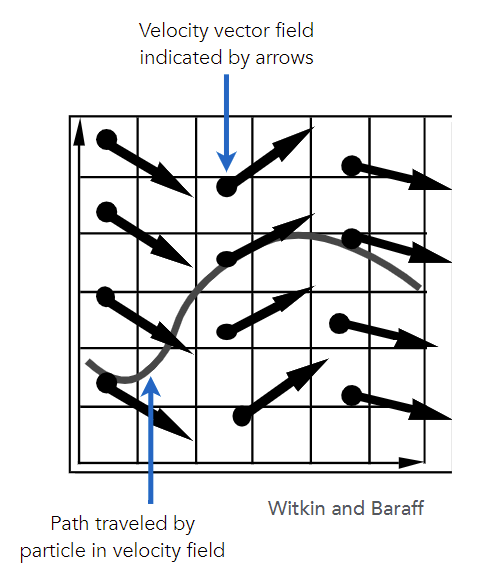

Ordinary Differential Equation (ODE)

- “First-order” refers to the first derivative being taken.
- “Ordinary” means no “partial” derivatives, i.e. x is just a function of t

$$
\frac{d x}{d t}=\dot{x}=v(x, t)
$$

We can solve the ODE, subject to a given initial particle position x~0~, by using forward numerical integration

#### Explicit Euler method 

Euler’s Method (a.k.a. Forward Euler, Explicit Euler) 

用上一个时间的位置、速度、加速度

- Simple iterative method 
- Commonly used 
- Very inaccurate 
- Most often goes <u>unstable</u>

$$
\begin{aligned}
&\boldsymbol{x}^{t+\Delta t}=\boldsymbol{x}^{t}+\Delta t \dot{\boldsymbol{x}}^{t} \\
&\dot{\boldsymbol{x}}^{t+\Delta t}=\dot{\boldsymbol{x}}^{t}+\Delta t \ddot{\boldsymbol{x}}^{t}
\end{aligned}
$$

**Euler’s Method - Errors** (误差)

With numerical integration, errors accumulate. Euler integration is particularly bad

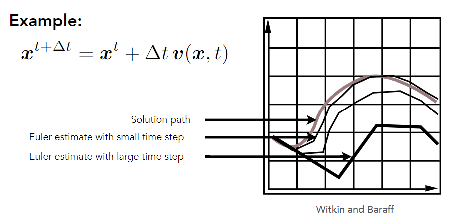

**Instability of the Euler Method** (稳定性)

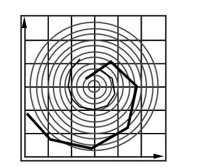

- 无法模拟圆周运动，肯定会偏离

Two key problems: 

- Inaccuracies increase as time step Δt increases 
- Instability is a common, serious problem that can cause simulation to diverge

**Errors and Instability**

Solving by numerical integration with finite differences leads to two problems:

Errors

- Errors at each time step accumulate. 

  Accuracy <u>decreases</u> as simulation proceeds

- Accuracy may not be critical in graphics applications 

Instability

- Errors can compound, causing the simulation to **diverge** even when the underlying system does not
- Lack of stability is a fundamental problem in simulation, and cannot be ignored

#### Instability and improvements  

Some Methods to Combat Instability

Midpoint method / Modified Euler

- Average velocities at start and endpoint

Adaptive step size

- Compare one step and two half-steps, recursively, until error is acceptable

Implicit methods

- Use the velocity at the next time step (hard)

Position-based / Verlet integration

- Constrain positions and velocities of particles after time step

##### Midpoint Method

midpoint的速度更有代表性

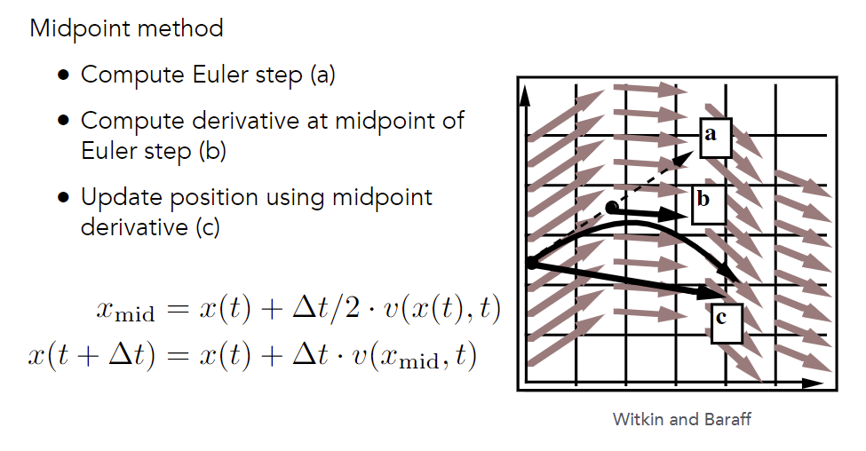

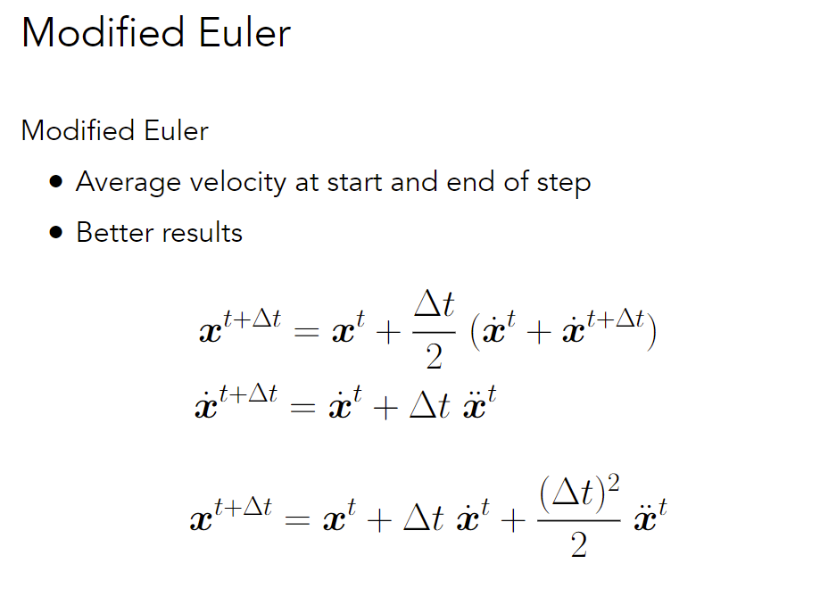

- 引入二次误差项

##### Adaptive Step Size

根据$\Delta t,\Delta t /2$分别得到x的误差来动态修改$\Delta t$

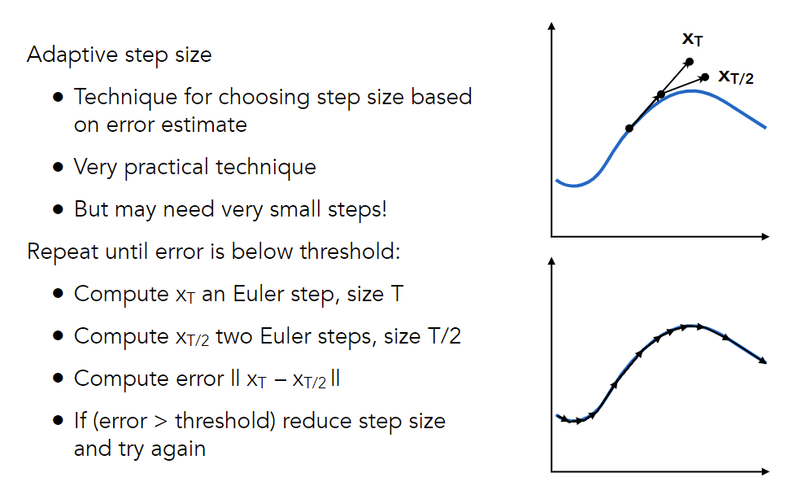

##### Implicit Euler Method

Use derivatives in the future, for the current step
$$
\begin{aligned}
&\boldsymbol{x}^{t+\Delta t}=\boldsymbol{x}^{t}+\Delta t \dot{\boldsymbol{x}}^{t+\Delta t} \\
&\dot{\boldsymbol{x}}^{t+\Delta t}=\dot{\boldsymbol{x}}^{t}+\Delta t \ddot{\boldsymbol{x}}^{t+\Delta t}
\end{aligned}
$$

- Solve nonlinear problem for $\boldsymbol{x}^{t+\Delta t}$ and $\dot{\boldsymbol{x}}^{t+\Delta t}$
- Use root-finding algorithm, e.g. Newton's method
- Offers much better stability

Q: How to determine / quantize “stability”? 

- We use the local truncation error (every step) and total accumulated error (overall) 
- Absolute values do not matter, but the orders w.r.t. step 
- Implicit Euler has order 1, which means that 
  - Local truncation error: O(h^2^) and 
  - Global truncation error: O(h)          (h is the step, i.e. ∆t) 
- Understanding of O(h) 
  - If we halve h, we can expect the error to halve as well
  - 阶数越高越好

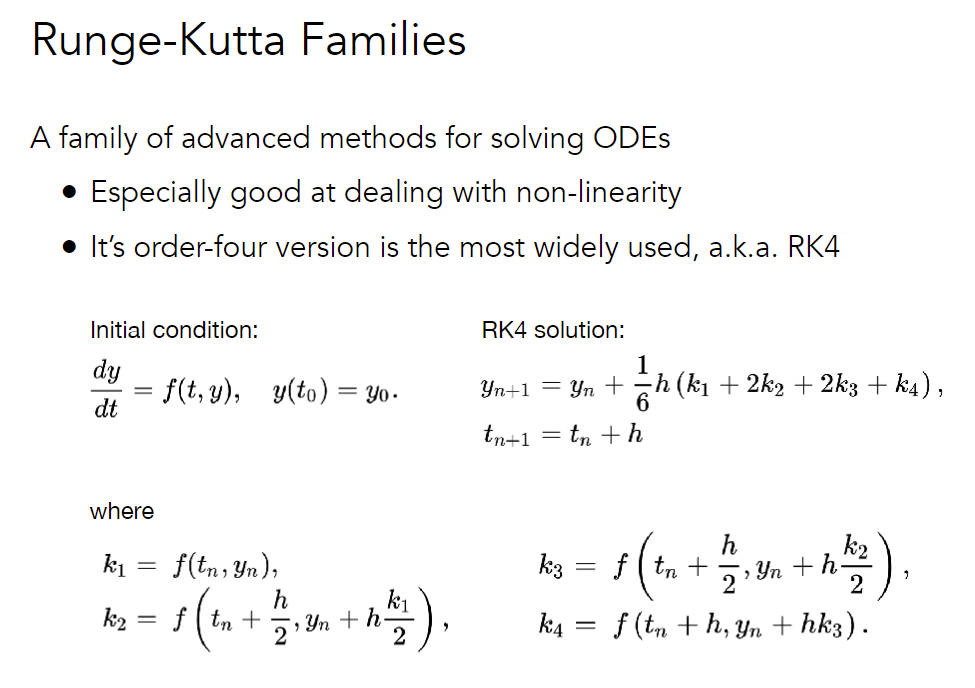

##### Position-Based / Verlet Integration

非物理的简化

Idea: 

- After modified Euler forward-step, <u>constrain positions</u> of particles to prevent divergent, unstable behavior 
- Use constrained positions to calculate velocity 
- Both of these ideas will dissipate energy, stabilize 

Pros / cons

- Fast and simple 
- Not physically based, dissipates energy (error)

### Rigid body simulation 

Simple case 

- Similar to simulating a particle 
- Just consider a bit more properties

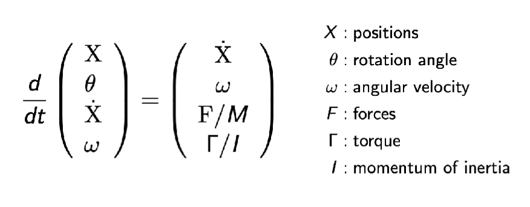

### Fluid simulation

A Simple Position-Based Method

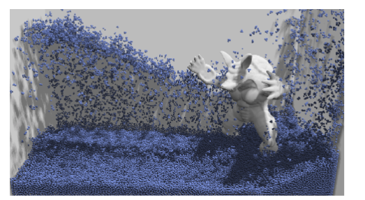

Key idea 

- Assuming water is composed of small rigid-body spheres 
- Assuming the water cannot be compressed (i.e. const. density) 

考虑整体密度，而不是单个点的位置

So, as long as the <u>density</u> changes somewhere, it <u>should be “corrected”</u> via changing the positions of particles 

- You need to know the <u>gradient of the density w.r.t. each particle’s position</u> 
- Update? Just gradient descent! (回到正确的密度)

#### Eulerian vs. Lagrangian

Two different views to simulating large collections of matters

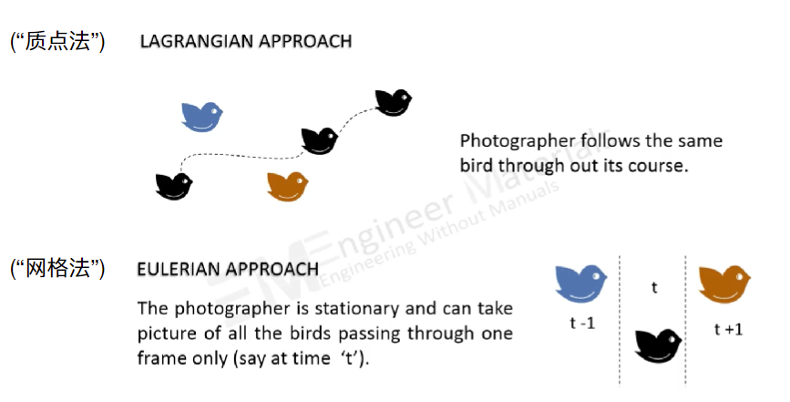

- 质点法考虑每个质点的运动
- 网格法把空间划分成网格，考虑网格的变化

#### Material Point Method (MPM) 

Hybrid, combining Eulerian and Lagrangian views 

- Lagrangian: consider particles carrying <u>material properties</u> 
- Eulerian: use a grid to do <u>numerical integration</u> 
- Interaction
  - particles transfer properties to the grid
  - grid performs update, then interpolate back to particles

## Advanced Topics

GAMES 201: 高级物理引擎实战

GAMES 202: 高质量实时渲染

Advanced Image Synthesis

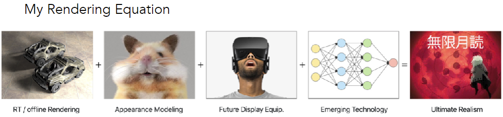

> Join my group and  become legendary!

