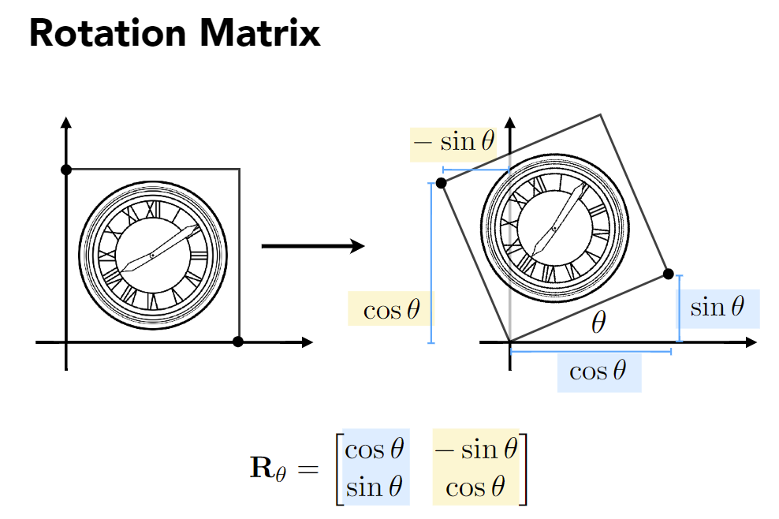
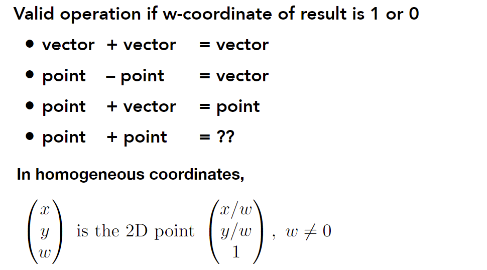

## 变换（二维与三维）

### Why study transformation

- modeling 模型变换

  translation, rotation, scaling

- viewing 视图变换

  projection

  

### 2D transformations: rotation, scale, shear

note: 找变换前后的坐标对映关系（例如找(1,0), (0,1)变换之后的坐标）

#### Scale

$$
\begin{pmatrix}
  x^\prime \\
  y^\prime
\end{pmatrix}=
\begin{pmatrix}
 s_x & 0 \\
 0 & s_y
\end{pmatrix}
\begin{pmatrix}
 x  \\
  y
\end{pmatrix}
$$

#### Reflection

horizontal reflection
$$
\begin{pmatrix}
 -1 & 0 \\
 0 & 1
\end{pmatrix}
$$

#### Shear

Horizontal shift is 0 at y=0, Horizontal shift is a at y=1, Vertical shift is always 0

沿水平方向移动
$$
\begin{pmatrix}
 1 & a \\
 0 & 1
\end{pmatrix}
$$

#### Rotate

关于原点，默认逆时针
$$
(1,0)^\top \rightarrow (\cos \theta, \sin \theta) \\
(0,1)^\top \rightarrow (-\sin \theta, \cos \theta)
$$

**Linear Transforms**
$$
\bold{x}^\prime=\bold{M}\bold{x}
$$

### Homogeneous coordinates (齐次坐标)

**Translation**: 不是线性变换

Q: Is there a unified way to represent all transformations?(and what’s the cost?)

**Solution**: Homogenous Coordinates

point = $(x,y,1)^\top$, vector = $(x,y,0) ^\top$

Matrix representation of translations
$$
\left(\begin{array}{c}
x^{\prime} \\
y^{\prime} \\
w^{\prime}
\end{array}\right)=\left(\begin{array}{ccc}
1 & 0 & t_{x} \\
0 & 1 & t_{y} \\
0 & 0 & 1
\end{array}\right) \cdot\left(\begin{array}{l}
x \\
y \\
1
\end{array}\right)=\left(\begin{array}{c}
x+t_{x} \\
y+t_{y} \\
1
\end{array}\right)
$$
note: 向量具有平移不变性

note: point + point = 中点

#### Affine(仿射) Transformations

Affine map = linear map + translation
$$
\left(\begin{array}{l}
x^{\prime} \\
y^{\prime}
\end{array}\right)=\left(\begin{array}{ll}
a & b \\
c & d
\end{array}\right) \cdot\left(\begin{array}{l}
x \\
y
\end{array}\right)+\left(\begin{array}{c}
t_{x} \\
t_{y}
\end{array}\right)
$$

$$
\left(\begin{array}{l}
x^{\prime} \\
y^{\prime} \\
1
\end{array}\right)=\left(\begin{array}{lll}
a & b & t_{x} \\
c & d & t_{y} \\
0 & 0 & 1
\end{array}\right) \cdot\left(\begin{array}{l}
x \\
y \\
1
\end{array}\right)
$$

note: 最下面必然是$(0,0,1)$

#### Scale

$$
\mathbf{S}\left(s_{x}, s_{y}\right)=\left(\begin{array}{ccc}
s_{x} & 0 & 0 \\
0 & s_{y} & 0 \\
0 & 0 & 1
\end{array}\right)
$$
#### Rotation

$$
\mathbf{R}(\alpha)=\left(\begin{array}{ccc}
\cos \alpha & -\sin \alpha & 0 \\
\sin \alpha & \cos \alpha & 0 \\
0 & 0 & 1
\end{array}\right)
$$
#### Translation

$$
\mathbf{T}\left(t_{x}, t_{y}\right)=\left(\begin{array}{ccc}
1 & 0 & t_{x} \\
0 & 1 & t_{y} \\
0 & 0 & 1
\end{array}\right)
$$

### Other transforms

#### Inverse transforms

$\bold{M}^{-1}$ is the inverse of transform $\bold{M}$ in both a matrix and geometric sense

### Composing transforms

note: Transform Ordering Matters! (矩阵乘法不可交换)

note: matrices are applied right to left (变换顺序从右到左)
$$
A_{n}\left(\ldots A_{2}\left(A_{1}(\mathbf{x})\right)\right)=\mathbf{A}_{n} \cdots \mathbf{A}_{2} \cdot \mathbf{A}_{1} \cdot\left(\begin{array}{l}
x \\
y \\
1
\end{array}\right) \\
\mathbf{A}=\mathbf{A}_{n} \cdots \mathbf{A}_{2} \cdot \mathbf{A}_{1}
$$
obtain a single matrix representing combined transform

### Decomposing Complex Transforms

How to rotate around a given point c?

1. Translate center to origin 
2. Rotate
3. Translate back 

$$
\mathbf{T}(\mathbf{c}) \cdot \mathbf{R}(\alpha) \cdot \mathbf{T}(-\mathbf{c})
$$

### 3D transformations

类比2D变换

point = $(x,y,z,1)^\top$, vector = $(x,y,z,0) ^\top$
$$
\left(\begin{array}{l}
x^{\prime} \\
y^{\prime} \\
z^{\prime} \\
1
\end{array}\right)=\left(\begin{array}{llll}
a & b & c & t_{x} \\
d & e & f & t_{y} \\
g & h & i & t_{z} \\
0 & 0 & 0 & 1
\end{array}\right) \cdot\left(\begin{array}{l}
x \\
y \\
z \\
1
\end{array}\right)
$$
note: 最下面是$(0,0,0,1)$

note: 上述形式表示的是先线性变换后平移