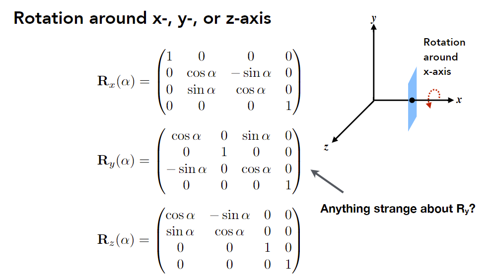

## 变换（模型、视图、投影）

### 3D transformations

#### Scale

$$
\mathbf{S}\left(s_{x}, s_{y}, s_{z}\right)=\left(\begin{array}{cccc}
s_{x} & 0 & 0 & 0 \\
0 & s_{y} & 0 & 0 \\
0 & 0 & s_{z} & 0 \\
0 & 0 & 0 & 1
\end{array}\right)
$$
#### Translation

$$
\mathbf{T}\left(t_{x}, t_{y}, t_{z}\right)=\left(\begin{array}{cccc}
1 & 0 & 0 & t_{x} \\
0 & 1 & 0 & t_{y} \\
0 & 0 & 1 & t_{z} \\
0 & 0 & 0 & 1
\end{array}\right)
$$

#### Rotation

**绕坐标轴旋转**

note: $\vec z \times \vec x =\vec y$，把z当作2D情况的x，把x当作2D情况的y，所以结果是反的

**一般的旋转**

简单的旋转可以组合成复杂的旋转
$$
R_{xyz}(\alpha,\beta,\gamma)=R_{x}(\alpha)R_{y}(\beta)R_z(\gamma)
$$
其中$\alpha,\beta,\gamma$称为欧拉角

**Rodrigues’ Rotation Formula**

Rotation by angle $\alpha$ around axis $\mathbf{n}$ (这里默认axis过原点)
$$
\mathbf{R}(\mathbf{n}, \alpha)=\cos (\alpha) \mathbf{I}+(1-\cos (\alpha)) \mathbf{n} \mathbf{n}^{T}+\sin (\alpha) \underbrace{\left(\begin{array}{ccc}
0 & -n_{z} & n_{y} \\
n_{z} & 0 & -n_{x} \\
-n_{y} & n_{x} & 0
\end{array}\right)}_{\mathbf{N}}
$$
说明：

1. 设要旋转的向量为$\vec s$，将$\vec s$对于$\vec n$分解为$\vec s_{\perp},\vec s_{\parallel}$

2. 将$\vec {n},\vec s_{\perp},\vec n \times \vec s_{\perp}$单位化后建立新的坐标系，记为$\vec {a},\vec{b},\vec {c}$

3. $\vec s_{\perp}$在旋转后会发生变化，而$\vec s_{\parallel}$不会

   $\vec s_{\perp}$的旋转完全在$\vec b,\vec c$平面内
   $$
   \bold {s}_{\perp}^{\text{rot}}=\left \| \vec s_{\perp} \right \| \cos\alpha \cdot \vec b+\left \| \vec s_{\perp} \right \|  \sin \alpha \cdot \vec {c} \\
   \bold s= \bold {s}_{\perp}^{\text{rot}} + \bold s_{\parallel}
   $$

沿任意轴：平移回原点，旋转，重新平移回去

note: 四元数可以用于旋转之间插值（例如旋转15°和旋转25°中间插值，20°不等于矩阵求平均）

### Viewing (观测) transformation

最终目的：3D物体变成2D照片

A: Think about how to take a photo

- Find a good place and arrange people (<u>model</u> transformation, 把场景建好)
- Find a good “angle” to put the camera (<u>view</u> transformation, 改变相机属性)
- Cheese! (<u>projection</u> transformation)

**note**: MVP变换

#### View (视图) / Camera transformation

摆照相机

相机和物体的位置是相对的。不妨把相机固定在原点，朝向-z方向，以y轴为向上方向，而对其它所有物体做变换

Transform objects together with the camera

如何把相机变换到标准位置？

1. Translates e to origin
2. Rotates g to -Z
3. Rotates t to Y

如何写成矩阵形式？

note: 把$(1,0,0),(0,1,0),(0,0,1)$分别带入$R^{-1}$可以检验正确性

note: $R_{view}^{-1}$是正交矩阵（正交变换）

note: 和model transformation类似，$M_{view}$也应用在物体上

#### Projection transformation

正交投影后，平行线还是平行的

透视投影带来<u>近大远小</u>的现象

正交投影可理解为把点摄像机移到无穷远处

##### Orthographic (正交) projection

A simple way of understanding

- Camera located at origin, looking at -Z, up at Y
- **Drop** Z coordinate (Q：丢掉z后怎么区分物体的前后？)
- Translate and scale the resulting rectangle to [-1, 1]^2^ (约定俗成做法)

**实际做法**

note: left/right, bottom/top, near/far

note: 沿-z方向看，数值上n>f (因此某些API会使用左手系)

先平移中心到原点，后缩放
$$
M_{\text {ortho }}=\left[\begin{array}{cccc}
\frac{2}{r-l} & 0 & 0 & 0 \\
0 & \frac{2}{t-b} & 0 & 0 \\
0 & 0 & \frac{2}{n-f} & 0 \\
0 & 0 & 0 & 1
\end{array}\right]\left[\begin{array}{cccc}
1 & 0 & 0 & -\frac{r+l}{2} \\
0 & 1 & 0 & -\frac{t+b}{2} \\
0 & 0 & 1 & -\frac{n+f}{2} \\
0 & 0 & 0 & 1
\end{array}\right]
$$
Q：考虑旋转？

##### Perspective (透视) projection

Most common in Computer Graphics, art, visual system

note: projection就是把线（光线）在f的点投影到在n的点，而透视投影中线会收缩

squish过程的规定：n平面不变，f平面z值不变，f平面中心点不变

**In order to find a transformation**

Find the relationship between transformed points (x’, y’, z’) and the original points (x, y, z)

- 先考虑x和y

  从侧面看
  $$
  y^\prime= \frac{n}{z}y \quad \quad x^\prime= \frac{n}{z}x
  $$
  

  

- 考虑z坐标

  - Any point on the near plane will not change
  - Any point’s z on the far plane will not change

  

  带入两个条件后可得，
  $$
  An+B=n^2 \\
  Af+B=f^2
  $$
  解得$A=n+f,B=-nf$

$M_{\text {persp }}=M_{\text {ortho }} M_{\text {persp } \rightarrow \text { ortho }}$

note: 在squish过程中，中间物体的z坐标会发生变化（变远）

Q：为什么中间物体会变远？

注意z为负数
$$
z^\prime=n+f-\frac{nf}{z}\leq z \quad (z \in [n,f])
$$