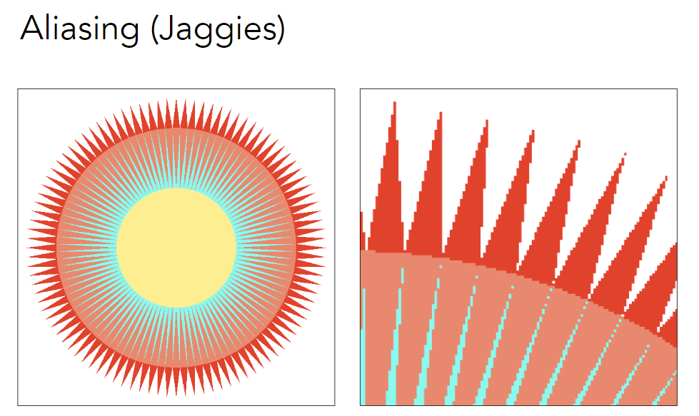

## 光栅化（三角形的离散化） 

### Finishing up Viewing

#### Perspective Projection

Q：如何定义视锥？

可以使用vertical field-of-view (fovY)和aspect ratio来表示 (assume symmetry i.e. l = -r, b = -t)

$$
\tan \frac{fovY}{2}=\frac{t}{|n|} \\
aspect=\frac{r}{t}
$$

#### Viewport (视口) transformation

观测变换的下一步

What’s after MVP?

- Model transformation (placing objects)
- View transformation (placing camera)
- Projection transformation
  - Orthographic projection (cuboid to “canonical” cube [-1, 1]^3^) 
  - Perspective projection (frustum to “canonical” cube) 

Canonical Cube to Screen

What is a **screen**?

- An array of pixels
- Size of the array: resolution
- A typical kind of raster display (光栅成像)

**Pixel**: For now, a pixel is a little square with uniform color (目前假设为最小单位)

**screen space** 

在屏幕建立坐标系

**Canonical Cube to Screen**

- Irrelevant to z (Q：之后如何处理z？)

- Transform in xy plane: [-1, 1]^2^ to [0, width] x [0, height]

- Viewport transform matrix

  缩放后平移到第一象限
  $$
  M_{\text {viewport }}=\left(\begin{array}{cccc}
  \frac{\text { width }}{2} & 0 & 0 & \frac{\text { width }}{2} \\
  0 & \frac{\text { height }}{2} & 0 & \frac{\text { height }}{2} \\
  0 & 0 & 1 & 0 \\
  0 & 0 & 0 & 1
  \end{array}\right)
  $$

现在已经可以得到照片了，下一步把结果变成像素显示出来

### Rasterization

Drawing to Raster Displays

#### Different raster displays

Frame Buffer: memory for a raster display

- Oscilloscope (示波器)

- Cathode Ray Tube (显像管)

  隔行扫描：一次只画奇数行，一次只画偶数行（视觉暂留）

  可以应用于压缩，但会造成画面撕裂

- Flat Panel Displays

  LCD (液晶)：液晶的旋光性

- Electrophoretic (Electronic Ink) Display

  不同电压控制颜色，刷新率很低

#### Rasterizing a triangle

**Triangles** - Fundamental Shape Primitives

- Most basic polygon
  - Break up other polygons

- Unique properties

  - Guaranteed to be planar (四边形不一定是平面的)

  - Well-defined interior (里面没有洞，一定是凸的)

  - Well-defined method for interpolating values at vertices over triangle (barycentric interpolation)

    只要定义顶点的属性，其它任何点都可以插值

    

**What Pixel Values Approximate a Triangle?**

A Simple Approach: **Sampling**

Evaluating a function at a point is sampling. (函数离散化)

用像素中心对屏幕空间采样

$$
\text{inside}(tri,x,y)=\left\{\begin{matrix}
1 \quad (x,y) \in tri \\
0 \quad otherwise
\end{matrix}\right.
$$
Evaluating inside(tri, x, y)

Inside? Recall: Three Cross Products!

Edge Cases: 可以自己定义

通过bounding box减少计算量

当三角形很瘦，并且呈45°角的情况下，AABB效果不理想

Rasterization on  Real Displays

LCD pixels do not actually emit light in a square of uniform color.

右侧显示可以看到绿点更多（人眼对绿色更敏感）

**Aliasing** (走样)

像素本身有一定大小，采样率对信号来说不够高，从而出现锯齿

