## 光栅化（深度测试与抗锯齿）

### Antialiasing (走样)

一个三角形是某种连续的在屏幕空间的信号

Testing in/out △ at pixels’ center

Pixels are uniformly-colored squares

#### Sampling theory

Sampling is Ubiquitous (广泛存在) in  Computer Graphics

- Rasterization = Sample 2D Positions

  sampling in space

- Photograph = Sample Image Sensor Plane
- Video = Sample Time

Sampling Artifacts(Errors / Mistakes / Inaccuracies) in Computer Graphics

- Jaggies (锯齿) (Staircase Pattern) 

- Moiré Patterns (摩尔纹) in Imaging

  cause: Skip odd rows and columns. e.g. 手机拍屏

  undersampling images

- Wagon Wheel Illusion (False Motion)

  sampling in time

  人眼在时间中采样频率不够

**Behind the Aliasing Artifacts**

Signals are <u>changing too fast</u> (high frequency),  but <u>sampled too slowly</u>

先给出一个结果

**Antialiasing Idea:  Blurring (Pre-Filtering) Before Sampling**

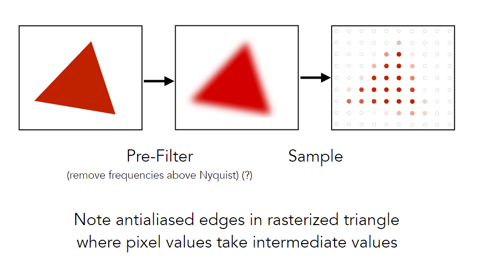

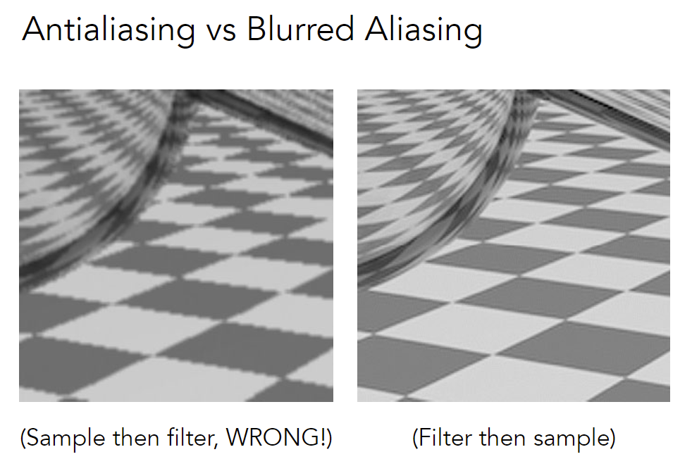

1. Why undersampling introduces aliasing? 
2. Why pre-filtering then sampling can do antialiasing?
3. Why sample then filter can not work?

**Frequency Domain**

Fourier Transform: Represent a function as a weighted sum of sines and cosines

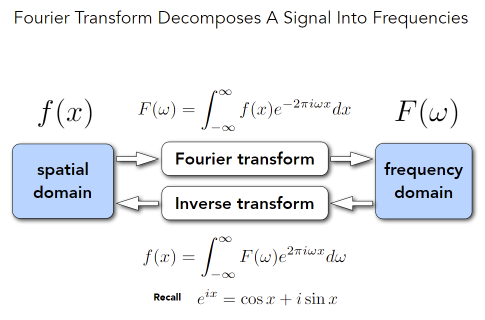

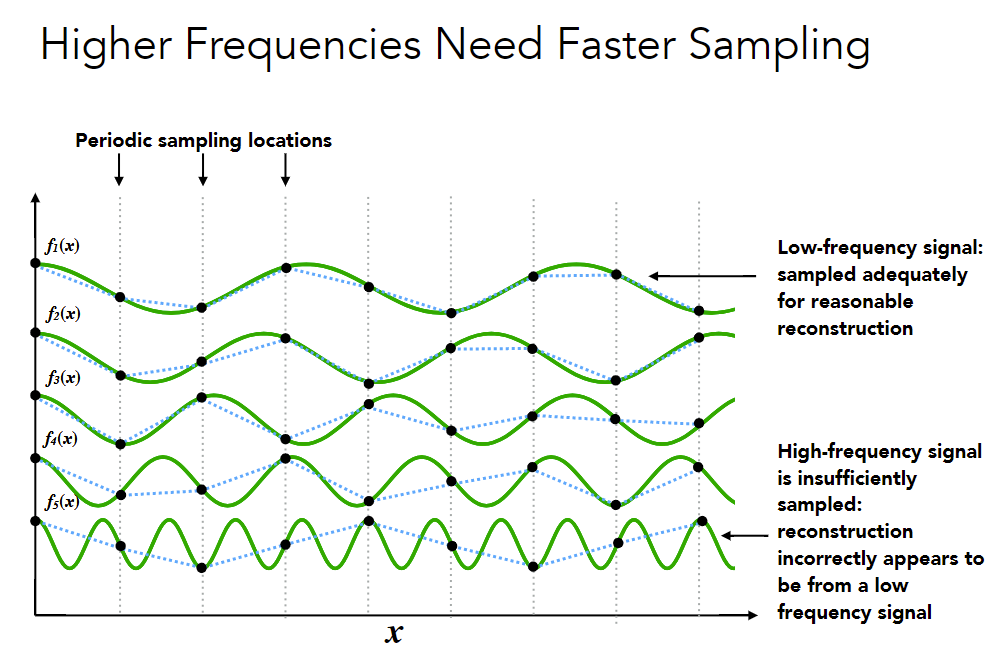

不同频率的信号需要不同的采样频率，低频采样无法恢复出高频信号

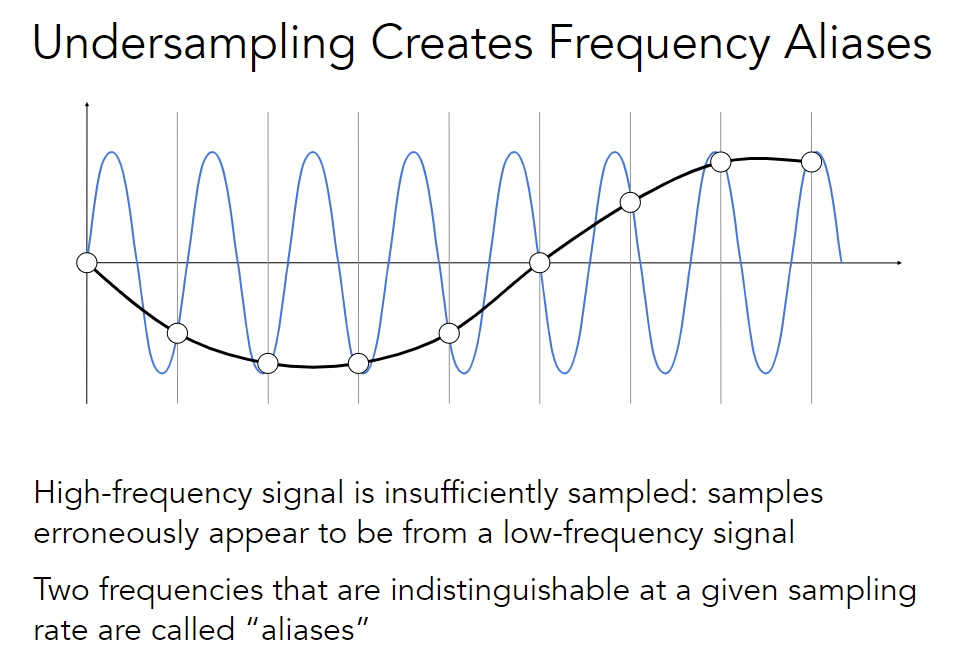

走样：有两个频率完全不一样的函数，在低频采样后结果一致

**Filtering** (滤波) = Getting rid of certain frequency contents

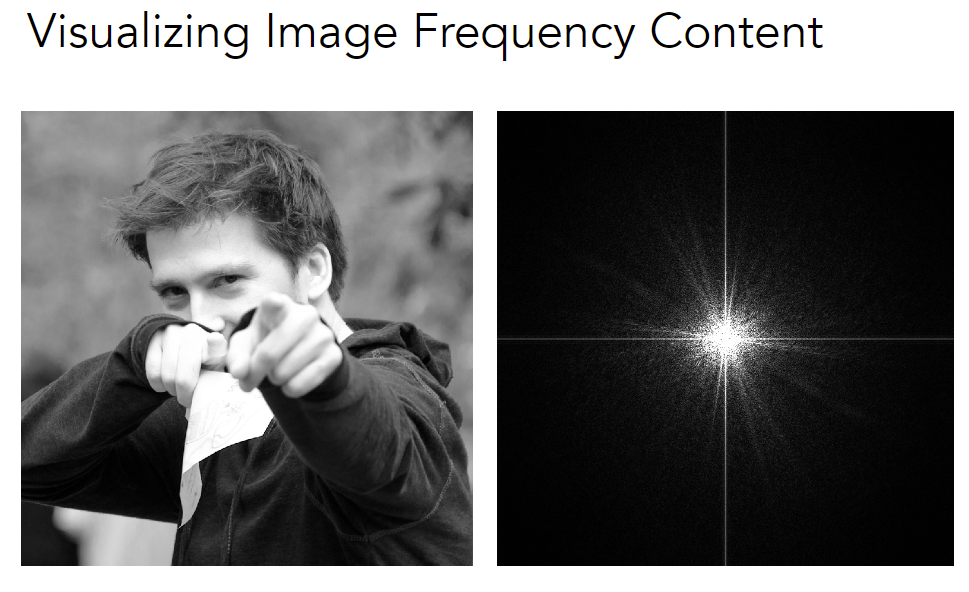

说明：

1. 图像的空间不同位置当作时间信息
2. 频率空间：中心低频，周围高频；亮度表示信息量
3. 自然图片一般大部分是低频信号
4. 水平和竖直线：图片没有周期性，把图片重复摆放形成周期信号，在相邻图片的边界上会有剧烈的信号变化

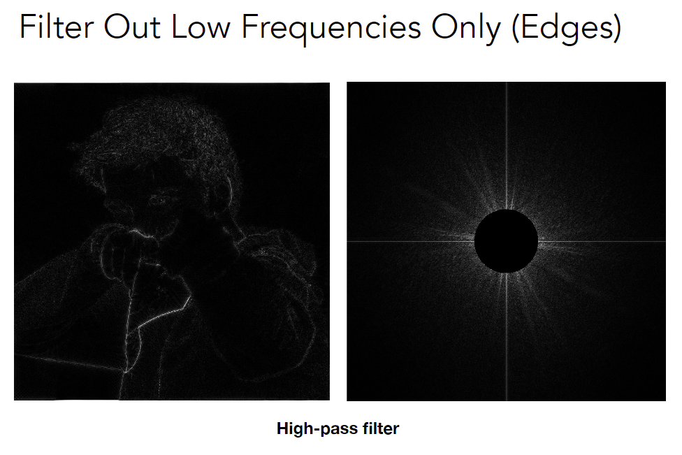

高通滤波：剩下高频信息，留下了图像的边界（边界发生突变）

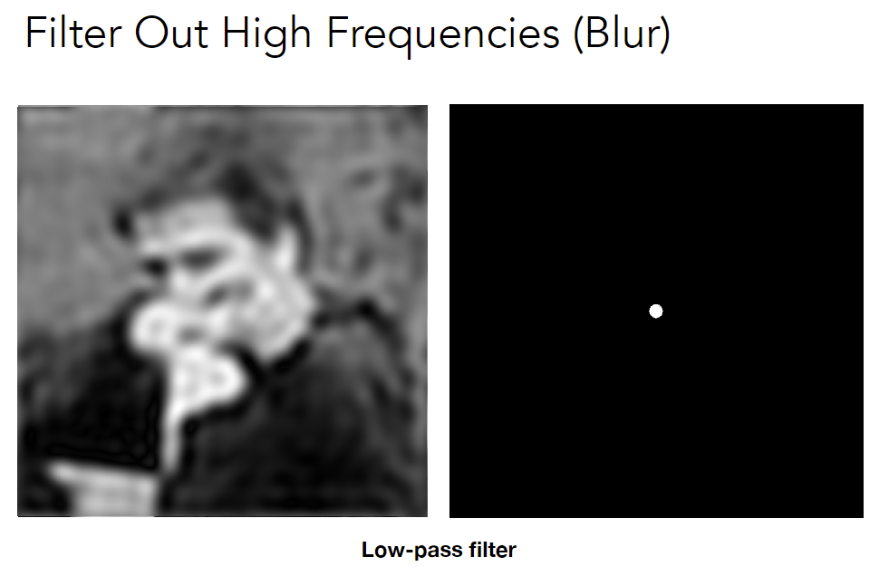

低通滤波：图像变模糊（去掉了边界）

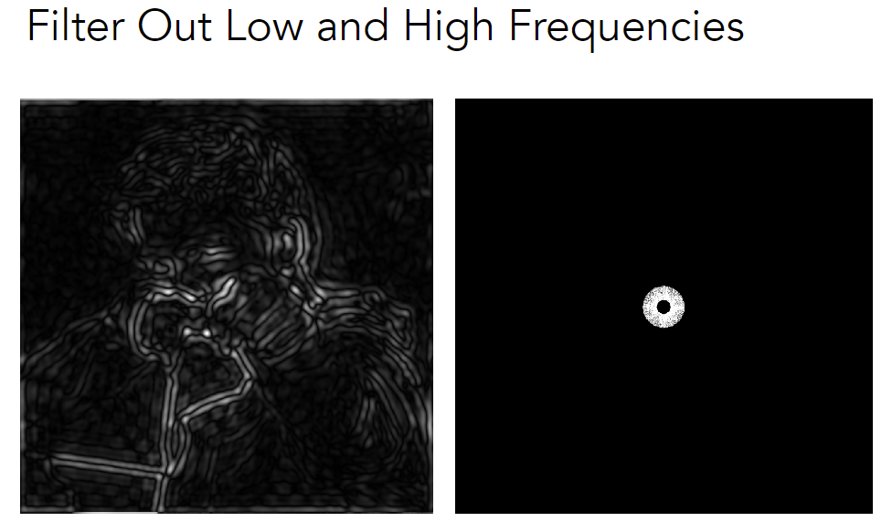

去掉高频和低频，提取到不是特别明显的边界（最明显的边界特征被去掉了，低频内容也被去掉了）

Filtering = **Convolution** (= Averaging)

Convolution: Point-wise local averaging in a “sliding window”

**Convolution Theorem**

Convolution in the spatial domain is equal to multiplication in the frequency domain, and vice versa

Option 1: 

- Filter by convolution in the spatial domain

Option 2: 

- Transform to frequency domain (Fourier transform) 
- Multiply by Fourier transform of convolution kernel 
- Transform back to spatial domain (inverse Fourier)

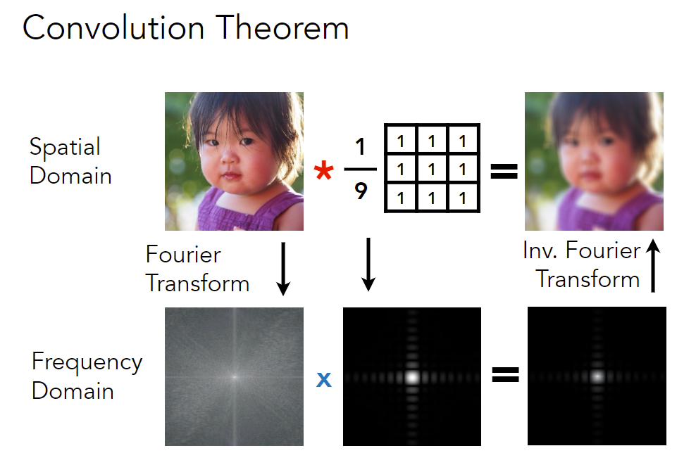

平均卷积核大部分集中在低频（周围有一点artifact），做平均卷积约等于低通滤波

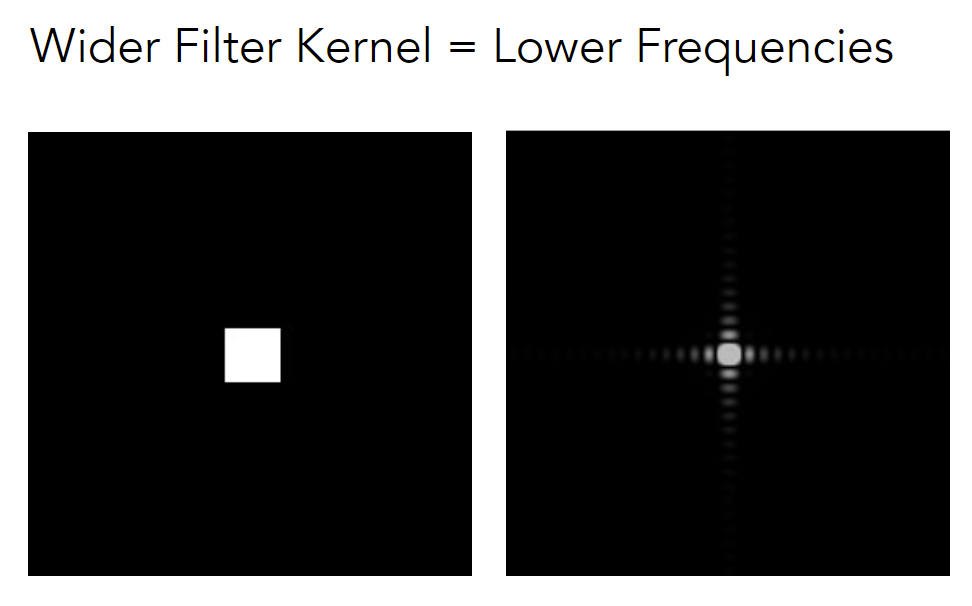

更大的box filter，在频域反而变小了（留下更低的频率，更模糊）

**Sampling = Repeating  Frequency Contents**

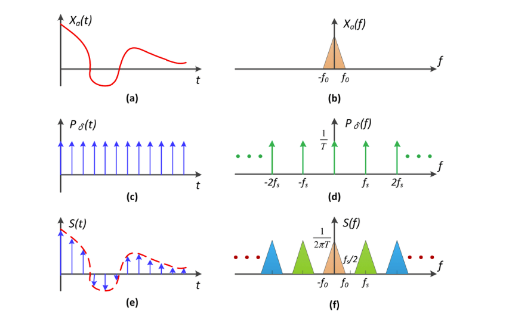

左侧为时域，右侧为频域。其中b,d分别为a,c在频域的相应的函数

采样 = 原函数和0-1指示函数（冲击函数）做乘积，等于在频域做卷积，f为b和d卷积的结果

采样在频域的操作：把原始函数在频域的像复制粘贴

**Aliasing = Mixed Frequency Contents**

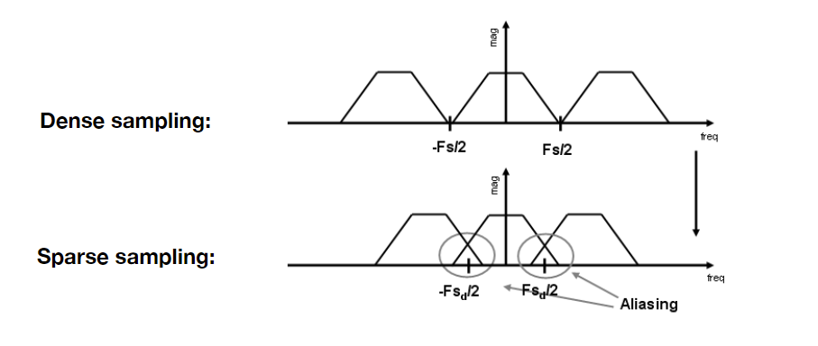

采样不够快，导致原始信号复制粘贴间隔变小（时域和频域相反）

走样：频谱在复制粘贴后发生混叠

#### Antialiasing in practice

Option 1: Increase sampling rate

分辨率高像素多等价于采样频率高

- Essentially increasing the distance between replicas in the Fourier domain

- Higher resolution displays, sensors, framebuffers... 

- But: costly & may need very high resolution 

Option 2: Antialiasing

- Making Fourier contents “narrower” before repeating 
- i.e. <u>Filtering out high frequencies before sampling</u> (先模糊后采样)

**Antialiasing = Limiting, then repeating**

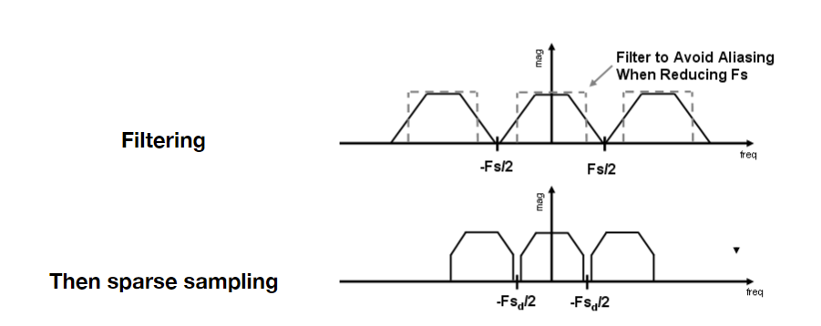

去掉高频信号后，剩下的信号不容易混叠

A Practical Pre-Filter: A <u>1 pixel-width</u> box filter (low pass, blurring)

Solution: 

1. Convolve f(x,y) by a 1-pixel box-blur 
2. Then sample at every pixel’s center (用average即可)

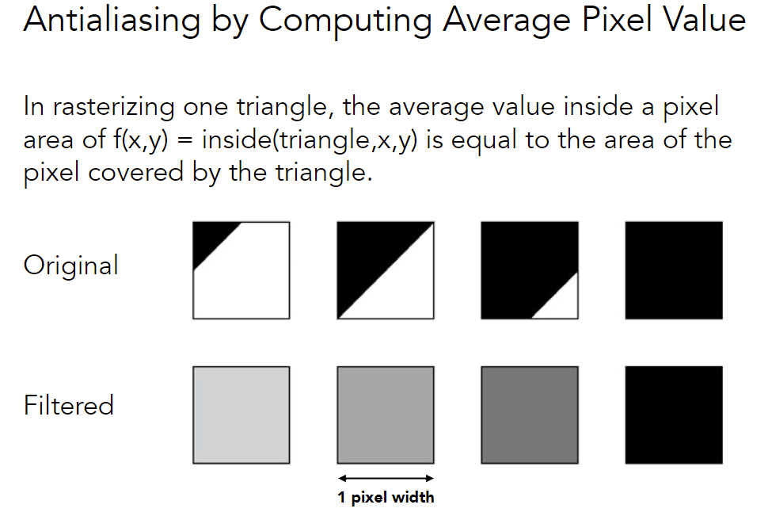

在每个pixel内对覆盖面积求平均

**Antialiasing By Supersampling (MSAA)**

Q：如何在每个pixel内求平均？

MSAA是通过更多采样来近似blur操作，采样隐含在过程中

Supersampling: 把每个原来的pixel划分成更小的pixel，在更小的pixel上采样后平均（在原来的每个pixel内sample多次）

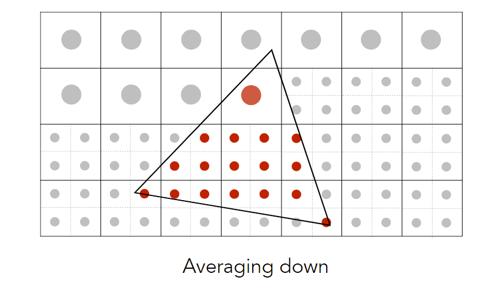

注：MSAA不是靠提升分辨率（提高采样率）直接解决走样（超采样只是为了更好的模糊）

No free lunch! MSAA costs more time. 

idea: random sampling, importance sampling

**Milestones**

- FXAA (Fast Approximate AA) 

  有锯齿的图像后期处理，把锯齿边界找到并替换成没有锯齿的

- TAA (Temporal AA) 

  找上一帧信息，每一帧使用不同的位置采样，复用上一帧的结果

  相当于把MSAA的样本分布在时间上

**Super resolution (超分辨率) / super sampling** 

- From low resolution to high resolution 

- Essentially still “not enough samples” problem 

- DLSS (Deep Learning Super Sampling)