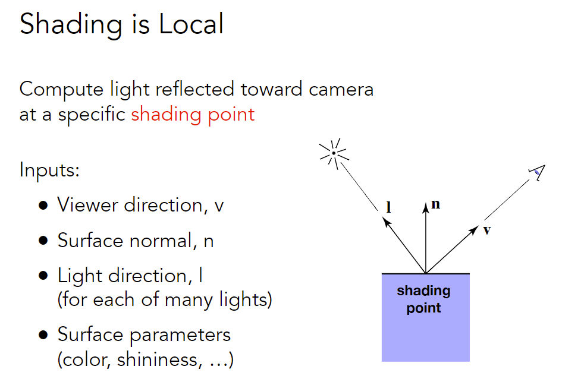

## 着色（光照与基本着色模型）

Q：为什么先采样再模糊是错的？

在信号混叠之后截断，但混叠的信号还是混叠的


### Visibility / occlusion

绘制多个空间位置不同的三角形

**Painter’s Algorithm**

解决绘制顺序

Inspired by how painters paint 

Paint from back to front, <u>overwrite</u> in the framebuffer

Can have unresolvable depth order (不一定总是能够排序)

#### Z-buffering

把物体拆分成多块（拆分成pixel）

对每个pixel能看到的部分排序

Idea: 

- Store current min. z-value for each sample (pixel)
- Needs an additional buffer for depth values 
  - frame buffer stores color values 
  - depth buffer (z-buffer) stores depth 

IMPORTANT: For simplicity we suppose  z is always positive (smaller z -> closer, larger z -> further)

```
for (each triangle T)
	for (each sample (x,y,z) in T)
		if (z < zbuffer[x,y])			// closest sample so far
			framebuffer[x,y] = rgb;		// update color
			zbuffer[x,y] = z;       	// update depth
```

Most important visibility algorithm. Implemented in hardware for all GPUs

in MSAA: 对每个sample做z-buffer

note: 无法处理透明物体


### Shading (着色)

What We’ve Covered So Far

MVP + viewport + rasterization


What Else Are We Missing?

无法反映出颜色根据光照的变化


#### Illumination & Shading 

**shading**

The process of <u>applying a material</u> (材质) to an object.

不同材质和光线作用效果不同


##### Blinn-Phong Reflectance Model

经验模型，不完全符合物理规律


Specular highlights (高光，镜面反射) + Diffuse reflection (漫反射) + Ambient lighting (环境光)

注：这里先假设每个点的Ambient lighting都是常量

把三部分光照分别计算


**shading inputs**



- 考虑某一个点(shading point)的着色结果

- $\vec n,\vec v,\vec l$仅表示方向，均为单位向量
- shading point有自己的属性


**Shading is Local** (局部性)

考虑点的着色仅考虑自己，不考虑光线被其它物体遮挡

<u>No shadows</u> will be generated! (shading ≠ shadow)


###### Diffuse Reflection


**物体如何接收光**

假设每根光线具有相同的能量


**光源如何发射光**


- $\max(0,\vec n \cdot \vec {l})$去掉反方向的光
- $k_d$是shading point自身的参数，$k_d=1$完全不吸收能量
- $L_d$和观测方向无关

