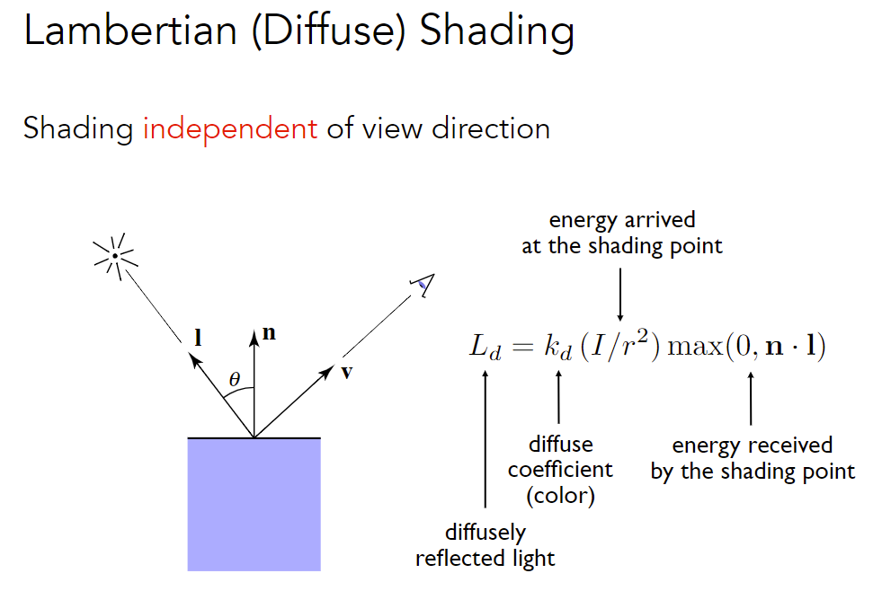

## 着色（着色频率、图形管线、纹理映射）

### Shading

#### Blinn-Phong reflectance model

note: shading at a <u>specific shading point</u> (需要对所有的点进行操作)

note: $\vec l ,\vec n ,\vec v$均为单位向量

##### Diffuse Term

##### Specular Term

类似镜面反射，观测方向和镜面反射方向足够接近时产生高光

V close to mirror direction $\Leftrightarrow$ <u>half vector near normal</u>

- 通常认为高光$k_s$是白的
- 简化模型，不考虑物体对光的吸收
- 半程向量比反射方向计算简单
- Increasing p narrows the reflection lobe (cos衰减太慢，一般p取100~200)

##### Ambient Term (环境光)

假设任何一个点接收到环境光是相同的

环境光与光照方向和观测方向无关，保证没有地方完全是黑的

#### Shading frequencies 

每个面着色 vs 每个顶点着色 + 插值 vs normal方向插值 + 每个pixel着色

##### Shade each triangle (flat shading)

平面着色

##### Shade each vertex (Gouraud shading)

Q：怎么求顶点法线？

每个顶点着色，中间插值

##### Shade each pixel (Phong shading)

求出顶点法线，在内部插值得到每个pixel的法线，对每个pixel着色

着色频率也取决于具体模型

- 模型足够复杂时，可以采用相对简单的着色频率
- 模型足够复杂时，Phong shading开销不一定更大（三角形数量超过pixel数量）

**Defining Per-Pixel Normal Vectors**

理想情况：根据试图表示的模型得到法线

一般情况：把相邻面法线做平均（也可根据面积加权平均）

Q：如何在三角形内部得到平滑过渡的法线？

Barycentric interpolation of vertex normal

#### Graphics (Real-time Rendering) Pipeline

如何从场景到输出图像

注：记录不同的三角形，再MVP $\Leftrightarrow$ 顶点MVP + 记录哪些顶点构成三角形

说明：

- MVP发生在Vertex Processing
- Sampling triangle发生在Rasterization
- Z-Buffer Visibility Tests发生在Fragment Processing
- Shading发生在Vertex Processing, Fragment Processing
  - 顶点着色可以发生在Vertex Processing
  - Phong shading发生在Fragment Processing
- Texture mapping (贴图) 发生在Vertex Processing, Fragment Processing

**Shader Programs**

GPU允许编程vertex and fragment processing阶段

**Shader**

Program vertex and fragment processing stages

- Describe operation on a single vertex (or fragment)

  每一个vertex (or fragment)都会执行，不需要循环

- 根据对象不同分为vertex shader和fragment shader

推荐链接：[ShaderToy](https://www.shadertoy.com/view/ld3Gz2)

**现代图形学发展方向**

Goal: Highly Complex 3D Scenes in Realtime

Graphics Pipeline Implementation: GPUs

new shader: geometry shader, compute shader (通用计算)

#### Texture mapping 

希望在物体表面不同位置定义不同的属性

纹理映射：把图贴在3D物体的表面；将纹理空间三角形映射到物体表面三角形上

Each triangle “copies” a piece of  the texture image to the surface.

纹理坐标通常用(u,v)表示，u,v范围通常认为在0~1

纹理可以重复使用（最好可以使纹理无缝衔接）