## 着色（插值、高级纹理映射）

### Shading

#### Barycentric coordinates

Why do we want to interpolate? 

- Specify values <u>at vertices</u>
- Obtain smoothly varying values <u>across triangles</u>

What do we want to interpolate? 

- Texture coordinates, colors, normal vectors, ... 

Interpolation Across Triangles: Barycentric Coordinates(重心坐标)

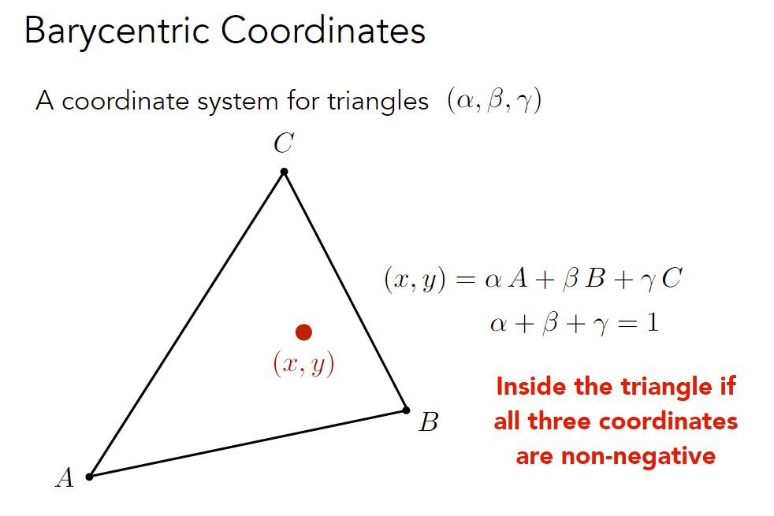

- 每个三角形有自己的重心坐标

- 平面内的任意一个点都可以表示成$(x, y)=\alpha A+\beta B+\gamma C \quad (\alpha +\beta +\gamma =1)$

  若$\alpha +\beta +\gamma \neq1$，得到的点不在平面内

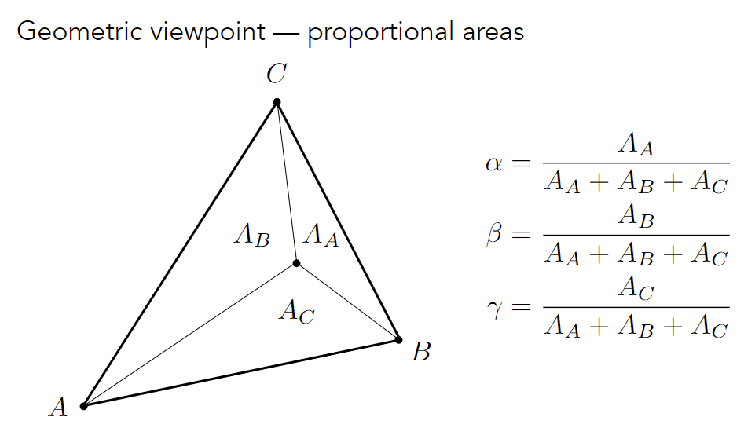

Formulas
$$
\begin{aligned}
&\alpha=\frac{-\left(x-x_{B}\right)\left(y_{C}-y_{B}\right)+\left(y-y_{B}\right)\left(x_{C}-x_{B}\right)}{-\left(x_{A}-x_{B}\right)\left(y_{C}-y_{B}\right)+\left(y_{A}-y_{B}\right)\left(x_{C}-x_{B}\right)} \\
&\beta=\frac{-\left(x-x_{C}\right)\left(y_{A}-y_{C}\right)+\left(y-y_{C}\right)\left(x_{A}-x_{C}\right)}{-\left(x_{B}-x_{C}\right)\left(y_{A}-y_{C}\right)+\left(y_{B}-y_{C}\right)\left(x_{A}-x_{C}\right)} \\
&\gamma=1-\alpha-\beta
\end{aligned}
$$
**Using Barycentric Coordinates**

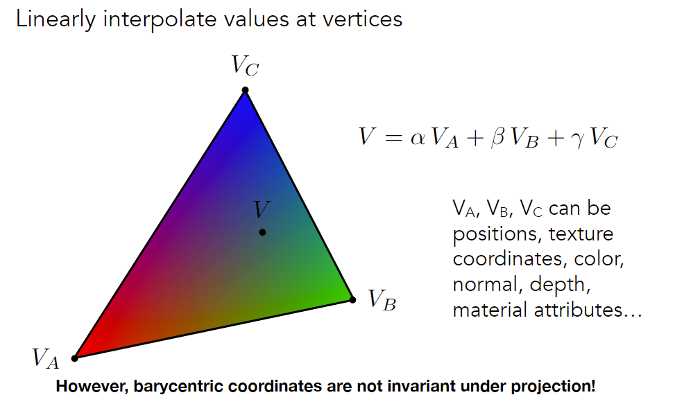

注：投影完重心坐标会改变，三维空间属性插值应该在投影之前完成

例如，插值z应该在原来的三维坐标中进行，而不是在投影后的二维坐标中计算

#### Texture queries 

**Applying Textures**

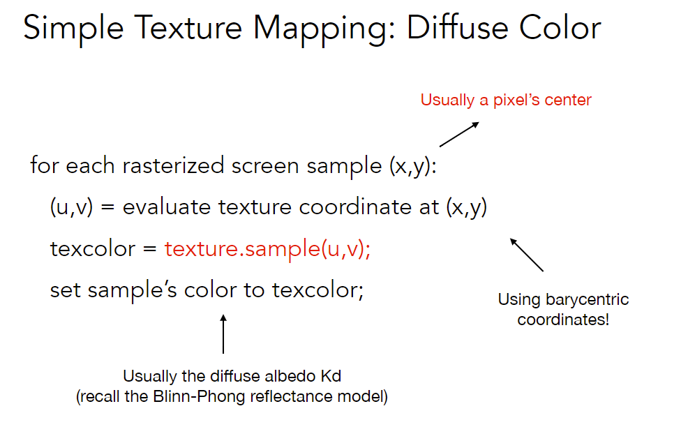

**Texture Magnification (Easy Case)**

What if the texture is too small? 

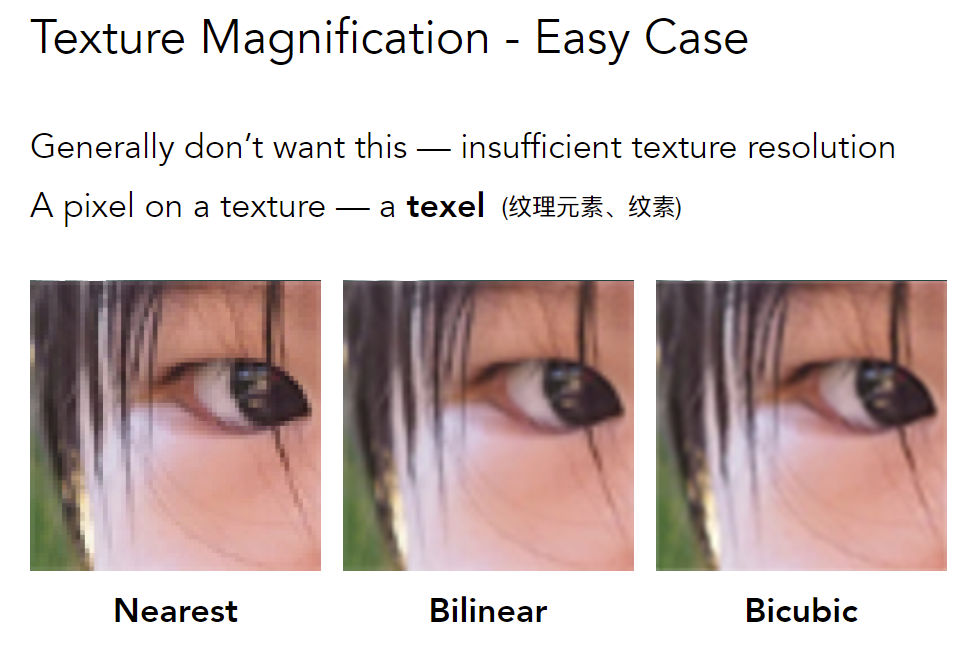

Nearest: 对于pixel映射的texel做round操作（在一定范围内texel可能是一样的）

**Bilinear Interpolation**

Bilinear = horizontal linear + vertical linear

Black points indicate texture sample locations

Want to sample texture value f(x,y) at red point

- Take 4 nearest sample locations, with texture values as labeled.
- And fractional offsets, (s,t) as shown
- Do Linear interpolation (1D), get Two helper lerps (horizontal)
- Final vertical lerp, to get result

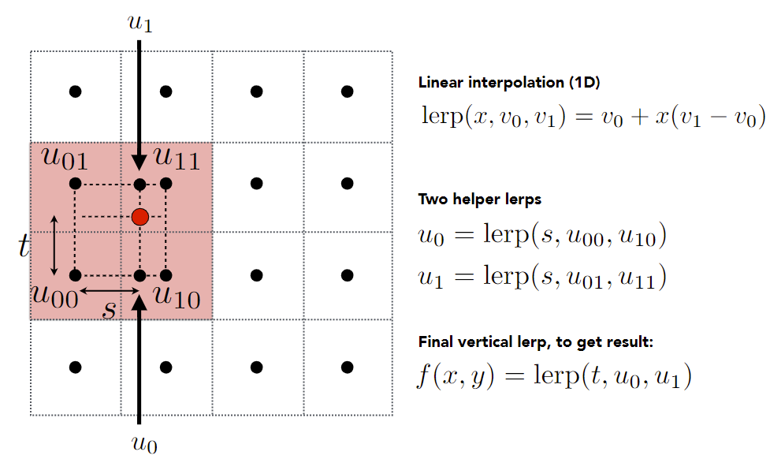

Bilinear interpolation usually gives pretty good results at reasonable costs

**Texture Magnification (hard case)**

What if the texture is too large?

对纹理的采样率不够高

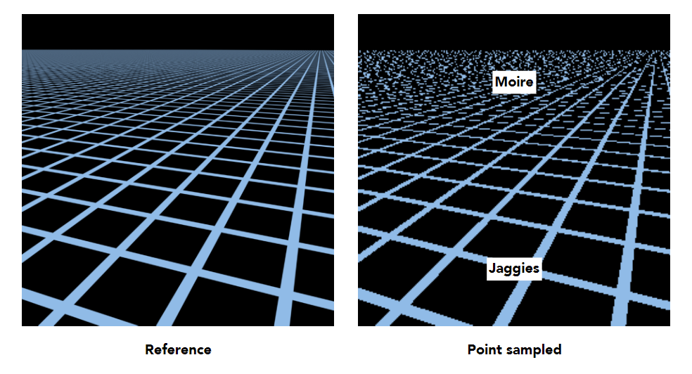

灰色点为纹理的sample locations

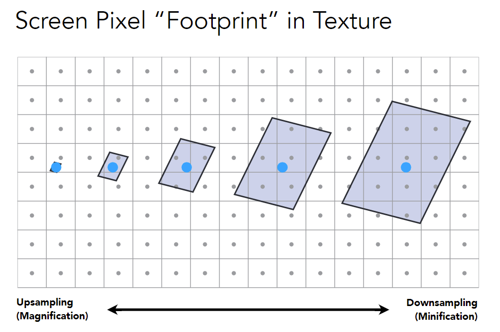

在近处，每个pixel覆盖的纹理区域较小；在远处，每个pixel则会覆盖较大区域

Will supersampling work? 

- Yes, high quality, but costly 

- When highly minified, many texels in pixel footprint.

  Signal frequency too large in a pixel 

- Need even higher sampling frequency

采样引起走样，直接避免采样

- What if we don’t sample? 
- Just need to get the average value within a range! (区间查询问题，需要支持任意大小的查询)

##### Mipmap

Allowing (fast, approx., square) range queries

根据原图生成一系列图（类似二维ST表）

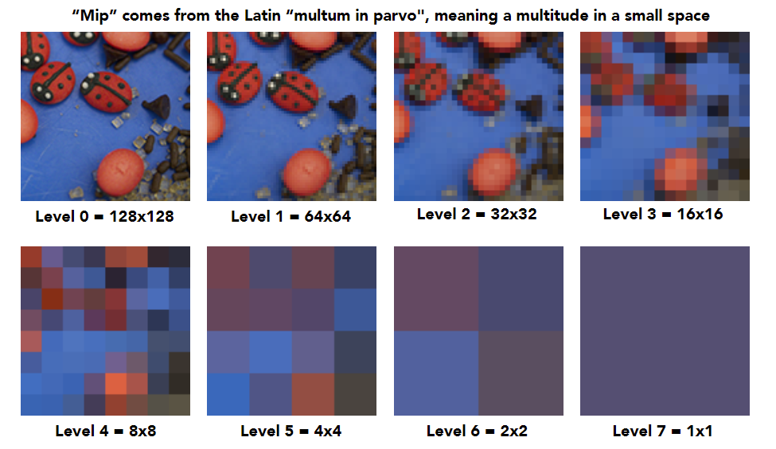

如何得到texture footprint

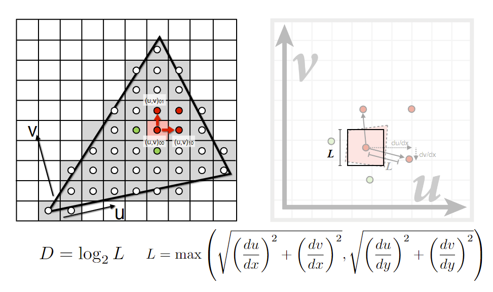

- Estimate texture footprint using texture coordinates of neighboring screen samples
- 求出相邻点映射后之间的长度$L$，用来近似正方形区域的边长（有限增量公式）
- 计算$D=\log_2L$，对于整数$D$直接查询，对于小数的$D$进行插值 (Trilinear Interpolation)

**Trilinear Interpolation**

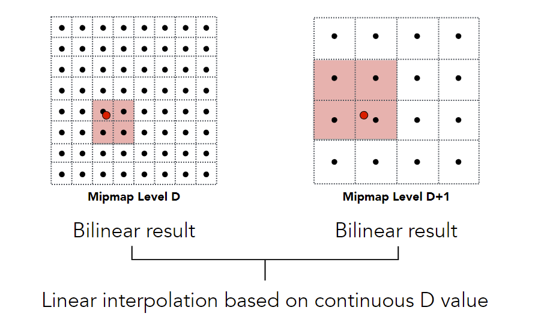

- 分别在level D和level D+1内先Bilinear插值，在D和D+1之间Linear插值

- 在层与层之间和层内部都是连续的

**Mipmap Limitations**

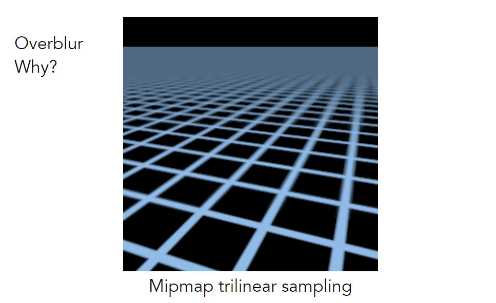

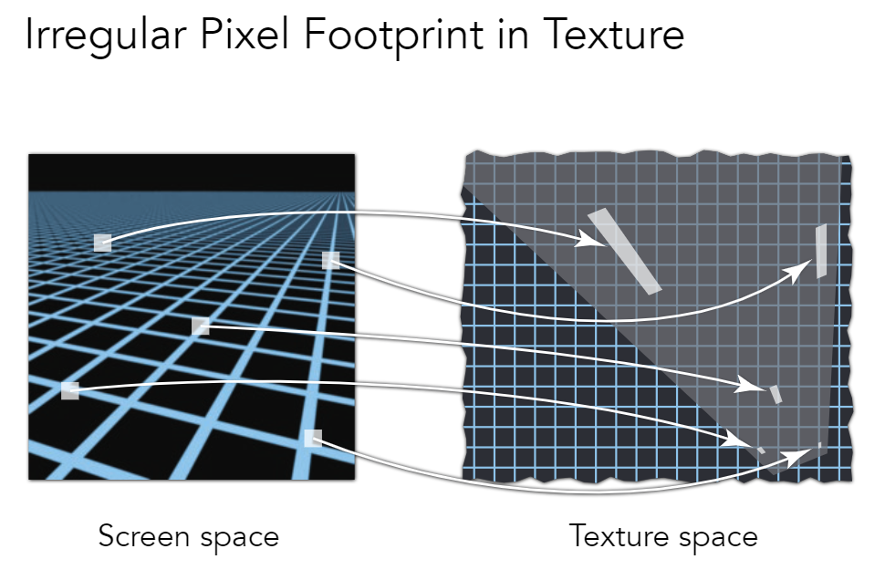

mipmap只能查询正方形，且引入了较多的近似

**Anisotropic Filtering** (各向异性过滤)

引入了不均匀的水平和竖直压缩，可以解决矩形区域情况，无法解决斜矩形的情况

最多引入3倍的额外存储量，kx各向异性过滤即引入k层压缩

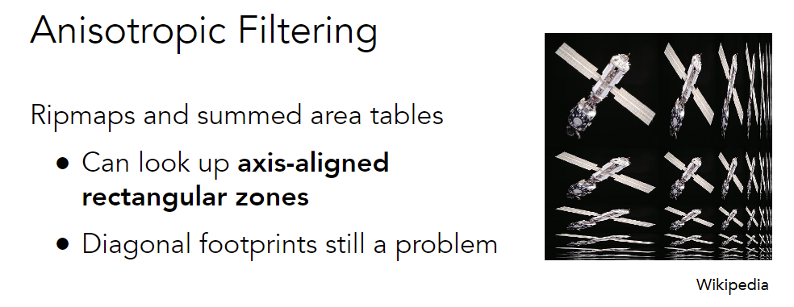

其它过滤方法

EWA filtering

用多个圆形覆盖区域

- Use multiple lookups 
- Weighted average 
- Mipmap hierarchy still helps 
- Can handle irregular footprints